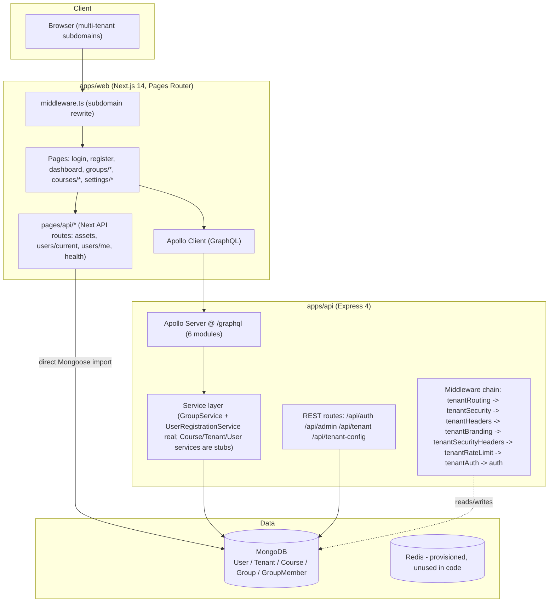
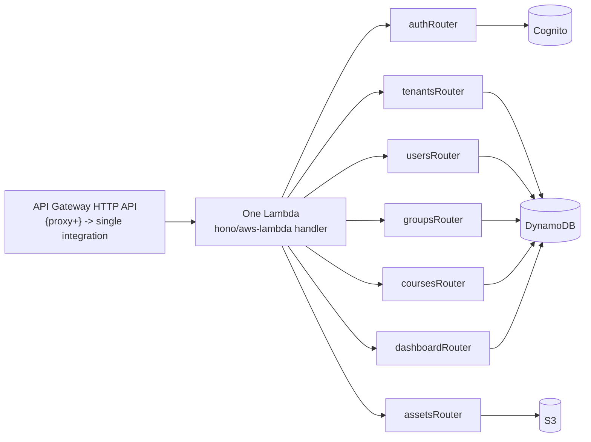
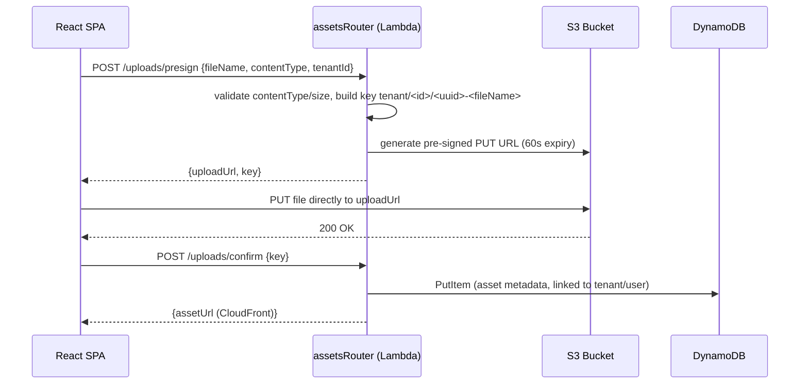
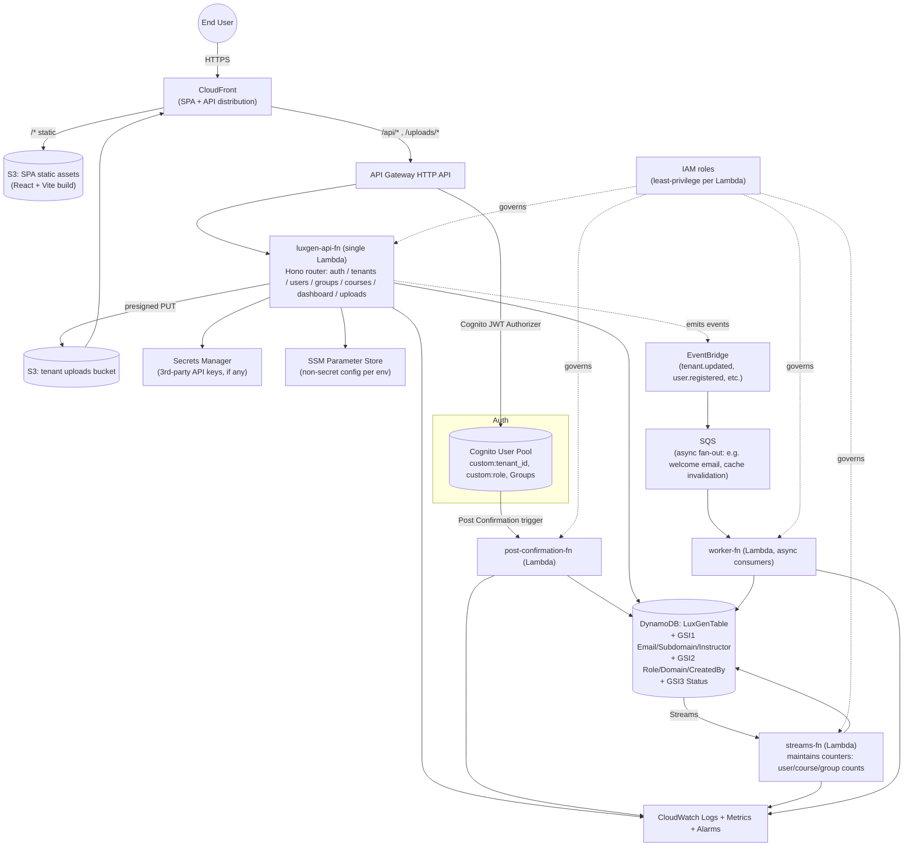

# LuxGen Monorepo — AWS Serverless Migration Report

**Prepared for:** pugal
**Repository:** `luxgen-monorepo`
**Date:** 2026-07-11
**Scope:** Full-repository architecture audit + MongoDB→DynamoDB, Express/Apollo→Hono/Lambda, JWT→Cognito, and infrastructure migration plan.

---

## 1. Executive Summary

LuxGen is a multi-tenant SaaS monorepo (Turborepo, npm workspaces) consisting of one Next.js 14 frontend (`apps/web`), one Express + Apollo GraphQL backend (`apps/api`), and seven shared packages. Multi-tenancy is implemented as a **shared database, shared schema** model: every tenant's data lives in the same MongoDB collections, isolated by a `tenant` field, with tenant resolved per-request from subdomain/custom-domain/header and enforced in middleware and service-layer queries. Tenant-specific branding, security policy, and feature flags are stored on the `Tenant` document and also duplicated across static config files (`apps/api/src/config/tenants/*`, `packages/db/src/tenant-config/*`, `packages/shared/src/tenant/TenantWorkflow.ts`).

Key facts discovered during this audit:

- **5 real Mongoose collections**: `User`, `Tenant`, `Course`, `Group`, `GroupMember`. No other models exist despite documentation referencing payments, sessions, and analytics — those are in-memory, non-persisted stub classes in `packages/core` that are **imported nowhere** in the running application.
- **Two API surfaces**: a legacy/parallel REST surface (`/api/auth`, `/api/admin`, `/api/tenant`, `/api/tenant-config` — 17 endpoints) and a GraphQL surface (`/graphql` — 6 modules, 25 queries, 27 mutations). Both implement **overlapping login/register logic independently** (different code paths, same business rules, real drift risk).
- **Three service classes are unimplemented stubs** (`courseService`, `tenantService`, `userService` all `console.log` + `throw new Error('Not implemented')`), meaning the `course` and generic `tenant`/`user` GraphQL operations do not work today. Only `GroupService` and `UserRegistrationService` are real, working, Mongoose-backed implementations.
- **No file upload code exists.** `multer`, `cloudinary`, and S3 SDKs are absent from every `package.json`. "File upload" only appears as a boolean feature flag and a `provider: 'local'` placeholder in tenant config — there is nothing to migrate here beyond building the feature fresh on S3.
- **Redis and Socket.io are provisioned in `docker-compose.yml` but never imported in any application code.** Rate limiting, sessions, and caching are all done in-process/in-memory today (and in one case not really implemented — see §9).
- **The Next.js app talks to MongoDB directly** from two `pages/api/*` routes (`apps/web/pages/api/users/current.ts`, `me.ts`), duplicating the JWT-verification logic that also lives in `apps/api`. This is an architectural leak that needs to be closed as part of the migration (frontend should never hold a Mongoose connection).
- **Custom per-tenant JWT signing keys** (`kid` header identifies which tenant's HMAC secret verifies the token) is a bespoke auth system that maps unusually well onto Cognito User Pools (one pool per tenant, or a single pool with a custom tenant claim — see §8).
- `packages/ui` (60+ components) is framework-agnostic React/Tailwind and is **almost entirely reusable as-is** on the new stack; it is the single biggest asset to preserve effort on.

**Overall verdict:** this is a small-to-medium, mostly CRUD, multi-tenant application (~13,000 lines of TypeScript across `apps/api` + packages, 615 files including UI in the whole repo). The domain logic is simple enough that a lift of business rules (not code) into Lambda handlers is realistic in 6–8 weeks for one senior engineer, plus 2–3 weeks for Cognito cutover and DynamoDB single-table modeling, plus buffer for the two unimplemented services (Course, generic Tenant CRUD) which need to be *built*, not migrated, since they don't currently work.

---

## 2. Current Architecture



### 2.1 Runtime / hosting today
Docker Compose (`docker-compose.yml`, `.dev.yml`, `.prod.yml`) runs: `mongodb`, `redis` (unused), `api`, `web`, plus dev tooling (`mongo-express`, `redis-commander`). `nginx.conf` fronts the containers. There is no CI/CD pipeline file in the repo (not found — flag for §11).

### 2.2 Target Architecture (preview — full detail in §10)
React/Vite SPA on S3 + CloudFront → API Gateway → Lambda (Hono) → DynamoDB, with Cognito for auth and S3 for file storage. Full Mermaid diagram in §10.


---

## 3. Folder Analysis (Task 1)

### 3.1 Top-level structure

```
luxgen-monorepo/
├── apps/
│   ├── api/                 # Backend: Express + Apollo GraphQL + Mongoose
│   └── web/                 # Frontend: Next.js 14 (Pages Router) + Apollo Client
├── packages/
│   ├── auth/                # JWT + bcrypt + role/permission constants (shared logic)
│   ├── config/               # env var loader, logger factory
│   ├── core/                 # UNUSED in-memory stub domain classes (payments, analytics, scheduler, plugin framework)
│   ├── db/                   # Mongoose models + static tenant-config templates
│   ├── shared/                # Tenant workflow/config service (large, mostly unused) + encryption/logger/validation utils
│   ├── ui/                    # 60+ React/Tailwind components (design system) — framework agnostic, high reuse value
│   └── utils/                 # date/math/constants/type helpers
├── scripts/                   # Node CLI scripts: tenant init, DB seed/clear, dev helpers
├── docs/                      # AWS free-tier deployment notes(!), dev knowledge base, auth API docs
├── docker-compose*.yml        # mongodb, redis, api, web, mongo-express, redis-commander
├── Dockerfile, nginx.conf     # container + reverse proxy config
└── *.md (root)                # Multi-tenant architecture, navigation architecture/spec/checklist docs
```

Note: `docs/AWS_FREE_TIER_DEPLOYMENT.md` and `AWS_FREE_TIER_RUNBOOK.md` already exist in the repo — worth reading before starting the migration, as they may contain prior AWS intent/decisions from the team (not read as part of this audit; flagged for follow-up).

### 3.2 `apps/api` (Backend) — detail

| Path | Role | Notes |
|---|---|---|
| `src/app.ts` | Express app assembly: helmet, CORS, body parsing, tenant middleware chain, route mounting, Apollo Server bootstrap | Middleware order matters a lot here — see §3.5 |
| `src/index.ts` | Entry point: connects Mongo, starts HTTP listener | |
| `src/context.ts` | GraphQL context builder (attaches `req.user`, resolves `tenant`) | |
| `src/config/` | Per-tenant static config objects (`demo`, `idea-vibes`) mirrored in 3 different places in the repo (see §8 tech debt) | |
| `src/db/connect.ts`, `dashboardSeed.ts`, `seed.ts` | Mongo connection + seed scripts | |
| `src/middleware/` | 7 middleware files — tenant resolution, tenant security headers, tenant branding CSS injection, tenant rate limiting (in-memory, not enforced), role/permission guards, dashboard-specific auth, request validation | **Controllers-equivalent** layer for REST routes |
| `src/routes/` | REST **Controllers**: `auth.ts`, `admin.ts` (tenant JWT key management), `tenant.ts`, `tenantConfig.ts` | |
| `src/schema/*/typeDefs.ts` + `resolvers.ts` | GraphQL **Controllers**: 6 modules — `tenant`, `user`, `course`, `group`, `dashboard`, `userRole` | |
| `src/services/` | **Service layer**: `courseService.ts` (stub), `groupService.ts` (real), `tenantService.ts` (stub), `userService.ts` (stub), `userRegistrationService.ts` (real) | |
| `src/utils/` | `jwt.ts`, `keyRotation.ts`, `tenantKeys.ts` (per-tenant HMAC secret store), `errorHandler.ts`, `logger.ts` | **Authentication** core |
| `src/tests/` | Jest + Supertest tests for auth routes, role management, tenant keys, user registration | Reasonable coverage of the *real* code paths |

### 3.3 `apps/web` (Frontend) — detail

| Path | Role |
|---|---|
| `pages/` | Next.js Pages Router: login, register, dashboard, courses/*, groups/* (list/create/edit/members/analytics/dashboard), settings/*, 404 |
| `pages/api/` | Next.js API routes — **contains a duplicate backend**: `users/current.ts` and `users/me.ts` import `@luxgen/db` (Mongoose) directly and re-implement JWT verification; `assets/*` serve static tenant brand asset JSON; `health.ts` is a liveness check |
| `components/` | Page-level composition components (Header, Footer, Sidebar, BannerCarousel, tenant switcher/banner) — thin wrappers around `@luxgen/ui` |
| `graphql/` | Apollo Client instance + typed query/mutation documents (auth, courses, dashboard, tenants, users) |
| `lib/` | `auth.ts` (localStorage token get/set + fetch-based `/api/auth/me`), `useAuth.ts` (Apollo-based auth hook — **duplicates `lib/auth.ts`, two competing auth strategies in the same app**), `tenant.ts`, `tenantService.ts`, `fetcher.ts`, `transformer.ts` |
| `middleware.ts` | Next.js edge middleware: subdomain → `?tenant=` query param rewrite |

### 3.4 Shared packages — detail

| Package | Contains | Reuse verdict |
|---|---|---|
| `@luxgen/auth` | `hash.ts` (bcrypt), `jwt.ts` (plain, non-tenant-aware — **shadowed by** `apps/api/src/utils/jwt.ts` which is the tenant-aware version actually used), `roles.ts` (role/permission matrix) | Business rules (role matrix) reusable; JWT code replaced by Cognito |
| `@luxgen/config` | `env.ts` (env var schema incl. `UPLOAD_DIR`, `REDIS_URL` — both unused), `logger.ts` | Mostly reusable as Lambda env-var loader |
| `@luxgen/core` | `analytics/`, `payments/`, `scheduler/`, `plugin/` — **all in-memory `Map`-backed classes with zero callers anywhere in the app** | Dead code — see §8 |
| `@luxgen/db` | Mongoose schemas (`User`, `Tenant`, `Course`, `Group`, `GroupMember`) + `tenant-config/*` static templates | Schemas become the source of truth for DynamoDB modeling (§7); connection code is discarded |
| `@luxgen/shared` | `TenantWorkflow.ts` (1219 lines — a much richer, unused superset of the `Tenant` Mongoose schema), `TenantConfigService.ts` (singleton cache/sync service), `encryption.ts`, `logger.ts`, `validation.ts` | Only imported by one **commented-out** middleware (`tenantWorkflow.ts` in `app.ts`) — effectively dead code today, but the richer branding/theming model is a good target shape for the DynamoDB Tenant item |
| `@luxgen/ui` | 60+ components with fixtures, specs, READMEs, translations, `TenantProvider`, `ThemeContext`, dashboard widgets | **Highest-value reusable asset** — pure React, Tailwind, no server coupling |
| `@luxgen/utils` | date/math/constants/type helpers | Fully reusable |

### 3.5 Layer mapping (for the DDD/Clean-Architecture framing requested)

| Requested layer | Where it actually lives |
|---|---|
| Frontend | `apps/web` |
| Backend | `apps/api` |
| Shared packages | `packages/*` (7 packages) |
| Utilities | `packages/utils`, `packages/shared/src/utils` |
| Database layer | `packages/db/src/*.ts` (Mongoose models), `apps/api/src/db/connect.ts` |
| Authentication | `packages/auth`, `apps/api/src/utils/{jwt,tenantKeys,keyRotation}.ts`, `apps/api/src/middleware/auth.ts` |
| Middleware | `apps/api/src/middleware/*` (7 files) |
| Services | `apps/api/src/services/*` (3 stubs, 2 real) |
| Controllers | `apps/api/src/routes/*` (REST) + `apps/api/src/schema/*/resolvers.ts` (GraphQL) — **no separate NestJS-style controller/service split; resolvers directly call Mongoose or services inconsistently** |
| Repositories | **Do not exist as a distinct layer.** Resolvers/routes call Mongoose models directly in most places (`User.findOne`, `Group.find`, etc.). Only `GroupService` and `UserRegistrationService` provide a thin repository-like abstraction. This is worth introducing formally during the Lambda rewrite (§5). |
| Models | `packages/db/src/{user,tenant,course,group}.ts` |


---

## 4. MongoDB / Mongoose Usage Catalog (Task 2)

No `aggregate()`, `bulkWrite()`, transactions (`startSession`/`withTransaction`), or schema-level indexes beyond simple single/compound field indexes were found anywhere in the codebase. This significantly de-risks the migration — there is no complex aggregation pipeline logic to re-architect.

| Pattern | Where used | Purpose | Migration difficulty | Risk |
|---|---|---|---|---|
| `mongoose.connect()` | `packages/db/src/connection.ts`, `apps/api/src/db/connect.ts` | Establish DB connection at boot | Trivial — deleted, replaced by DynamoDB SDK client init | None |
| `Schema` / `model()` | All 4 files in `packages/db/src` | Define `User`, `Tenant`, `Course`, `Group`, `GroupMember` | Medium — becomes DynamoDB table design (§5) | Medium — nested objects (`metadata.permissions`, `settings.branding/security/config`) must be flattened or kept as DynamoDB maps |
| `Model.findById()` | ~15 call sites (auth middleware, routes, resolvers, services) | Point lookups by Mongo ObjectId | Low — becomes `GetItem` by PK | Low |
| `Model.findOne()` | `routes/auth.ts` (login), `services/userRegistrationService.ts` (email uniqueness), `routes/tenant*.ts` (subdomain lookup), `groupService.ts` (join-group duplicate check) | Single-record lookup by non-PK field (email, subdomain) | Medium — requires a GSI (email, subdomain are not the natural partition key) | Medium — must add `EmailIndex` / `SubdomainIndex` GSIs, and enforce uniqueness in application code since DynamoDB has no native unique-secondary-index constraint |
| `Model.find()` | `userRole/resolvers.ts` (`getUsers`, `getUsersByRole`, `getPendingUsers`, `getTenantAdmins`), `groupService.ts` (list groups/members), `tenantConfig.ts` (list active tenants) | Filtered, paginated list queries | Medium-High — becomes `Query` on GSI + `FilterExpression`, cursor pagination must be rebuilt on `LastEvaluatedKey` instead of `_id` comparisons | Medium — current cursor logic (`$gt`/`$lt` on `_id`) is Mongo-specific and must be replaced entirely, not translated 1:1 |
| `Model.findByIdAndUpdate()` / `findOneAndUpdate()` | `routes/tenant.ts` (branding/security patch), `groupService.ts` (updateGroup/updateGroupMember), `schema/user/resolvers.ts` (updateUser) | Partial updates | Low-Medium — becomes `UpdateItem` with `UpdateExpression` | Low |
| `Model.findByIdAndDelete()` / `findOneAndDelete()` | `schema/user/resolvers.ts`, `groupService.ts` (deleteGroup, removeGroupMember, leaveGroup) | Deletes | Low — becomes `DeleteItem` | Low |
| `Model.deleteMany()` | `groupService.ts` (`deleteGroup` cascades to delete all `GroupMember` rows; `bulkRemoveGroupMembers`) | Cascade / bulk delete | Medium — DynamoDB has no cascade; must be done with a `Query` + `BatchWriteItem` loop, or via DynamoDB Streams + Lambda for async cascade | Medium — cascade-delete-on-parent-delete is exactly the kind of implicit relational behavior that's easy to silently break during a NoSQL port |
| `Model.insertMany()` | `groupService.ts` (`bulkAddGroupMembers`) | Bulk insert | Low — becomes `BatchWriteItem` (25-item batches, needs chunking + retry-on-unprocessed-items logic that Mongo's driver handled for free) | Low-Medium |
| `Model.countDocuments()` | `groupService.ts` (pagination `totalCount`), `dashboard/resolvers.ts` (`getDashboardStats`), `routes/tenant.ts` (`stats`) | Counts for pagination/dashboards | **High** — DynamoDB has no efficient `COUNT` query; `Query`+`Select: COUNT` still scans all matching items (billed the same as reading them). For dashboards this needs a maintained counter item (DynamoDB Streams + Lambda incrementing a counter attribute) instead of a live count | **High** — this is the single riskiest data-access pattern to port faithfully |
| `.populate()` | 17 call sites — nearly every `User` read populates `tenant`; `tenantRouting.ts` populates `metadata.createdBy` | Mongo's relational join emulation | Medium-High — DynamoDB has no join. Each populate site becomes either (a) a denormalized copy of the needed tenant fields stored directly on the `User` item, or (b) a second `GetItem` call in the resolver/handler | Medium — denormalization is the right long-term answer but means **tenant branding changes must fan out** to every user item, or be read from a separate always-fetched Tenant item (recommended — see §7) |
| `.lean()` | `groupService.ts` (all list/read queries) | Skip Mongoose document hydration for perf | N/A — DynamoDB SDK always returns plain JS objects, so this concern disappears entirely | None |
| Mongoose `enum` + `match` (regex) validators | `User.role/status`, `Tenant.subdomain`, `Tenant.settings.branding.*Color` | Schema-level validation | Medium — DynamoDB has no schema validation; must move to application-layer validation (e.g., `zod`) in every Lambda handler | Medium — currently free validation becomes a required, explicit implementation step |
| `timestamps: true` | All 4 schemas | Auto `createdAt`/`updatedAt` | Trivial — set explicitly in application code on write | None |
| Compound unique index | `GroupMemberSchema.index({ groupId: 1, userId: 1 }, { unique: true })` | Prevent duplicate membership | Medium — becomes the DynamoDB item's composite key itself (`PK=GROUP#<id>`, `SK=MEMBER#<userId>`), which gives uniqueness for free via `ConditionExpression: attribute_not_exists(PK)` | Low once modeled correctly |
| Aggregation (`aggregate()`) | **Not found anywhere in the codebase** | — | — | — |
| Transactions | **Not found anywhere in the codebase** | — | — | — |
| `bulkWrite` | **Not found anywhere in the codebase** | — | — | — |

**Important caveat:** three of the six GraphQL modules (`courseService`, `tenantService`, `userService`) are stub implementations that never touch the database (`console.log(...); throw new Error('Not implemented')`). They are listed above only where equivalent *working* Mongo patterns exist elsewhere (e.g. `Tenant.findOne` in REST routes). The `course` domain and generic `tenant`/`user` CRUD via GraphQL have **no real Mongo usage to migrate** — they need to be built new against DynamoDB directly, which is arguably less risky than migrating broken code.


---

## 5. Per-Model Schema Analysis & DynamoDB Redesign (Task 3)

### Design principle used throughout
Given the small number of entity types (5) and the fact that almost every access pattern is "give me X's children" (tenant→users, group→members, user→groups), this repo is a textbook candidate for a **single-table design**. One table (`LuxGenTable`) holds all five entity types, discriminated by key prefixes. This minimizes Lambda cold-start connection overhead (one client, one table) and lets tenant-scoped queries be answered with a single `Query` call using the tenant as the partition key wherever possible. GSIs cover the cross-tenant / by-email / by-role access patterns.

---

### 5.1 `User`

**Current Mongoose schema:** `email` (unique), `password` (bcrypt hash), `firstName`, `lastName`, `role` (enum: SUPER_ADMIN/ADMIN/USER), `status` (enum: ACTIVE/INACTIVE/PENDING/SUSPENDED), `tenant` (ref → Tenant, required), `isActive`, `metadata.{lastLogin, loginCount, preferences.{theme,notifications,language}, permissions.{8 booleans}, tenantRoles[] (tenantId ref, role, assignedBy ref, assignedAt)}`, timestamps.

**Relationships:** belongs to one `Tenant` (required ref); can hold role assignments across *multiple* tenants via `metadata.tenantRoles[]` (a many-to-many the primary `tenant` field doesn't fully capture — noted inconsistency, see §8).

**Indexes today:** unique index on `email` (implicit from `unique: true`).

**Validation today:** email format/lowercase/trim, password minlength 6, role/status enums, required tenant.

**DynamoDB design:**

| Field | Value |
|---|---|
| Table | `LuxGenTable` (shared) |
| PK | `TENANT#<tenantId>` |
| SK | `USER#<userId>` |
| GSI1 (`EmailIndex`) | PK: `EMAIL#<email>`, SK: `USER#<userId>` — enforces login lookup and app-level email uniqueness |
| GSI2 (`RoleIndex`) | PK: `TENANT#<tenantId>#ROLE#<role>`, SK: `USER#<userId>` — powers `getUsersByRole`, `getTenantAdmins` |

Example item:
```json
{
  "PK": "TENANT#64f...ab1",
  "SK": "USER#64f...c22",
  "entityType": "USER",
  "email": "jane@acme.com",
  "passwordHash": "$2a$12$...",
  "firstName": "Jane",
  "lastName": "Doe",
  "role": "ADMIN",
  "status": "ACTIVE",
  "isActive": true,
  "metadata": {
    "lastLogin": "2026-07-10T08:00:00Z",
    "loginCount": 42,
    "preferences": { "theme": "dark", "notifications": true, "language": "en" },
    "permissions": { "canManageUsers": true, "canManageTenants": false, "...": "..." },
    "tenantRoles": [ { "tenantId": "64f...ab1", "role": "ADMIN", "assignedBy": "64f...aa0", "assignedAt": "2026-01-01T00:00:00Z" } ]
  },
  "createdAt": "2026-01-01T00:00:00Z",
  "updatedAt": "2026-07-10T08:00:00Z"
}
```

**Query patterns:**
- Login by email → `Query GSI1` where `PK = EMAIL#<email>` (1 call, replaces `User.findOne({email})`)
- List tenant's users / by role → `Query` on `PK = TENANT#<id>` with `SK begins_with USER#` (+ optional `FilterExpression status=`), or `Query GSI2` for role-scoped
- Get user by id (need tenant too) → requires tenant id up front; if only `userId` is known (as in `req.user.id` from JWT), store the JWT payload's `tenant` claim so both PK+SK are always available for a direct `GetItem` — **avoids a table scan**
- `metadata.tenantRoles[]` (multi-tenant role assignment) → keep as a JSON list attribute; querying "all tenants a user administers" is rare enough (not exposed in any current resolver) to leave as a `Scan`-free non-requirement for v1

**Reasoning:** Tenant-as-partition-key matches the dominant access pattern (`users` query is always tenant-scoped in every current resolver/route). Email lookup is the only cross-tenant point lookup, hence GSI1.

---

### 5.2 `Tenant`

**Current Mongoose schema:** `name`, `subdomain` (unique), `domain` (optional custom domain), `status` (active/suspended/pending), `settings.branding.{logo,favicon,primaryColor,secondaryColor,accentColor,fontFamily,customCSS}`, `settings.security.{allowedDomains[],corsOrigins[],rateLimiting.{enabled,maxRequests,windowMs},sessionTimeout,requireMFA,passwordPolicy.{...}}`, `settings.config.{features.{analytics,notifications,fileUpload,apiAccess,customDomain},limits.{maxUsers,maxStorage,maxApiCalls},integrations.{emailProvider,paymentProvider,analyticsProvider}}`, `metadata.{plan,createdAt,lastActive,createdBy ref}`, timestamps.

**Relationships:** referenced by `User.tenant`, `Course.tenant`, `Group.tenant` (all required FKs).

**Indexes today:** `subdomain`, `domain`, `status`, `metadata.plan` (all single-field).

**Validation today:** subdomain regex `^[a-z0-9-]+$`, hex-color regex on branding colors, enum status/plan.

**DynamoDB design:**

| Field | Value |
|---|---|
| PK | `TENANT#<tenantId>` |
| SK | `METADATA` |
| GSI1 (`SubdomainIndex`) | PK: `SUBDOMAIN#<subdomain>`, SK: `TENANT#<tenantId>` — this is the **hottest read in the whole app** (every single request resolves tenant by subdomain in `tenantRoutingMiddleware`/Hono equivalent) |
| GSI2 (`DomainIndex`) | PK: `DOMAIN#<customDomain>`, SK: `TENANT#<tenantId>` — for custom-domain tenants |
| GSI3 (`StatusIndex`) | PK: `STATUS#<status>`, SK: `TENANT#<tenantId>` — powers "list active tenants" (`/api/tenant-config/available`) |

Example item: (branding/security/config nested exactly as today, stored as DynamoDB maps — no flattening needed since these are always read/written whole, never queried by nested field)

```json
{
  "PK": "TENANT#64f...ab1",
  "SK": "METADATA",
  "entityType": "TENANT",
  "name": "Demo Platform",
  "subdomain": "demo",
  "domain": null,
  "status": "active",
  "settings": { "branding": { "...": "..." }, "security": { "...": "..." }, "config": { "...": "..." } },
  "metadata": { "plan": "pro", "lastActive": "2026-07-11T00:00:00Z", "createdBy": "64f...aa0" },
  "createdAt": "2025-01-01T00:00:00Z",
  "updatedAt": "2026-07-11T00:00:00Z"
}
```

**Query patterns:**
- Subdomain → tenant (every request, hot path) → `Query GSI1` (1 call, single-digit-ms) — **recommend also caching this in Lambda execution-environment memory / CloudFront-Function edge cache since it's read on literally every request** (see §9 performance)
- Tenant stats (`users`/`courses` count) → **cannot be a live count in DynamoDB** (see §4 risk row); needs a maintained counter attribute on the `METADATA` item, updated via DynamoDB Streams + Lambda whenever a `USER#`/`COURSE#` item is created/deleted under that `PK`

**Reasoning:** `METADATA` as a fixed sort key lets the same partition later hold denormalized child summaries if needed, without a redesign.

---

### 5.3 `Course`

**Current Mongoose schema:** `title`, `description`, `instructor` (ref → User, required), `students[]` (ref → User), `tenant` (ref → Tenant, required), `startDate`, `endDate`, `status` (enum DRAFT/PUBLISHED/COMPLETED/CANCELLED), timestamps.

**Relationships:** many-to-one Tenant, many-to-one instructor (User), many-to-many students (User).

**Indexes today:** none beyond default `_id`.

**Note:** `courseService.ts` is entirely unimplemented — this table design is **prospective** (based on the schema and GraphQL contract only; there is no working query behavior to preserve).

**DynamoDB design:**

| Field | Value |
|---|---|
| PK | `TENANT#<tenantId>` |
| SK | `COURSE#<courseId>` |
| GSI1 (`InstructorIndex`) | PK: `INSTRUCTOR#<instructorId>`, SK: `COURSE#<courseId>` — powers `coursesByInstructor` |
| Enrollment | Model `students[]` as a **separate item** `PK=COURSE#<courseId>`, `SK=STUDENT#<userId>` (mirrors the `Group`/`GroupMember` pattern already used elsewhere in the codebase) rather than an unbounded list attribute on the course item — avoids DynamoDB's 400KB item-size ceiling for popular courses and matches `enrollStudent`/`unenrollStudent` being separate mutations already in the GraphQL schema |

Example item:
```json
{ "PK": "TENANT#64f...ab1", "SK": "COURSE#7a1...", "entityType": "COURSE",
  "title": "Advanced React Patterns", "description": "...",
  "instructorId": "64f...c22", "status": "PUBLISHED",
  "startDate": "2026-08-01", "endDate": "2026-09-01",
  "createdAt": "...", "updatedAt": "..." }
```
Enrollment item: `{ "PK": "COURSE#7a1...", "SK": "STUDENT#64f...c99", "entityType": "ENROLLMENT", "enrolledAt": "..." }`

**Query patterns:** list tenant's courses (`PK=TENANT#id`, `SK begins_with COURSE#`), by instructor (GSI1), roster for a course (`PK=COURSE#id`, `SK begins_with STUDENT#`).

---

### 5.4 `Group` / `GroupMember`

**Current Mongoose schema — Group:** `name`, `description`, `color`, `icon`, `tenant` (string, indexed — **not an ObjectId ref here, inconsistent with other models**), `createdBy` (string, indexed), `isActive`, `settings.{allowSelfJoin,requireApproval,maxMembers,allowFileSharing,allowComments,allowNudges,canSendNudges}`, timestamps.

**Current Mongoose schema — GroupMember:** `groupId` (string, indexed), `userId` (string, indexed), `role` (admin/moderator/member), `joinedAt`, `isActive`, `permissions.{canInvite,canRemove,canEdit,canDelete}`, timestamps.

**Relationships:** `Group` belongs to `Tenant`; `GroupMember` is the join table between `Group` and `User`.

**Indexes today:** `{tenant,isActive}`, `{createdBy}` on Group; unique compound `{groupId,userId}` and `{userId,isActive}` on GroupMember.

**This is the only fully-implemented, production-quality data-access module in the app** (`GroupService`) — treat it as the reference pattern for how the other domains should be rebuilt.

**DynamoDB design:**

| Entity | PK | SK | GSIs |
|---|---|---|---|
| Group | `TENANT#<tenantId>` | `GROUP#<groupId>` | GSI1 `CreatedByIndex`: PK `USER#<createdBy>`, SK `GROUP#<groupId>` |
| GroupMember | `GROUP#<groupId>` | `MEMBER#<userId>` | GSI2 `UserGroupsIndex`: PK `USER#<userId>`, SK `GROUP#<groupId>` — powers `userGroups` query directly, replacing the current `GroupMember.find({userId})` scan-by-attribute |

The compound-unique `{groupId,userId}` Mongo index is now free: `PutItem` with `ConditionExpression: attribute_not_exists(PK)` on `GROUP#<id>`/`MEMBER#<userId>` gives the same guarantee `joinGroup`'s current "check-then-insert" (racy, two round-trips) does today — **this is actually a correctness improvement**, not just a lateral port.

Example items:
```json
{ "PK": "TENANT#64f...ab1", "SK": "GROUP#9c1...", "entityType": "GROUP", "name": "Development Team",
  "isActive": true, "createdBy": "64f...c22",
  "settings": { "allowSelfJoin": false, "requireApproval": true, "...": "..." } }

{ "PK": "GROUP#9c1...", "SK": "MEMBER#64f...c99", "entityType": "GROUP_MEMBER",
  "role": "member", "isActive": true, "joinedAt": "2026-06-01T00:00:00Z",
  "permissions": { "canInvite": false, "canRemove": false, "canEdit": false, "canDelete": false } }
```

**Query patterns:**
- List tenant's groups → `Query PK=TENANT#id, SK begins_with GROUP#` (replaces `Group.find({tenant, isActive})`)
- List group's members → `Query PK=GROUP#id, SK begins_with MEMBER#` (replaces `GroupMember.find({groupId})`)
- List user's groups → `Query GSI2 PK=USER#userId` (replaces `GroupMember.find({userId})`, previously an unindexed-by-tenant scan pattern)
- Cascade delete on group delete → `Query PK=GROUP#id` then `BatchWriteItem` deletes (replaces `GroupMember.deleteMany({groupId})`) — **must be implemented explicitly**, DynamoDB has no cascade
- Cursor pagination (`first`/`after`) → replace Mongo `_id` comparison cursors with base64-encoded `LastEvaluatedKey` — this is a **breaking change to the GraphQL cursor format** the frontend currently round-trips as an opaque Mongo ObjectId string; frontend cursor handling is opaque already (treated as a string), so this should be a non-breaking swap as long as the API keeps returning an opaque string


---

## 6. Full API Inventory (Task 4)

### 6.1 REST endpoints (`apps/api/src/routes`)

| Endpoint | Method | File | Business logic | DB queries | Rewrite strategy |
|---|---|---|---|---|---|
| `/api/auth/login` | POST | `auth.ts` | Find user by email(+tenant), bcrypt compare, issue tenant-keyed JWT | `User.findOne().populate('tenant')` | Modify — becomes Cognito `InitiateAuth`, remove custom JWT signing |
| `/api/auth/register` | POST | `auth.ts` | Delegates to `UserRegistrationService.registerUser` | via service | Modify — Cognito `SignUp` + post-confirmation Lambda trigger to create the DynamoDB `User` profile item |
| `/api/auth/me` | GET | `auth.ts` | Return current user from `req.user` | `User.findById().populate('tenant')` | Modify — read from Cognito claims + one `GetItem` |
| `/api/auth/logout` | POST | `auth.ts` | No-op (client discards token) | none | Can remain unchanged conceptually; with Cognito becomes a client-side `signOut` / token revoke call |
| `/api/auth/invite` | POST | `auth.ts` | Generates temp password, calls registration service | via service | Modify — becomes Cognito `AdminCreateUser` with a temporary password / invite email via Cognito or SES |
| `/api/auth/users/:userId/role` | PUT | `auth.ts` | Role update via service, requires ADMIN | via service | Modify — same logic, DynamoDB `UpdateItem`; role also needs syncing to a Cognito custom attribute/group if used for authz at the gateway |
| `/api/auth/users/:userId/activate` | PUT | `auth.ts` | Activate user via service, requires ADMIN | via service | Modify |
| `/api/admin/tenants/keys` | GET | `admin.ts` | List all tenant JWT signing keys (admin only) | env-var based, no DB | **Remove** — tenant-keyed JWT signing is obsoleted entirely by Cognito |
| `/api/admin/tenants/:tenantId/keys` | GET | `admin.ts` | Key info for one tenant | none | Remove |
| `/api/admin/tenants/:tenantId/keys/generate` | POST | `admin.ts` | Generate new tenant key | none | Remove |
| `/api/admin/tenants/:tenantId/keys/rotate` | POST | `admin.ts` | Rotate tenant key | none | Remove |
| `/api/admin/tenants/:tenantId/keys` | DELETE | `admin.ts` | Revoke tenant keys | none | Remove |
| `/api/admin/keys/reload` | POST | `admin.ts` | Reload keys from env | none | Remove |
| `/api/tenant/current` | GET | `tenant.ts` | Return resolved tenant context | via middleware-populated `req.tenant` | Modify — becomes `GET /tenants/current` Lambda, `Query GSI1 SubdomainIndex` |
| `/api/tenant/config` | GET | `tenant.ts` | Return branding/security/config | same | Modify |
| `/api/tenant/branding` | PATCH | `tenant.ts` | Update branding | `Tenant.findByIdAndUpdate` — **note: references undefined `tenant` variable, likely a pre-existing bug** (uses `tenant.settings.branding` without it being in scope) | Modify — fix bug during rewrite, becomes `UpdateItem` |
| `/api/tenant/security` | PATCH | `tenant.ts` | Update security settings | `Tenant.findByIdAndUpdate` | Modify |
| `/api/tenant/stats` | GET | `tenant.ts` | User/course counts for tenant | `User.countDocuments`, `Course.countDocuments` | **Rewrite** — becomes read of maintained counter attributes (see §5.2) instead of a live count |
| `/api/tenant/init` | POST | `tenant.ts` | Create new tenant from static config template | `Tenant.findOne`, `new Tenant().save()` | Modify — becomes `PutItem` with `ConditionExpression` for subdomain uniqueness (via a transactional write to both the `METADATA` item and a uniqueness-guard item, since DynamoDB GSIs don't enforce uniqueness) |
| `/api/tenant-config/config/:subdomain` | GET | `tenantConfig.ts` | Public tenant branding lookup for frontend theming | `Tenant.findOne({subdomain,status:'active'})` | Modify — `Query GSI1`, this is the hottest unauthenticated read in the app, strong CloudFront/edge-cache candidate |
| `/api/tenant-config/available` | GET | `tenantConfig.ts` | List active tenants (tenant switcher) | `Tenant.find({status:'active'})` | Modify — `Query GSI3 StatusIndex` |
| `/api/tenant-config/assets/:subdomain` | GET | `tenantConfig.ts` | Tenant logo/favicon/colors | `Tenant.findOne` | Modify |

Also present, not REST but relevant: `apps/web/pages/api/users/current.ts` and `me.ts` (Next.js API routes that **duplicate** `/api/auth/me` against Mongo directly) and `apps/web/pages/api/assets/*` (serve static JSON, no DB). These must be deleted once the SPA calls API Gateway directly — this duplicated backend-in-the-frontend is the clearest deletable-on-migration code in the repo.

### 6.2 GraphQL API (`/graphql`, 6 modules, Apollo Server)

| Module | Query fields | Mutation fields | Backing implementation | Rewrite strategy |
|---|---|---|---|---|
| `tenant` | `tenant(id)`, `tenantBySubdomain`, `tenants` | `createTenant`, `updateTenant`, `deleteTenant` | `tenantService` — **fully stubbed, returns null/[]/throws** | **Rewrite from scratch** against DynamoDB; no working logic to preserve |
| `user` | `user(id)`, `users(tenantId)`, `currentUser` | `createUser`, `updateUser`, `deleteUser`, `login`, `register` | Direct Mongoose calls in resolver (bypasses `userService`, which is also stubbed) | Modify — working logic exists here (unlike `userService`), port query shapes to DynamoDB; `login`/`register` duplicate the REST versions and should be **consolidated to one Lambda-backed implementation** shared by both API styles (or GraphQL dropped in favor of REST — see §11 recommendation) |
| `course` | `course(id)`, `courses(tenantId)`, `coursesByInstructor` | `createCourse`, `updateCourse`, `deleteCourse`, `enrollStudent`, `unenrollStudent` | `courseService` — **fully stubbed** | **Build new** against the DynamoDB design in §5.3; treat as net-new feature work, not migration |
| `group` | `groups`, `group(id)`, `groupMembers`, `userGroups` (+ field resolvers for `Group.tenant/createdBy/members/memberCount`, `GroupMember.user/group`) | `createGroup`, `updateGroup`, `deleteGroup`, `addGroupMember`, `removeGroupMember`, `updateGroupMember`, `joinGroup`, `leaveGroup`, `bulkAddGroupMembers`, `bulkRemoveGroupMembers` | `GroupService` — **fully implemented, real, tested logic** | Modify — direct, faithful port to DynamoDB per §5.4; this is the template for how a "successful" migration of a module should look |
| `dashboard` | `getDashboardData`, `getDashboardStats`, `getUserRetentionData`, `getEngagementBreakdown`, `getEngagementTrends`, `getRecentActivities`, `getLastSurvey`, `getPermissionRequests` | — | **Only `getDashboardStats` touches real data** (`User.countDocuments`, `Group.countDocuments`); the other 6 fields return hard-coded/`Math.random()` mock arrays | Modify `getDashboardStats` per §5 counter pattern; the 6 mock endpoints are **not real features** — flag to the product owner before spending migration effort on them; do not treat as working functionality to preserve |
| `userRole` | `getUsers`, `getUserById`, `getUsersByRole`, `getPendingUsers`, `getUserPermissions`, `getRoleAssignments`, `getTenantAdmins`, `getUserInvitations` (returns `[]`, unimplemented) | `registerUser`, `inviteUser`, `updateUserRole`, `activateUser`, `deactivateUser`, `suspendUser`, `updateUserPermissions`, `assignTenantRole`, `removeTenantRole`, `bulkUpdateUserRoles` | Real Mongoose logic via `UserRegistrationService` + direct `User` model calls; **`bulkUpdateUserRoles` runs a sequential `for` loop of awaits (N+1 pattern)** | Modify — port to DynamoDB; fix the N+1 (§9); this module and `user`/`auth.ts` all implement **overlapping** registration/role logic that should be consolidated into one Lambda-backed domain service during the rewrite |

**Cross-cutting observation:** login/registration business logic currently exists in **three independent places** (`routes/auth.ts`, `schema/user/resolvers.ts`, `schema/userRole/resolvers.ts` → `UserRegistrationService`) with slightly different validation and response shapes. The migration is the right moment to collapse these into one Lambda-backed auth domain module called by both REST and (if kept) GraphQL — do not migrate three copies of the same logic three times.


---

## 7. Lambda Function Split (Task 5)

**Per user direction: single Lambda, internal routing via Hono.** Rather than one Lambda per domain, this design uses **one Lambda function** running one Hono app, with API Gateway (HTTP API) configured as a single `$default` / `{proxy+}` route that forwards every request to that one function. Hono's router (not API Gateway) does the domain dispatch internally, using the same `hono/aws-lambda` adapter pattern as an Express app today — this is the closest structural match to the current single-process `app.ts`, and it avoids per-function cold starts and N-times IAM/env-var duplication. Domains are still kept as separate Hono sub-routers (mounted with `app.route('/users', usersRouter)` etc.) so the codebase stays modular even though deployment is unified; this also means the team can split it into multiple Lambdas later without a rewrite, if one domain's traffic or blast-radius needs eventually justify it.

| Hono sub-router (mounted inside the one Lambda) | Routes it owns | Purpose |
|---|---|---|
| `authRouter` → `/auth/*` | `/auth/login`, `/auth/register`, `/auth/me`, `/auth/logout`, `/auth/invite`, `/auth/users/:id/role`, `/auth/users/:id/activate` | Cognito-backed auth: sign-in delegation, post-confirmation profile sync, role/activation management. Consolidates the 3 duplicate implementations found in §6. |
| `tenantsRouter` → `/tenants/*` | `/tenants/current`, `/tenants/config`, `/tenants/branding`, `/tenants/security`, `/tenants/stats`, `/tenants/init`, `/tenants/config/:subdomain`, `/tenants/available`, `/tenants/assets/:subdomain` | Tenant resolution (highest QPS route in the system — see caching note below), branding/security config, tenant provisioning |
| `usersRouter` → `/users/*` | `/users`, `/users/:id`, `/users/by-role`, `/users/pending`, `/users/:id/permissions`, `/users/tenant-admins`, role assignment mutations | User CRUD + role/permission management (today's `userRole` GraphQL module + REST duplicates, consolidated) |
| `groupsRouter` → `/groups/*` | `/groups`, `/groups/:id`, `/groups/:id/members`, join/leave/bulk-add/bulk-remove | Direct, faithful port of `GroupService` — the one module with real logic to migrate |
| `coursesRouter` → `/courses/*` | `/courses`, `/courses/:id`, `/courses/:id/enroll`, `/courses/:id/unenroll`, `/courses/by-instructor/:id` | **New build**, not a migration (service was a stub) |
| `dashboardRouter` → `/dashboard/*` | `/dashboard/stats`, `/dashboard/summary` | Only the real stats aggregation; **descope the 6 mock-data fields** unless product confirms they're needed |
| `assetsRouter` → `/uploads/*` | `POST /uploads/presign`, `DELETE /uploads/:key` | New — S3 pre-signed upload flow (§8), since no upload code exists today |
| — (removed) | tenant JWT key management (`admin.ts`) | **Removed entirely**, replaced by Cognito |



### Function-level detail (one Lambda, `luxgen-api-fn`)

| Aspect | Value |
|---|---|
| Input | API Gateway HTTP API proxy event (all routes) |
| Output | JSON, shaped per-route the same as today's REST responses |
| IAM permissions | Union of what each domain needs, attached to the one execution role: `cognito-idp:AdminCreateUser/AdminInitiateAuth/AdminUpdateUserAttributes/AdminGetUser`, `dynamodb:GetItem/PutItem/UpdateItem/DeleteItem/Query/BatchWriteItem` on `LuxGenTable` (+ GSIs), `s3:PutObject/GetObject` scoped to `tenant/<id>/*` prefix |
| Env vars | `TABLE_NAME`, `USER_POOL_ID`, `USER_POOL_CLIENT_ID`, `UPLOADS_BUCKET`, `REGION` |
| Timeout | 15s (covers the slowest route with headroom; API Gateway's own hard cap is 30s) |
| Memory | 512MB (one process now holds every domain's code + the AWS SDK v3 clients for DynamoDB/Cognito/S3, so it needs more headroom than a narrowly-scoped per-domain function would; tune with CloudWatch after load testing) |
| Cold start mitigation | Because this function now serves 100% of API traffic, put it behind **Provisioned Concurrency** (start with 1–2) once traffic is non-trivial — with the per-domain split this was only recommended for the tenant-resolution path; with a single function it matters for everything |
| Separate function (Cognito trigger) | `post-confirmation-fn` stays a **second, tiny Lambda** — Cognito triggers cannot be mounted inside the API Lambda since they're invoked directly by Cognito, not via API Gateway. IAM: `dynamodb:PutItem` on `LuxGenTable`. Timeout 5s, memory 128MB. |

**Authorization model:** API Gateway HTTP API with a **Cognito JWT Authorizer** attached at the route level — public routes (`tenantsRouter`'s config/branding/available endpoints, `authRouter`'s login/register) are excluded from the authorizer; everything else requires a valid Cognito-issued JWT. Because dispatch is internal to one Hono app, tenant-scoping is enforced consistently in Hono middleware (`app.use('*', tenantAuthGuard)`) rather than duplicated per Lambda — this is actually a simplification versus the per-domain split, since there's only one place to get the authz check right.

**Trade-off called out explicitly:** a single Lambda means one noisy/slow domain (e.g., a runaway `dashboard` mock-data endpoint) can consume concurrency that starves `auth`/`tenants` traffic, and a bad deploy affects 100% of routes at once rather than one domain. Given this app's actual traffic profile (small-to-medium multi-tenant SaaS, no evidence of high QPS or hot single domains in the current code), that trade-off is acceptable in exchange for the simpler deploy/IAM/cold-start story requested. Revisit the split if any one router's traffic or memory profile diverges significantly from the others post-launch.


---

## 8. Authentication Analysis & Cognito Migration Plan (Task 6)

### 8.1 What exists today

- **JWT, self-signed, HS256**, issued by `apps/api/src/utils/jwt.ts::generateToken`. Payload: `{id, email, tenant, role}`. Expiry from `JWT_EXPIRES_IN` env var (default 7d).
- **Custom per-tenant signing keys**: the JWT header carries a non-standard `kid` (key ID) equal to the tenant ID; `TenantKeyManager` (`apps/api/src/utils/tenantKeys.ts`) loads one HMAC secret per tenant from `TENANT_<ID>_KEY` env vars, falling back to a global `JWT_SECRET`. Verification looks up the tenant-specific key from the token's own `kid` before checking the signature (`verifyToken` in `jwt.ts`). This is a deliberate but non-standard mechanism for **per-tenant key rotation/revocation** without needing separate token issuers.
- A **second, non-tenant-aware JWT implementation** exists in `packages/auth/src/jwt.ts` (plain `JWT_SECRET`, no `kid`) — unused by the running app (shadowed by the tenant-aware version in `apps/api`), but present and importable, which is a foot-gun (see §10).
- **Password hashing**: bcrypt, 12 salt rounds (`packages/auth/src/hash.ts`) — solid, industry-standard.
- **No sessions, no cookies.** The token is stored in **`localStorage`** on the frontend (`apps/web/lib/auth.ts`) and attached as a `Bearer` header by both the REST `fetch` calls and the Apollo Client link (`apps/web/graphql/client.ts`). This is vulnerable to XSS-based token theft (no `httpOnly` cookie) — worth flagging as a pre-existing security gap independent of the migration.
- **No Passport.js**, no OAuth/social login, no MFA implementation (the `Tenant.settings.security.requireMFA` flag exists in the schema but nothing enforces it anywhere in the code — dead config).
- **Two competing frontend auth strategies coexist**: `apps/web/lib/auth.ts` (fetch-based, calls REST `/api/auth/me`) and `apps/web/lib/useAuth.ts` (Apollo-based, calls GraphQL `currentUser`/`login`/`register` mutations). Different pages use different ones inconsistently (`login.tsx`/`register.tsx`/`dashboard.tsx` use the Apollo hook per the grep in §6; other pages import the REST helper). **Consolidate to one auth strategy during the Cognito cutover** rather than porting both.
- **Role/permission model**: 3 roles (`SUPER_ADMIN`, `ADMIN`, `USER`) with a static permission matrix (`packages/auth/src/roles.ts`) plus a **separate, overlapping per-user `metadata.permissions` object** stored on the `User` document with 8 fine-grained booleans — two sources of truth for "what can this user do" that occasionally diverge (permission-matrix constants vs. stored booleans defaulted by `UserRegistrationService.getDefaultPermissions`). Consolidate to one model when rebuilding.

### 8.2 Recommended Cognito design

**One Cognito User Pool, multi-tenant via a custom attribute** — not one pool per tenant. Given tenants share one database and the app already resolves tenant per-request from the subdomain, a single pool with `custom:tenant_id` and `custom:role` custom attributes mirrors the current architecture most closely and avoids the operational overhead of provisioning/managing N user pools as tenants are added (today's `POST /api/tenant/init` flow implies tenants are created dynamically, which is awkward with a one-pool-per-tenant Cognito design).

| Current concept | Cognito equivalent |
|---|---|
| `User.email` / login | Cognito username (or alias) = email |
| `User.password` (bcrypt) | Cognito-managed password (Cognito handles hashing/storage; bcrypt code deleted) |
| JWT `{id,email,tenant,role}`, tenant-keyed `kid` | Cognito ID token claims: `sub` (→ user id), `email`, `custom:tenant_id`, `custom:role`. **Per-tenant signing keys become unnecessary** — Cognito's pool-level key rotation supersedes the bespoke `TenantKeyManager`/`keyRotation.ts` system, which is deleted wholesale |
| `UserRole` enum (SUPER_ADMIN/ADMIN/USER) | Cognito Groups: `SuperAdmins`, `Admins`, `Users` — group membership drives `custom:role`, and can additionally gate API Gateway routes directly via a Cognito Groups-based authorizer scope if desired |
| `metadata.permissions` (8 booleans) | Kept as **application data** on the DynamoDB `User` item (not a Cognito concept) — Cognito answers "who is this / what tenant / what role", DynamoDB answers "what can they do in the product" |
| `POST /api/auth/register` | Cognito `SignUp` (self-serve) or `AdminCreateUser` (invite-only, matching current `invite` endpoint behavior) → **Post Confirmation Lambda trigger** creates the corresponding `User` profile item in DynamoDB (`PK=TENANT#<id>, SK=USER#<cognitoSub>`) |
| `POST /api/auth/login` | Cognito `InitiateAuth` (`USER_PASSWORD_AUTH` or `USER_SRP_AUTH` flow) from the frontend via Amplify/`amazon-cognito-identity-js`, or proxied through `authRouter` for parity with today's API shape |
| Tenant-mismatch check in `authMiddleware`/`tenantAuthMiddleware` | Hono middleware compares `custom:tenant_id` claim (from the API Gateway Cognito authorizer context) against the resolved tenant from subdomain — same check, cheaper (no manual key lookup/verify) |
| Key rotation admin endpoints (`/api/admin/tenants/*/keys/*`) | **Deleted.** Cognito pool key rotation is automatic and managed by AWS. |
| `requireMFA` tenant flag (currently unenforced) | Now genuinely enforceable — Cognito supports per-user or pool-level MFA (TOTP/SMS); wire the existing (currently dead) `Tenant.settings.security.requireMFA` flag to actually call `AdminSetUserMFAPreference` |
| `sessionTimeout` tenant flag | Maps to Cognito ID/access token expiry configured per app client, or refresh-token rotation settings |

### 8.3 Frontend changes required

1. Replace `localStorage`-based bearer-token handling in both `lib/auth.ts` and `lib/useAuth.ts` with **AWS Amplify Auth** (or `amazon-cognito-identity-js` directly, lighter weight) — this also gives an opportunity to move off `localStorage` to a more XSS-resistant pattern (e.g., in-memory token + silent refresh, or Amplify's default secure storage).
2. Consolidate the two competing auth hooks into one `useAuth()` built on Amplify's `Auth` class, backing both the REST calls (Vite SPA calling API Gateway directly) and removing the Apollo-specific login/register mutations if GraphQL is dropped (see §17 recommendation).
3. Apollo Client's `authLink` (`graphql/client.ts`) either goes away entirely (if GraphQL is dropped) or is updated to attach the Cognito ID token instead of the custom JWT.
4. The Next.js edge `middleware.ts` subdomain-rewrite logic has a direct equivalent in a CloudFront Function / Lambda@Edge (or simply client-side `window.location.host` parsing, since `apps/web/lib/tenant.ts`'s `getCurrentTenant()` already does this) once the app is a static Vite SPA behind CloudFront rather than a Next.js server.
5. Delete `apps/web/pages/api/users/current.ts` and `me.ts` — these directly import Mongoose and duplicate JWT verification inside the frontend; with Cognito + a real API Gateway, the SPA should never hold a database credential or re-implement token verification client-side.


---

## 9. File Uploads → S3 (Task 7)

**Finding: there is no upload implementation to migrate.** A repo-wide search for `multer`, `cloudinary`, `aws-sdk`, and upload-handling routes found:

- No upload middleware in any `package.json` (`apps/api`, `apps/web`, or any package).
- No route in `apps/api/src/routes` or GraphQL resolver that accepts `multipart/form-data` or binary payloads.
- `fileUpload: boolean` is a **feature flag only** on `Tenant.settings.config.features` and in the static tenant-config templates (`apps/api/src/config/tenants/demo/features/index.ts` even sketches a `provider: 'local' | 's3' | 'gcs'` config shape and a `bucket: 'demo-uploads'` name — clearly aspirational/placeholder, never wired to code).
- `packages/config/src/env.ts` defines an unused `UPLOAD_DIR` env var.
- The only "upload" UI is `apps/web/pages/settings/profile.tsx`, which **simulates** an image upload (comment: `// Simulate image upload`) with no network call.
- `packages/ui/src/Assets/AssetManager.tsx` manages *tenant brand assets* (logos etc.) but reads from a static in-memory list (`DefaultBrandAssets.ts`), not a real upload/storage backend.

**Conclusion:** this is 100% new feature work, not a migration. Recommended architecture (standard, low-risk pattern):



**Design decisions:**
- **Direct browser-to-S3 pre-signed uploads**, not proxying file bytes through Lambda (avoids the 6MB Lambda payload / 10MB API Gateway payload limits entirely, and is cheaper).
- Bucket layout: `s3://luxgen-uploads-<env>/tenant/<tenantId>/<assetType>/<uuid>-<filename>` — mirrors the multi-tenant partitioning used everywhere else and lets IAM policies scope `assets-fn`'s (or the single Lambda's) `s3:PutObject` permission to `tenant/${aws:PrincipalTag/tenant_id}/*` if using ABAC, or simply to the whole bucket with app-level checks if that's overkill for this app's size.
- Serve uploaded assets via **CloudFront in front of the S3 bucket** (private bucket + Origin Access Control), not public S3 URLs — gives CDN caching for logos/avatars for free and keeps the bucket private.
- Metadata (who uploaded what, when, content-type, size) stored as a DynamoDB item: `PK=TENANT#<id>, SK=ASSET#<assetId>` — enables listing a tenant's assets without a S3 `ListObjectsV2` call.
- Validate `contentType` and enforce a size cap (e.g. 5MB for logos/avatars) both client-side and in the presign Lambda — nothing currently does either.
- Tie into the existing (currently unenforced) `Tenant.settings.config.limits.maxStorage` — track cumulative bytes uploaded per tenant in a DynamoDB counter (same maintained-counter pattern as §5.2) and reject presign requests once the tenant's plan limit is hit.


---

## 10. Reusable Code / Technical Debt Report (Task 8)

| Code | Verdict | Why |
|---|---|---|
| `packages/ui/**` (60+ components) | **Safe to reuse, near-zero changes** | Pure React + Tailwind + `classnames`; no server/data-layer coupling beyond a few components fetching via `fetcher.ts`. Works unchanged under Vite. This is the highest-leverage reuse in the repo. |
| `packages/utils/**` (date/math/constants/types) | **Safe to reuse as-is** | Pure functions, zero framework coupling. |
| `packages/auth/src/roles.ts` (role/permission matrix) | **Safe to reuse** | Pure business-rule constants; port directly into the new auth domain module. |
| `packages/auth/src/hash.ts` | **Reusable only if any bcrypt hashes need to be verified during a transition window**; otherwise superseded by Cognito-managed passwords | Keep temporarily for a dual-auth cutover period (see §13), then delete. |
| `GroupService` (`apps/api/src/services/groupService.ts`) | **Safe to reuse — as business logic, not code** | The only fully real, tested service. Port its *rules* (pagination, cascade delete, membership uniqueness) into DynamoDB handlers per §5.4; the Mongoose calls themselves are discarded. |
| `UserRegistrationService` (`apps/api/src/services/userRegistrationService.ts`) | **Safe to reuse — as business logic** | Role-assignment validation rules (who can grant SUPER_ADMIN/ADMIN) are real product rules worth preserving; the persistence layer is discarded. |
| `courseService.ts`, `tenantService.ts`, `userService.ts` | **Must rewrite (there is nothing to migrate)** | Every method is `console.log(...) ; throw new Error('Not implemented')` or returns `null`/`[]`. Confirm with product whether `course` functionality is even needed before building it. |
| `packages/auth/src/jwt.ts` | **Delete** | Dead, non-tenant-aware duplicate of `apps/api/src/utils/jwt.ts`; a foot-gun if anyone imports the wrong one. Superseded by Cognito regardless. |
| `apps/api/src/utils/{jwt,tenantKeys,keyRotation}.ts` + `routes/admin.ts` | **Delete after Cognito cutover** | The entire bespoke per-tenant-key JWT system (3 files, ~280 lines, 6 admin endpoints) is purpose-built to solve a problem Cognito solves natively. |
| `packages/core/**` (payments, analytics, scheduler, plugin framework — 2,457 lines including `packages/shared`) | **Dead code — not imported by any app** | `grep` for `@luxgen/core` across the entire repo returns **zero** results outside the package itself. In-memory `Map`-backed "trackers" with no persistence, no API routes, no UI wired to them. Either delete before migration (recommended — don't port dead code to Lambda) or, if the payments/scheduling/analytics domains are actually on the roadmap, treat as a spec/sketch and design fresh against DynamoDB rather than "migrating" non-functional code. The `plugin/` subsystem (Plugin, PluginRegistry, Presenter, Transformer, WorkflowContext — 7 files) looks like an abandoned extensibility framework; same recommendation. |
| `packages/shared/src/tenant/TenantWorkflow.ts` (1,219 lines) + `TenantConfigService.ts` (463 lines) | **Mostly dead, but the *shape* is valuable** | Only referenced by a middleware (`tenantWorkflow.ts`) that is **commented out** in `app.ts` (`// app.use(tenantWorkflowMiddleware);`). It's a much richer, more complete tenant/branding model than the one actually in use (`packages/db/src/tenant.ts`). Recommendation: treat `TenantWorkflow`'s shape as the target schema for the DynamoDB `Tenant` item's `settings` map (richer typography/spacing/shadow tokens, tiered limits with `current`/`max`, etc.) rather than the thinner shipped `ITenant` — but don't port the *code* (singleton, in-memory `Map` cache, fake `setInterval` "auto-sync" that syncs nothing) since none of it is real. |
| Duplicate tenant static config (3 places: `apps/api/src/config/tenants/*`, `packages/db/src/tenant-config/*`, `packages/shared/src/tenant/TenantWorkflow.ts` template functions) | **Consolidate, don't migrate 3x** | Same `demo`/`idea-vibes` tenant seed data hand-duplicated across three independent file trees with slightly different shapes. Pick one source of truth (recommend: DynamoDB seed script + a single TypeScript template file) during the rewrite. |
| Duplicate login/register logic (REST `routes/auth.ts`, GraphQL `user` resolvers, GraphQL `userRole` resolvers → `UserRegistrationService`) | **Consolidate — see §6, §7** | Three independent implementations of the same business rules with subtly different validation/response shapes is the largest correctness risk in the current codebase for future maintenance, migration aside. |
| Two frontend auth strategies (`lib/auth.ts` fetch-based vs `lib/useAuth.ts` Apollo-based) | **Consolidate to one — see §8.3** | |
| `apps/web/pages/api/users/{current,me}.ts` | **Delete** | Frontend directly importing Mongoose and re-implementing JWT verification is an architecture violation independent of the AWS migration; remove regardless. |
| `docker-compose.yml` Redis service | **Unused — decide before migrating** | Provisioned but zero application imports of `redis`/`ioredis`. Either it's genuinely unneeded (delete from compose, don't provision ElastiCache) or there was intended functionality (rate limiting, session cache) that never got built — confirm with the team; don't carry forward "just in case." |
| Socket.io (`packages/ui/src/services/LiveReload{Client,Server}.ts`) | **Dev-tooling only — do not migrate** | This is a local hot-reload mechanism for the component library's dev server, unrelated to production runtime. Leave as-is for local dev; irrelevant to the Lambda migration. |
| `apps/api/src/routes/tenant.ts` `PATCH /branding` handler | **Bug to fix during rewrite** | References a bare `tenant` variable in the update payload (`'settings.branding': { ...tenant.settings.branding, ...branding }`) that is never destructured/declared in that handler's scope (only `tenantId` is pulled from `tenantContext`) — this route would throw a `ReferenceError` at runtime today. Confirms this endpoint is effectively untested/unused in practice. |
| `groupService.ts` join-group flow | **Latent race condition, worth fixing in the port** | "Check if user already a member" (`findOne`) then "insert" (`save()`) are two separate round-trips with no transaction/unique-constraint enforcement at the DB level beyond the compound index (which does exist, so a real double-submit would 500 rather than silently duplicate — acceptable but not clean). The DynamoDB port with a `ConditionExpression` on `PutItem` fixes this for free (§5.4) — call this out as a positive side-effect of the migration. |

**Unused-code summary:** roughly **2,900+ lines** (`packages/core` in full + `packages/shared/src/tenant/*` + the tenant-key JWT subsystem + `packages/auth/src/jwt.ts`) of the audited codebase are dead or non-functional at runtime today. Recommend a dedicated "delete dead code" PR *before* migration work starts, so the Lambda rewrite isn't accidentally scoped to include porting things nothing calls.


---

## 11. Performance Analysis (Task 9)

No heavy Mongo aggregation pipelines exist (confirmed in §4 — `aggregate()` is not used anywhere), so the usual "rewrite a 200-line pipeline" risk is absent. The real performance issues found are architectural/pattern-level:

| Issue | Location | Detail | Serverless-era fix |
|---|---|---|---|
| **N+1 sequential awaits** | `schema/userRole/resolvers.ts::bulkUpdateUserRoles` | `for (const update of updates) { await UserRegistrationService.updateUserRole(...) }` — N sequential round trips for a "bulk" operation instead of a batch | Rewrite using `Promise.all` at minimum; better, use DynamoDB `TransactWriteItems`/`BatchWriteItem` so N updates cost close to 1 round trip |
| **Extra round-trip per paginated request** | `groupService.ts::getGroups/getGroupMembers/getUserGroups` | Cursor validation does a separate `findById(cursor)` **before** the actual list query, and `countDocuments()` for `totalCount` on every page load | DynamoDB's `LastEvaluatedKey` cursor is opaque and self-validating — the pre-check `GetItem` disappears entirely. `totalCount` (see next row) needs its own fix. |
| **Live `COUNT` queries on every list/dashboard request** | `groupService.ts` (`totalCount`), `dashboard/resolvers.ts::getDashboardStats`, `routes/tenant.ts::/stats` | `Model.countDocuments()` scans matching documents; cheap at current data volume, but doesn't scale, and has **no efficient DynamoDB equivalent** at all (see §4) | Maintain running counters via **DynamoDB Streams → Lambda** incrementing/decrementing an attribute on the parent item whenever a child item (`USER#`, `GROUP#`, etc.) is created/deleted. Read is then a single `GetItem`, O(1) regardless of collection size. This is the single most important performance re-architecture in the whole migration — it's a genuine pattern change, not a lift-and-shift. |
| **Every single request re-resolves tenant from the database** | `tenantRoutingMiddleware` (Express) — runs on every request before any route handler, does a `Tenant.findOne({subdomain})` **plus** a `Tenant.findByIdAndUpdate` (to bump `lastActive`) on every request | Two DB round trips before any real work starts, on 100% of traffic | In the Hono/Lambda version: (a) cache the subdomain→tenant lookup in Lambda execution-environment memory (persists across warm invocations, effectively free for bursty traffic on the same warm instance), with a short TTL; (b) move `lastActive` bump off the hot path — batch it (update once per N minutes) or do it asynchronously via an EventBridge scheduled rule / Streams rather than synchronously blocking the request. Given this function receives every request (§7), this is the highest-value optimization available. |
| **Sequential, un-parallelized dashboard aggregation** | `dashboard/resolvers.ts::getDashboardData` | 7 sequential `await` calls (`getDashboardStats`, `getUserRetentionData`, `getEngagementBreakdown`, `getEngagementTrends`, `getRecentActivities`, `getLastSurvey`, `getPermissionRequests`) where none depend on each other's results | Trivial fix: `Promise.all([...])`. Note again that 6 of these 7 are currently mock/random data (§6) — real fix effort should focus on whichever of these become real. |
| **`.populate('tenant')` on nearly every `User` read** (17 call sites) | Auth middleware, most GraphQL resolvers, REST routes | Each is effectively a join done as 2 sequential Mongo queries | DynamoDB has no join; this becomes either (a) denormalizing the small set of Tenant fields actually used (name, subdomain, plan) directly onto the `User` item at write time, updated on the rare occasion tenant branding changes, or (b) a second parallel `GetItem` (cheap, single-digit ms, and can run in parallel with other work via `Promise.all` rather than sequentially like today) — recommend (b) for correctness (always-fresh tenant data) unless profiling shows it matters |
| **In-memory, per-instance rate limiting that doesn't actually limit anything** | `tenantHeadersMiddleware`'s `tenantRateLimitMiddleware` | Sets `X-Rate-Limit-*` response headers but the comment admits *"Simple in-memory rate limiting (in production, use Redis)"* — there is no counter, no rejection logic, it's headers only | Use API Gateway's built-in throttling (per-route or usage-plan-based) plus, if per-tenant limits are a real product requirement, a DynamoDB-backed token-bucket counter (or WAF rate-based rules) — don't reintroduce in-process state, since Lambda instances are ephemeral and this pattern silently doesn't work today for the same underlying reason it won't work in Lambda either |
| **Large `X-Tenant-Features` header JSON-stringified on every response** | `tenantHeadersMiddleware` | Minor, but adds serialization + header-size overhead to every single response | Fine to keep if genuinely needed by the frontend, but confirm it's actually consumed — likely can be fetched once and cached client-side instead of repeated on every response |
| **No response caching / CDN today** | Entire REST + GraphQL surface served directly from Express, no `Cache-Control` on the highly-cacheable public tenant-branding endpoints (`/api/tenant-config/config/:subdomain`, `/available`, `/assets/:subdomain`) | Every page load re-fetches unauthenticated, rarely-changing branding data from the DB | These become prime **CloudFront cache** candidates once served through API Gateway — set `Cache-Control: public, max-age=300` (or an EventBridge-driven invalidation on tenant update) and let CloudFront absorb the vast majority of this traffic before it ever reaches Lambda/DynamoDB |
| **No large-response concerns found** | — | No endpoint returns unbounded arrays without pagination except `Tenant.find({status:'active'})` in `/api/tenant-config/available`, which is fine at expected tenant-count scale (dozens–hundreds, not millions) | Low priority; revisit only if tenant count grows to the point `available` needs pagination |


---

## 12. Target AWS Architecture (Task 10)

**IaC recommendation: AWS CDK (TypeScript).** Rationale: the team already works entirely in TypeScript across the monorepo (frontend, backend, shared packages), so CDK keeps infrastructure-as-code in the same language and toolchain (can even live as another `packages/infra` workspace member), gets type-checked constructs for API Gateway/Lambda/DynamoDB/Cognito, and avoids context-switching to HCL. Terraform is a reasonable alternative if the org already standardizes on it elsewhere, but nothing in this repo suggests that — CDK is the lower-friction choice here.



### Component notes

| AWS service | Role in this design |
|---|---|
| **CloudFront** | Single distribution serving the Vite SPA build from S3 (default behavior) and proxying `/api/*`, `/uploads/*` to API Gateway (secondary behavior) — one domain for the whole app, avoids CORS entirely. Also caches the public tenant-branding GET endpoints (§11). |
| **S3 (SPA bucket)** | Private bucket, Origin Access Control from CloudFront only, holds the built static SPA. |
| **API Gateway (HTTP API)** | Single `{proxy+}` route → the one Lambda (§7). Cognito JWT Authorizer attached per-route (public routes excluded). Request throttling configured here (replaces the non-functional in-app rate limiter, §11). |
| **Lambda (`luxgen-api-fn`)** | The one function, Hono-routed, per §7. |
| **DynamoDB** | Single table, on-demand billing to start (traffic is unproven post-migration; switch to provisioned + auto-scaling once a baseline is established). Streams enabled for the counter-maintenance pattern (§5, §11). |
| **Cognito** | One User Pool, custom attributes for tenant/role, Groups for role-based authorization, Post Confirmation trigger to provision the DynamoDB profile row. |
| **S3 (uploads bucket)** | Private, per-tenant-prefixed, pre-signed-URL upload pattern (§9). |
| **SQS + EventBridge** | New — nothing in the current app does async work (no email sending, no background jobs were found), but tenant provisioning (`/tenants/init`) and user invitation flows are natural candidates for async fan-out (e.g., sending an invite email) rather than blocking the request. Introduce EventBridge for domain events (`tenant.created`, `user.invited`) and SQS + a small `worker-fn` for the actual side effects. This is new infrastructure for new reliability, not a migration of existing async code (none exists). |
| **CloudWatch** | Logs (structured JSON, replacing the current `console.log`/custom `logger.ts` — several different ad hoc logger implementations exist across `apps/api/src/utils/logger.ts`, `packages/config/src/logger.ts`, `packages/shared/src/utils/logger.ts`; consolidate to one during the rewrite), metrics, and alarms on Lambda errors/duration and DynamoDB throttling. |
| **IAM** | One execution role for `luxgen-api-fn` scoped to exactly the DynamoDB table/GSIs, S3 uploads bucket prefix, and Cognito admin actions it needs (§7); separate minimal roles for `post-confirmation-fn`, `streams-fn`, `worker-fn`. |
| **Secrets Manager** | For any third-party credentials (none identified in the current codebase beyond env-var JWT secrets, which are being removed — provisioned for forward-compatibility, e.g. future payment provider keys if `packages/core/payments` is ever actually built). |
| **SSM Parameter Store** | Non-secret per-environment config (table name, bucket name, pool ID) injected into Lambda env vars via CDK — replaces the current `.env` file sprawl (`apps/api/.env`, `apps/web/.env.local`, root `.env`). |


---

## 13. Migration Roadmap (Task 11)

### Phase 1 — Quick wins (pre-migration cleanup, ~1 week)
- Delete confirmed dead code: `packages/core/**`, `packages/shared/src/tenant/**` (after extracting the `TenantWorkflow` shape as a design reference — §10), `packages/auth/src/jwt.ts`.
- Fix the `tenant.ts` `PATCH /branding` `ReferenceError` bug (or just don't port it — it's about to be rebuilt anyway).
- Consolidate the 3 tenant static-config duplicates into one file.
- Consolidate the 3 login/register implementations conceptually (design the single target implementation now, even if not deployed yet).
- Decide Redis's fate (delete from `docker-compose.yml` or document why it's kept) — don't carry an unused dependency into the AWS cost model.
- Stand up the CDK app skeleton (`packages/infra` or a sibling repo) with empty stacks for Auth/Data/API/Web, wired into CI.

### Phase 2 — Backend (Hono + Lambda, running against MongoDB first, ~2–3 weeks)
- Build the single Hono app (§7) with all sub-routers, initially still reading/writing MongoDB via a documented Atlas connection (Lambda-compatible connection pooling) — **this de-risks the Hono rewrite by isolating it from the DynamoDB modeling work**, so the team validates routing/authz/business-logic parity before also swapping the datastore.
- Port `GroupService` and `UserRegistrationService` logic faithfully (existing tests in `apps/api/src/tests/*` should mostly translate — supertest-against-Hono is a straightforward swap).
- Build `courses` and generic `tenant`/`user` CRUD for real (net-new, since they were stubs) — confirm scope with product first (§10).
- Decide GraphQL's fate now (see §17) — recommend dropping it in favor of REST-only through the single Lambda, since 3 of 6 GraphQL modules are non-functional today and maintaining two API styles through a rewrite doubles surface area for no proven benefit.

### Phase 3 — Database (DynamoDB cutover, ~2 weeks)
- Provision `LuxGenTable` + GSIs per §5.
- Write a one-time migration script (Mongo → DynamoDB) for `Tenant`, `User`, `Group`, `GroupMember` data (Course has no real data to migrate — stub).
- Swap the Hono app's data layer from Mongoose to the DynamoDB SDK behind the same service-layer interfaces built in Phase 2, so route/business-logic code doesn't change again.
- Implement the DynamoDB Streams counter-maintenance Lambda (§11) before cutting traffic over, so dashboard/stats numbers are correct from day one.
- Load-test list/pagination endpoints against DynamoDB before cutover (cursor format is changing — §5.4).

### Phase 4 — Authentication (Cognito cutover, ~2 weeks)
- Provision the Cognito User Pool + app client + Groups per §8.
- Build the Post Confirmation Lambda trigger.
- **Run a dual-auth window**: accept both old JWTs (read-only, for in-flight sessions) and new Cognito tokens for a short deprecation period, OR force a hard cutover with a "please log in again" migration banner — given this is an internal/early-stage multi-tenant app (no evidence of a large existing user base in the codebase itself), a hard cutover is likely simpler and lower-risk than dual-auth complexity. Confirm actual user count with the team before deciding.
- Migrate existing users into Cognito via `AdminCreateUser` (bulk import script) with a forced password-reset flow (bcrypt hashes cannot be imported into Cognito directly).
- Update frontend per §8.3.
- Delete the tenant-key JWT subsystem and `/api/admin/tenants/*/keys/*` routes.

### Phase 5 — Production cutover
- Stand up S3 + CloudFront for the Vite SPA build (frontend framework migration from Next.js Pages Router to a React+Vite SPA is implied by the target stack and is its own workstream — not detailed task-by-task here since it wasn't explicitly scoped in the request beyond "React, Vite" as the target, but budgeted for in §14).
- Build the S3 upload feature (§9) as net-new functionality.
- Cut DNS over subdomain-by-subdomain (tenant-by-tenant) if possible, using CloudFront + API Gateway custom domains matching today's subdomain routing model, to allow a staged rollback per tenant rather than all-or-nothing.
- Decommission Docker Compose / Mongo / Redis infrastructure only after a confirmed rollback window has passed with no incidents.
- Turn on CloudWatch alarms, X-Ray tracing, and cost budgets before declaring the migration complete.

---

## 14. Effort Estimates (Task 12)

Estimates assume **one senior full-stack/serverless engineer**, familiar with this report, working focused (not interrupted-context-switching) hours. Ranges reflect the uncertainty flagged throughout (e.g., unclear real user count for Phase 4, unclear whether `course`/dashboard-mock features are in scope).

| Module / workstream | Complexity | Estimated hours | Risk | Priority |
|---|---|---|---|---|
| Dead-code removal & config consolidation (Phase 1) | Easy | 12–16h | Low | High (unblocks everything else, cheap) |
| CDK skeleton + CI/CD pipeline | Medium | 16–24h | Medium (no existing CI/CD found — building from zero, not migrating a pipeline) | High |
| Hono rewrite — `auth` domain (consolidating 3 impls) | Medium | 20–28h | Medium (behavior-drift risk between the 3 existing implementations) | High |
| Hono rewrite — `tenants` domain | Medium | 16–24h | Medium | High (highest-QPS route) |
| Hono rewrite — `users`/`userRole` domain | Medium | 20–28h | Low-Medium | High |
| Hono rewrite — `groups` domain (port of real `GroupService`) | Medium | 16–24h | Low (real logic already exists and is tested) | High |
| Hono rewrite — `courses` domain (net-new build) | Medium-Hard | 24–32h | Medium (no existing behavior to anchor scope — needs product input) | Medium (confirm it's actually needed before investing) |
| Hono rewrite — `dashboard` domain (real stats only) | Easy | 6–10h | Low | Medium (skip the 6 mock endpoints unless requested) |
| DynamoDB table design + Mongo→DynamoDB data migration script | Hard | 24–32h | **High** (cascade-delete semantics, cursor pagination rebuild, counter-maintenance streams logic — see §4, §5, §11) | High |
| DynamoDB Streams counter-maintenance Lambda | Medium | 10–16h | Medium | High (dashboard/stats correctness depends on it) |
| Cognito User Pool + auth cutover + frontend auth consolidation | Hard | 32–48h | **High** (user migration path, dual-auth decision, two competing frontend auth hooks to unify) | High |
| S3 upload feature (net-new) | Medium | 16–24h | Low-Medium | Medium |
| Frontend: Next.js → React/Vite SPA port | Hard | 40–60h | Medium-High (not detailed task-by-task in this report's scope, but real and substantial — `apps/web` has ~35 page/component files plus `@luxgen/ui` integration to re-wire for a client-only SPA, subdomain routing without Next middleware, etc.) | High |
| CloudFront/S3/API Gateway wiring (CDK) | Medium | 16–24h | Low | High |
| GraphQL deprecation (if approved) or full GraphQL Lambda port (if not) | Medium | 8h (deprecate) or 24–32h (port) | Low vs Medium | Decision needed early — affects several other estimates |
| Testing, load-testing pagination/cursor changes, CloudWatch/alarms setup | Medium | 20–30h | Medium | High |
| **Total (excluding frontend SPA port, mid-estimate)** | — | **~250–350h (~6–9 weeks single engineer)** | — | — |
| **Total (including frontend SPA port)** | — | **~290–410h (~7–10 weeks single engineer)** | — | — |


---

## 15. Risk Analysis

| Risk | Likelihood | Impact | Mitigation |
|---|---|---|---|
| DynamoDB `COUNT`-query pattern (dashboard/stats) silently wrong or slow after cutover | Medium | Medium | Build and test the Streams counter-maintenance Lambda *before* cutover, not after; include it explicitly in Phase 3 exit criteria |
| Cascade-delete semantics (Group → GroupMembers) not reimplemented correctly | Medium | Medium | Explicit test case: delete a group with members, assert all `MEMBER#` items are gone |
| User migration to Cognito loses password continuity (bcrypt hashes can't be imported) | High (certain, if any real users exist) | Medium-High (support burden of forced resets) | Decide dual-auth vs. hard-cutover with the product owner *before* Phase 4 starts; communicate to users in advance if hard cutover |
| Behavioral drift between the 3 duplicate login/register implementations means the "true" business rules are ambiguous | Medium | Medium | Write down the consolidated rule set explicitly and get product/eng sign-off before building the single `auth` domain, rather than guessing which of the 3 is "correct" |
| `course` domain has no working reference implementation, so scope is undefined | High | Low-Medium (wasted effort if unneeded) | Confirm with product whether Course/enrollment is a live requirement before budgeting Phase 2 hours for it |
| Frontend SPA port (Next.js → Vite) is out of this report's detailed line-item scope but is a large real effort | High | High (schedule risk if underestimated) | Scope it as its own mini-audit before Phase 5 begins; this report only sizes it at a rough order of magnitude (§14) |
| No existing CI/CD pipeline found in the repo | Confirmed | Medium | Build CI/CD as part of Phase 1, not as an afterthought — deploying Lambda/CDK changes by hand is not viable even short-term |
| Multi-tenant data isolation bugs during the Mongo→DynamoDB data migration (wrong `tenant` field copied into wrong `PK`) | Medium | **High** (cross-tenant data leakage is a severe multi-tenant SaaS failure mode) | Write and dry-run the migration script against a full staging copy with automated post-migration tenant-isolation assertions (every item's `PK` tenant matches its source `tenant` field) before touching production data |
| Rate limiting is currently a no-op (§11) — if any tenant relies on it for abuse protection, removing it during the rewrite window is a regression, not a fix | Low | Low-Medium | Replace with real API Gateway throttling in the same phase it's removed from the app code, not "later" |
| Unread `docs/AWS_FREE_TIER_DEPLOYMENT.md` / `AWS_FREE_TIER_RUNBOOK.md` may contain prior team decisions that conflict with this report's recommendations | Unknown | Unknown | Read both documents before finalizing the CDK design — flagged, not resolved, by this audit |

---

## 16. Cost Estimate

**Caveat, stated plainly:** this repository contains no production traffic metrics, no analytics data, and no evidence of current user/tenant counts (the dashboard's usage numbers are mock data — §6). Any dollar figure below is a **rough order-of-magnitude estimate for a small multi-tenant SaaS app in early operation** (tens of tenants, low thousands of users, modest request volume), not a forecast grounded in this app's actual usage. Treat as a planning input to validate against real numbers once available, not a budget commitment.

| Service | Assumption | Rough monthly cost |
|---|---|---|
| Lambda (single function, low-hundreds-of-thousands of invocations/month) | 512MB, ~150ms avg duration | $5–20 |
| API Gateway (HTTP API) | Same volume | $1–5 |
| DynamoDB (on-demand) | Low read/write volume, single table + 3 GSIs | $5–25 |
| S3 (SPA + uploads) | A few GB storage, modest transfer | $1–5 |
| CloudFront | Low-hundreds-of-thousands of requests | $1–10 |
| Cognito | Free tier covers up to 50,000 MAUs (Cognito's standard free tier) — likely **$0** at this app's apparent scale | $0 |
| CloudWatch (logs/metrics/alarms) | Modest log volume | $2–10 |
| SQS/EventBridge | Low event volume | <$1 |
| Secrets Manager / SSM | A handful of secrets/parameters | $1–3 |
| **Estimated total** | — | **~$20–80/month** at small scale, scaling roughly linearly with tenant/user count thereafter |

For comparison, the **current** always-on Docker Compose stack (implied EC2/ECS-equivalent host running MongoDB + Redis + API + Web containers continuously) likely already costs more than this at idle than the serverless target costs under real light traffic, since Mongo/Redis need a persistently-running instance regardless of request volume — this is one of the stronger quantitative arguments for the migration, though it should be validated against actual current hosting costs, which were not available in this repository.

---

## 17. Recommendations

Presented as direct recommendations with reasoning, not just findings:

1. **Do the dead-code deletion pass first, as its own PR, before any AWS work begins.** ~2,900 lines of non-functional code (`packages/core`, most of `packages/shared/src/tenant`, the tenant-key JWT system) will otherwise silently inflate every subsequent estimate and confuse "what am I migrating" decisions.
2. **Drop GraphQL, standardize on REST through the single Hono Lambda.** Half of the GraphQL surface (`course`, `tenant`, most of `dashboard`) is non-functional today, and the app already runs a parallel REST surface with real, working, and slightly more complete logic in several places (e.g., tenant CRUD works in REST but not GraphQL). Maintaining both API styles through a full rewrite is pure overhead unless there's a product reason (e.g., a mobile client that specifically wants GraphQL) not visible in this codebase — confirm before committing either way.
3. **Get an explicit product decision on whether `course`/enrollment is a real, needed feature** before budgeting engineering time for it — it has never worked, so "migrating" it is actually "building it," and that's a product prioritization call, not an engineering one.
4. **Resolve the two competing frontend auth strategies and the three backend login/register implementations into one each**, as a design exercise, before writing new code — don't let the rewrite inherit the duplication.
5. **Treat the Course/Tenant/User "stub" services as a signal**, not just a fact: this suggests the team scaffolded a broader domain model than they've had time to build out. Worth a short conversation with the team about which of these were abandoned on purpose (descope) vs. still intended (prioritize).
6. **Single-Lambda design (per your direction) is a reasonable fit for this app's current size** — the domain logic is small, the team is small-repo-scale, and a unified deploy/IAM/observability story is simpler to operate than 6+ separate functions for an app this size. Keep the internal Hono sub-router boundaries clean so a future split (if one domain's traffic profile diverges) is a config change, not a rewrite.
7. **Budget real time for the Next.js → Vite frontend port.** This report was scoped primarily around backend/data/auth per the request's task list, but the frontend framework change is a genuinely large, separate piece of work (§14) that deserves its own detailed audit before Phase 5 starts.

---

## 18. Migration Checklist

### Phase 1 — Quick wins
- [ ] Delete `packages/core/**` (or confirm with product it's needed and re-scope as new feature work)
- [ ] Delete `packages/shared/src/tenant/**` after extracting design reference notes
- [ ] Delete `packages/auth/src/jwt.ts` (non-tenant-aware duplicate)
- [ ] Fix or remove the `PATCH /api/tenant/branding` `ReferenceError` bug
- [ ] Consolidate 3 duplicate tenant static-config sources into 1
- [ ] Decide and document Redis's fate (keep + wire up, or remove from `docker-compose.yml`)
- [ ] Read `docs/AWS_FREE_TIER_DEPLOYMENT.md` and `AWS_FREE_TIER_RUNBOOK.md` for prior team AWS decisions
- [ ] Stand up CDK app skeleton with empty Auth/Data/API/Web stacks
- [ ] Stand up CI/CD pipeline (none currently exists)

### Phase 2 — Backend (Hono, single Lambda)
- [ ] Design the single consolidated `auth` domain (replacing 3 existing implementations)
- [ ] Build `authRouter`, `tenantsRouter`, `usersRouter`, `groupsRouter`, `dashboardRouter` (real stats only) in Hono, mounted in one app
- [ ] Get product confirmation on `courses` domain scope; build `coursesRouter` if approved
- [ ] Port `GroupService` and `UserRegistrationService` business rules into the new routers
- [ ] Decide GraphQL fate (recommend: deprecate) and communicate to any consumers
- [ ] Port/adapt existing Jest/Supertest tests to the new Hono app

### Phase 3 — Database (DynamoDB)
- [ ] Provision `LuxGenTable` + GSIs (Email, Subdomain, Domain, Status, Role, Instructor, CreatedBy, UserGroups) per §5
- [ ] Implement DynamoDB Streams counter-maintenance Lambda for user/course/group counts
- [ ] Write Mongo → DynamoDB migration script (Tenant, User, Group, GroupMember)
- [ ] Add automated post-migration tenant-isolation assertions (no cross-tenant `PK` leakage)
- [ ] Rebuild cursor-based pagination against `LastEvaluatedKey`
- [ ] Reimplement cascade-delete (Group → GroupMembers) explicitly
- [ ] Load-test list/pagination endpoints against DynamoDB

### Phase 4 — Authentication (Cognito)
- [ ] Provision Cognito User Pool, app client, Groups (SuperAdmins/Admins/Users)
- [ ] Add `custom:tenant_id`, `custom:role` custom attributes
- [ ] Build Post Confirmation Lambda trigger → DynamoDB profile creation
- [ ] Decide dual-auth transition window vs. hard cutover (get product sign-off)
- [ ] Build/execute bulk user import into Cognito with forced password reset
- [ ] Update frontend to Amplify/Cognito SDK; remove `localStorage` custom JWT handling
- [ ] Consolidate `lib/auth.ts` + `lib/useAuth.ts` into one auth hook
- [ ] Delete tenant-key JWT subsystem (`tenantKeys.ts`, `keyRotation.ts`, `/api/admin/tenants/*/keys/*`)
- [ ] Delete `apps/web/pages/api/users/{current,me}.ts` (direct Mongo access from frontend)

### Phase 5 — Production cutover
- [ ] Build S3 pre-signed-upload feature (net-new, §9)
- [ ] Port `apps/web` from Next.js Pages Router to React + Vite SPA
- [ ] Wire CloudFront (SPA + API behaviors), S3 (web + uploads), API Gateway custom domains
- [ ] Stage tenant-by-tenant DNS cutover with rollback plan
- [ ] Enable CloudWatch alarms, X-Ray tracing, budget alerts
- [ ] Decommission Docker Compose / MongoDB / Redis infrastructure after rollback window passes
- [ ] Final sign-off: cost review against §16 estimate, security review of IAM policies, load test against expected real traffic
