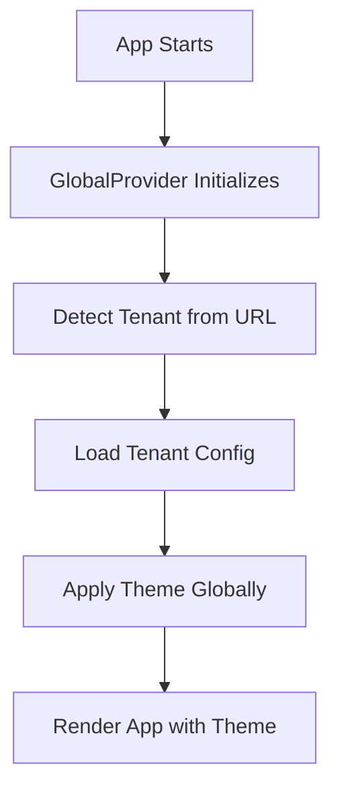
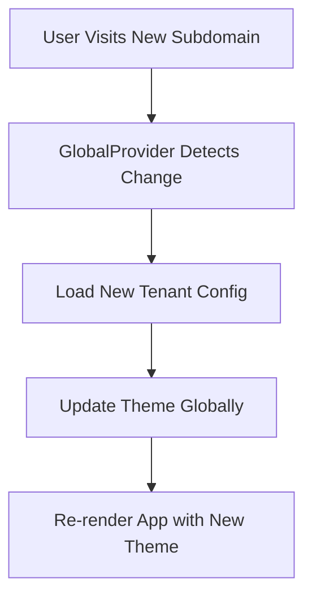

# 🏢 Multi-Tenant Architecture Documentation

This document explains the multi-tenant architecture implemented in the LuxGen platform, including theme management, tenant configuration, and global context workflow.

## 📁 Directory Structure

```
packages/db/src/tenant-config/
├── index.ts                    # Central export of all tenant configs
├── default.ts                  # Default configuration that all tenants extend
├── demo/
│   ├── index.ts               # Demo tenant configuration
│   └── tenant.ts              # Demo tenant database model
├── idea-vibes/
│   ├── index.ts               # Idea Vibes tenant configuration
│   └── tenant.ts              # Idea Vibes tenant database model
└── acme-corp/
    ├── index.ts               # ACME Corporation tenant configuration
    └── tenant.ts              # ACME Corporation tenant database model
```

## 🎨 Theme Management Architecture

### 1. Default Configuration (`default.ts`)

The `default.ts` file contains the base configuration that all tenants extend from:

```typescript
export const defaultTenantConfig: TenantConfig = {
  id: 'default',
  name: 'Default Company',
  subdomain: 'default',
  theme: {
    colors: { /* default colors */ },
    fonts: { /* default fonts */ },
    spacing: { /* default spacing */ },
    // ... other theme properties
  },
  branding: { /* default branding */ },
  features: { /* default features */ },
  settings: { /* default settings */ },
};
```

### 2. Tenant-Specific Configurations

Each tenant has its own folder with:
- `index.ts` - Configuration that extends the default
- `tenant.ts` - Database model and operations specific to that tenant

Example for Demo tenant:

```typescript
// demo/index.ts
import { mergeTenantConfig, TenantConfig } from '../default';

const demoConfig: Partial<TenantConfig> = {
  id: 'demo',
  name: 'Demo Company',
  subdomain: 'demo',
  branding: {
    logo: {
      src: '/logos/demo-logo.svg',
      alt: 'Demo Company Logo',
      text: 'LuxGen',
      href: '/',
    },
    // ... other branding overrides
  },
};

// Merge with default configuration
const demo: TenantConfig = mergeTenantConfig(demoConfig);
export default demo;
```

### 3. Configuration Merging

The `mergeTenantConfig` utility ensures that:
- All tenants inherit from the default configuration
- Only specified properties are overridden
- Deep merging is performed for nested objects
- Type safety is maintained

## 🌐 Global Context Management

### 1. GlobalProvider

The `GlobalProvider` manages the overall application state:

```typescript
export const GlobalProvider: React.FC<GlobalProviderProps> = ({ 
  children, 
  defaultTenant = 'demo' 
}) => {
  const [isInitialized, setIsInitialized] = useState(false);
  const [currentTenant, setCurrentTenant] = useState<string>(defaultTenant);
  const [tenantConfig, setTenantConfig] = useState<TenantConfig | null>(null);

  // Initialize global context
  useEffect(() => {
    const initializeGlobalContext = async () => {
      const detectedTenant = detectTenantFromUrl();
      const config = await loadTenantConfig(detectedTenant);
      
      setCurrentTenant(detectedTenant);
      setTenantConfig(config);
      setIsInitialized(true);
    };

    initializeGlobalContext();
  }, [defaultTenant]);

  return (
    <GlobalContext.Provider value={contextValue}>
      <TenantProvider defaultTenant={currentTenant}>
        <ThemeProvider initialTheme={tenantConfig.theme}>
          {children}
        </ThemeProvider>
      </TenantProvider>
    </GlobalContext.Provider>
  );
};
```

### 2. Tenant Detection

The system automatically detects tenants from:
1. **Subdomain**: `ideavibes.localhost:3000` → `idea-vibes` tenant
2. **Query Parameter**: `localhost:3000?tenant=idea-vibes` → `idea-vibes` tenant
3. **Fallback**: Default to `demo` tenant

### 3. Theme Application

The `ThemeProvider` applies themes globally through CSS custom properties:

```typescript
const applyTheme = (newTheme: TenantTheme) => {
  if (typeof window !== 'undefined') {
    const root = document.documentElement;
    
    // Apply color variables
    root.style.setProperty('--color-primary', newTheme.colors.primary);
    root.style.setProperty('--color-secondary', newTheme.colors.secondary);
    // ... other CSS variables
  }
};
```

## 🔄 Workflow

### 1. Application Initialization



### 2. Tenant Switching



### 3. Component Usage

```typescript
// In any component
import { useGlobalContext } from '@luxgen/ui';

const MyComponent = () => {
  const { currentTenant, tenantConfig, setTenant } = useGlobalContext();
  
  return (
    <div style={{ color: tenantConfig.theme.colors.primary }}>
      Current tenant: {currentTenant}
    </div>
  );
};
```

## 🎯 Key Features

### 1. **Inheritance-Based Configuration**
- All tenants extend from a default configuration
- Only override what's different
- Ensures consistency across tenants

### 2. **Global Theme Application**
- Themes are applied globally through CSS custom properties
- Instant theme switching without page reload
- Consistent styling across all components

### 3. **Automatic Tenant Detection**
- Subdomain-based detection for production
- Query parameter fallback for development
- Secure tenant validation

### 4. **Database Integration**
- Each tenant has its own database model
- Tenant-specific operations and settings
- Secure data isolation

## 🚀 Usage Examples

### Adding a New Tenant

1. **Create tenant folder**:
   ```bash
   mkdir packages/db/src/tenant-config/new-tenant
   ```

2. **Create configuration** (`new-tenant/index.ts`):
   ```typescript
   import { mergeTenantConfig, TenantConfig } from '../default';

   const newTenantConfig: Partial<TenantConfig> = {
     id: 'new-tenant',
     name: 'New Company',
     subdomain: 'new-tenant',
     theme: {
       colors: {
         primary: '#FF6B6B', // Custom color
       },
     },
     branding: {
       logo: {
         src: '/logos/new-tenant-logo.svg',
         text: 'New Company',
       },
     },
   };

   const newTenant: TenantConfig = mergeTenantConfig(newTenantConfig);
   export default newTenant;
   ```

3. **Create database model** (`new-tenant/tenant.ts`):
   ```typescript
   import { Schema, model, Document } from 'mongoose';

   export interface NewTenantDocument extends Document {
     tenantId: string;
     customSettings: any;
   }

   const newTenantSchema = new Schema<NewTenantDocument>({
     tenantId: { type: String, required: true, unique: true, default: 'new-tenant' },
     customSettings: { type: Schema.Types.Mixed }
   }, { timestamps: true });

   export const NewTenant = model<NewTenantDocument>('NewTenant', newTenantSchema);
   ```

4. **Export from main index**:
   ```typescript
   // packages/db/src/tenant-config/index.ts
   export { default as newTenant } from './new-tenant';
   ```

### Using Themes in Components

```typescript
import { useTheme } from '@luxgen/ui';

const ThemedComponent = () => {
  const { theme } = useTheme();
  
  return (
    <div 
      style={{
        backgroundColor: theme.colors.primary,
        color: theme.colors.surface,
        padding: theme.spacing.md,
        borderRadius: theme.borderRadius.md,
        boxShadow: theme.shadows.md,
      }}
    >
      Themed content
    </div>
  );
};
```

## 🔒 Security Considerations

1. **Tenant Isolation**: Each tenant has its own database model and operations
2. **Configuration Validation**: Only valid tenants can be loaded
3. **Secure Defaults**: Default configuration provides secure baseline
4. **Environment Separation**: Different configs for development/production

## 📝 Best Practices

1. **Always extend from default**: Use `mergeTenantConfig` for new tenants
2. **Use CSS custom properties**: Leverage global theme variables
3. **Validate tenant IDs**: Check tenant validity before loading
4. **Handle loading states**: Show loading UI during tenant detection
5. **Fallback gracefully**: Always have a default tenant fallback

## 🐛 Troubleshooting

### Common Issues

1. **Theme not applying**: Check if `ThemeProvider` is wrapping your app
2. **Tenant not detected**: Verify subdomain setup in `/etc/hosts`
3. **Configuration errors**: Ensure all required fields are provided
4. **Database errors**: Check tenant-specific model imports

### Debug Tools

```typescript
// Add to your app for debugging
const DebugPanel = () => {
  const { currentTenant, tenantConfig } = useGlobalContext();
  
  return (
    <div style={{ position: 'fixed', bottom: 0, right: 0, background: 'white', padding: '10px' }}>
      <div>Current Tenant: {currentTenant}</div>
      <div>Theme Primary: {tenantConfig.theme.colors.primary}</div>
    </div>
  );
};
```

This architecture provides a robust, scalable foundation for multi-tenant applications with proper theme management and global context workflow.
