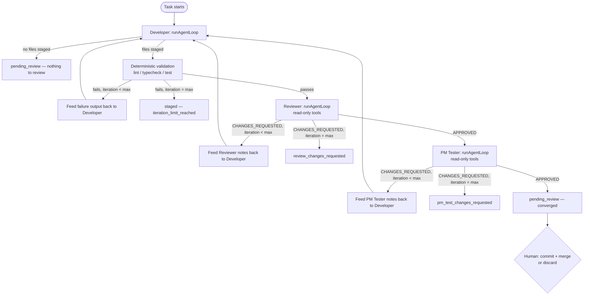

# Agent Orchestrator — Developer -> Reviewer -> PM Tester

**Status:** Implemented for headless tasks (`apps/agent-worker`). Interactive chat (`/agent`,
`apps/web/pages/api/agent/chat.ts`) is unchanged — a human in the chat IS the reviewer/tester
there, so the loop doesn't apply.
**Related docs:** [AGENT_STUDIO_ARCHITECTURE.md](./AGENT_STUDIO_ARCHITECTURE.md) (the pre-existing
single-agent architecture this extends), [technical/agent/AGENT_STUDIO.md](./technical/agent/AGENT_STUDIO.md),
[skills/ai-studio/SKILL.md](../skills/ai-studio/SKILL.md), role docs in [`.agents/`](../.agents/AGENTS.md).

---

## Why this exists

A single "write the code" prompt conflates three different questions: does it work, is it well
written and secure, and does it actually satisfy what was asked. Agent Studio already had a
Developer role (`runAgentLoop`) and a deterministic quality gate (the validation pipeline). What
it didn't have was a second opinion on code quality beyond what a linter catches, or any check
that the result matches the original request. This feature adds those two roles — Reviewer and
PM Tester — as a bounded loop around the existing Developer engine.

## Built by extension, not from scratch

Every primitive below already existed; this feature adds the loop that sequences them and the two
new role prompts:

| Already existed | Reused as |
| --- | --- |
| `runAgentLoop` (`core/orchestrator.ts`) | The execution engine for **all three** roles — Developer, Reviewer, and PM Tester differ only in system prompt (`prompts/system.ts` vs `prompts/roles.ts`) and `toolFilter` |
| `runValidationPipeline` (`validation/pipeline.ts`) | The deterministic half of "code review" — lint/typecheck/test, scoped to whichever `apps/*`/`packages/*` prefixes the staged files touch |
| `AgentSession` + session-store (`changeset/session-store.ts`) | State persistence across loop iterations — staged files already survive across separate `runAgentLoop` calls because they live in the session, not the LLM's context window |
| `appendAuditEntry` / `AgentAuditRecord` (`persistence/mongo.ts`, `@luxgen/db`'s `AgentAuditEntry`) | Extended with new `AuditAction` values for review/pm-test stages — same audit trail, more entries |
| `TaskStatus` on `AgentSession`/`AgentTask` | Extended with `reviewing` / `review_changes_requested` / `pm_testing` / `pm_test_changes_requested` |
| `commitStagedSession` / `mergeAgentBranch` (`git/service.ts`) | Unchanged — still the explicit, human-gated (or `AGENT_AUTO_MERGE`-gated) step after the loop reaches `pending_review` |
| `.github/workflows/ci.yml` | Still the repo-wide gate on the resulting PR — no new CI workflow added; see "CI/CD" below |

New code: `types/review.ts`, `prompts/roles.ts`, `core/diff.ts`, `core/roles.ts`,
`core/orchestrated-task.ts`, plus the `TaskStatus`/`AuditAction`/`AgentSession` extensions and
`.agents/*.md` human-readable role docs.

## The state machine



Implementation: `core/orchestrated-task.ts`'s `runOrchestratedTask`, called from
`queue/worker.ts`'s `processHeadlessJob`.

Bounded by `MAX_ORCHESTRATOR_ITERATIONS` (3, `config/limits.ts`). Each iteration is at most one
Developer call plus one deterministic validation pass plus up to two more LLM calls (Reviewer,
PM Tester) — so worst case is 3 Developer calls, 3 validation passes, and up to 6 review-role LLM
calls before the loop gives up and marks the task for a human. This is a deliberate, low ceiling:
a task that can't converge in 3 rounds needs a person to look at the prompt or split the task, not
more automated retries burning tokens.

## Cost control: front-load logic outside the LLM

Deterministic validation (lint/typecheck/test) always runs **before** either LLM review role, and
if it fails, neither Reviewer nor PM Tester is invoked that iteration — the failure output goes
straight back to the Developer. This means a broken build never costs a Reviewer or PM Tester
call; those two roles only ever see code that has already passed its own linter and test suite.

## Why a VERDICT line

Early designs for this kind of loop parse free text for words like "approved" or "looks good."
That's exactly the kind of ambiguity this system is built to avoid — a model can hedge, say
"mostly looks fine but," or bury a real objection in a paragraph a naive substring search misses.
Instead, both role prompts (`prompts/roles.ts`) require the response to end with exactly one line:

```
VERDICT: APPROVED
```
or
```
VERDICT: CHANGES_REQUESTED
```

`core/roles.ts`'s `parseVerdict` matches this with a strict regex. If the line is missing or
doesn't match, the result is `changes_requested` regardless of what the rest of the text says —
fail-safe, never auto-approved on an ambiguous response. This mirrors the "treat all agent output
as untrusted" principle: the loop should never advance past a checkpoint on a guess.

## Human-in-the-loop, unchanged

The loop converging to `pending_review` is a checkpoint, not a finish line. Exactly like the
pre-orchestrator pipeline, commit and merge remain explicit calls
(`commitStagedSession`/`mergeAgentBranch`) gated by `AGENT_AUTO_MERGE` — the orchestrator does not
grant itself merge rights it didn't already have. A human (or an explicitly configured auto-merge
policy, same env var as before) still approves the actual code change.

## CI/CD — no new workflow added

`.github/workflows/ci.yml` already runs oxlint, oxfmt, build, and tests on every PR to `main` —
including PRs an orchestrated task eventually produces once a human commits/merges its output.
Adding a second, orchestrator-specific GitHub Actions workflow would duplicate that gate for no
benefit, since the orchestrator itself isn't GitHub-Actions-triggered (it's a persistent worker
process listening on the existing Redis queue, per `AGENT_STUDIO_ARCHITECTURE.md`). The two
enforcement layers that matter are already in place:

1. **Per-session, before the loop can converge:** `runValidationPipeline` (scoped lint/typecheck/test
   on just the staged files' path prefixes).
2. **Repo-wide, before merge:** `ci.yml`, unchanged.

## Known limitation

`validation/pipeline.ts`'s `packages/agent` scope check runs a bare `npx tsc --noEmit`, not the
package's own tolerant build script (`scripts/tsc-tolerant.js`, which allows a tracked baseline of
pre-existing Mongoose 7.x type-definition errors). Verified manually while building this feature:
`packages/agent`'s cross-package type-check currently reports 16 pre-existing errors, all in
`packages/db/src/*` files unrelated to this change (confirmed zero errors in any file this feature
added or touched). Concretely, this means **any** orchestrated task that stages a change under
`packages/agent/` will currently fail its own deterministic validation step on pre-existing,
unrelated errors — not a regression this feature introduces, but a pre-existing gap it now makes
visible because it's the first thing to actually depend on that check passing. Fixing it (making
the validation pipeline call the tolerant script instead of bare `tsc`) is a separate, narrowly
scoped `fix/` PR — not bundled here per this repo's PR-splitting rule
(`.cursor/rules/pr-workflow.mdc`).

## Extending this

- **New role?** Add a prompt to `prompts/roles.ts`, a pass function to `core/roles.ts` (reuse
  `runRolePass`'s pattern), a stage to `core/orchestrated-task.ts`'s loop, and matching
  `TaskStatus`/`AuditAction` values (update both `packages/agent/src/types/task.ts` and the
  parallel `packages/db/src/agent-task.ts`/`agent-audit.ts` enums — they're intentionally
  duplicated, see that file's comments, keep them in sync by hand).
- **Different iteration bound per task type?** `MAX_ORCHESTRATOR_ITERATIONS` is currently a single
  global constant; making it per-task would mean threading a param through
  `RunOrchestratedTaskParams` rather than changing the constant.
- **Surfacing role notes in the UI?** `AgentSession.orchestration` (and the mirrored
  `AgentTask.orchestration` in Mongo) already holds the latest Reviewer/PM Tester `RoleReviewResult`
  including full `notes` text — `HeadlessTaskPanel.tsx` doesn't render it yet, that's a follow-up,
  not blocked on anything in this feature.
