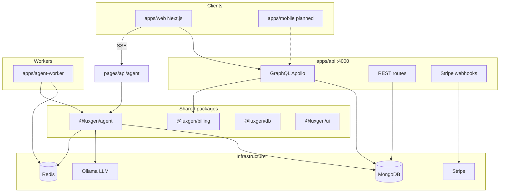

# LuxGen — System Architecture

> **Audience:** Architects, senior developers, AI agents planning cross-cutting changes.  
> **Companion:** [GRAPHQL_PLATFORM.md](./GRAPHQL_PLATFORM.md), [API_REFERENCE.md](./API_REFERENCE.md)

---

## 1. What LuxGen is

```
LuxGen = Multi-tenant LMS + Automation Engine + Billing + (Enterprise) AI Change Platform + Business Listings
```

Single GraphQL API (`apps/api`) serves web (`apps/web`), future mobile, and integrations. Multi-tenancy via subdomain / `x-tenant` header.

---

## 2. High-level diagram



---

## 3. Applications

| App | Port | Responsibility |
|-----|------|----------------|
| `apps/web` | 3000 | Admin, learner, agent UI, billing, automations, listings |
| `apps/api` | 4000 | GraphQL + REST + webhooks — **source of truth** |
| `apps/agent-worker` | — | Headless agent jobs from Redis queue |

---

## 4. Packages

| Package | Purpose |
|---------|---------|
| `@luxgen/db` | Mongoose models: User, Tenant, Course, Group, Automation, BusinessListing, TenantSubscription, … |
| `@luxgen/agent` | Agent orchestrator, git pipeline, validation, automation bridge, queue |
| `@luxgen/billing` | Plan tiers, feature gates, usage limits |
| `@luxgen/auth` | JWT helpers |
| `@luxgen/ui` | Shared React components, sidebar, layouts |
| `@luxgen/config` | Env utilities |
| `@luxgen/utils` | Pure helpers |

---

## 5. GraphQL domains

Registered in `apps/api/src/schema/index.ts`:

| Domain | Path | Persistence |
|--------|------|-------------|
| tenant | `schema/tenant/` | Tenant |
| user | `schema/user/` | User |
| course | `schema/course/` | Course |
| group | `schema/group/` | Group |
| dashboard | `schema/dashboard/` | Mixed / seed |
| userRole | `schema/userRole/` | User metadata |
| automation | `schema/automation/` | Automation, AutomationRun |
| billing | `schema/billing/` | TenantSubscription |
| marketplace | `schema/marketplace/` | AutomationTemplate, TenantUsageMonthly |
| listing | `schema/listing/` | BusinessListing, EmailNotificationLog |

**Rule:** New features ship GraphQL first. See [GRAPHQL_PLATFORM.md](./GRAPHQL_PLATFORM.md).

---

## 6. Agent Studio architecture

| Layer | Location |
|-------|----------|
| Package core | `packages/agent/src/` |
| Web API (thin) | `apps/web/pages/api/agent/*` |
| UI | `apps/web/pages/agent.tsx`, `components/agent/` |
| Worker | `apps/agent-worker/` |

**Flow:** Chat SSE → `runAgentLoop` → tools → JSON staging → validate → commit/merge (git mode) → automation bridge events.

Details: [AGENT_STUDIO_ARCHITECTURE.md](./AGENT_STUDIO_ARCHITECTURE.md), [AGENT_STUDIO.md](../AGENT_STUDIO.md).

---

## 7. Automations & marketplace

```
Trigger event → AutomationBridge (packages/agent) → match Automation docs → execute actions
GraphQL CRUD ← automationService ← MongoDB
Marketplace templates → installAutomationTemplate → Automation (paused)
```

Phase 10 adds usage metering via `TenantUsageMonthly` and plan limits from `@luxgen/billing`.

---

## 8. Billing & plan gates

| Layer | Location |
|-------|----------|
| Plan definitions | `packages/billing/src/plans.ts` |
| Feature gates | `packages/billing/src/gates.ts` |
| Stripe | `apps/api/src/services/billingService.ts` |
| GraphQL | `schema/billing/` |
| UI gates | `apps/web/components/billing/PlanGate.tsx` |

Gated features: automations (Pro+), analytics (Pro+), agentStudio (Enterprise).

---

## 9. Business listings (directory)

Separate from tenant SaaS billing — each **listing** has its own Stripe subscription.

| Concern | Service |
|---------|---------|
| Application workflow | `listingService.ts` |
| Emails | `listingNotificationService.ts` |
| Reminders | `listingReminderService.ts` + `POST /api/jobs/listing-reminders` |
| Stripe | `listingSubscriptionService.ts` (webhook metadata `listing_subscription`) |

Lifecycle: [LISTING_SUBSCRIPTION_LIFECYCLE.md](./LISTING_SUBSCRIPTION_LIFECYCLE.md).

---

## 10. Multi-tenancy

- Middleware: `apps/api/src/middleware/tenantRouting.ts`, `apps/web/middleware.ts`
- Header: `x-tenant` or subdomain → `demo`, `idea-vibes`
- Tenant plan in `Tenant.metadata.plan` + `TenantSubscription`

---

## 11. Data stores

| Store | Use |
|-------|-----|
| MongoDB | All persistent domain data |
| Redis | Agent job queue, optional automation pub/sub |
| `.agent-staging/` | Ephemeral agent file staging (dev) |
| `.agent-worktrees/` | Git worktrees per agent session |

---

## 12. External integrations

| Service | Config | Used by |
|---------|--------|---------|
| Stripe | `STRIPE_*` | SaaS billing + listing subscriptions |
| SendGrid | `SENDGRID_API_KEY` | Listing emails |
| Ollama | `OLLAMA_HOST` | Agent LLM |

---

## 13. Security model

- JWT auth: `@luxgen/auth`, `apps/api/src/middleware/auth.ts`
- Agent auth: `packages/agent/src/auth/`, `apps/web/lib/agent-auth.ts`
- Plan gates: GraphQL `requireFeature`, web `requirePlanFeature`
- Stripe webhooks: raw body route before JSON parser

---

## 14. Deployment topology (typical)

```
CDN → Next.js (web) → GraphQL API → MongoDB
                    → Redis ← agent-worker
Stripe webhooks → API /api/billing/webhook
Cron → POST /api/jobs/listing-reminders
```

See [CHECKLIST.md](../CHECKLIST.md) for environment validation.
