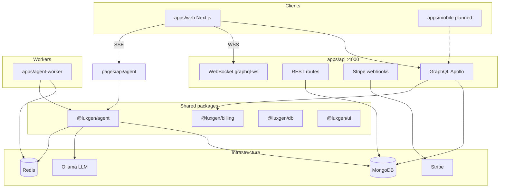

# LuxGen — System Architecture

> **Audience:** Architects, senior developers, AI agents planning cross-cutting changes.  
> **Companion:** [GRAPHQL_PLATFORM.md](./GRAPHQL_PLATFORM.md), [API_REFERENCE.md](./API_REFERENCE.md), [SECURITY_HARDENING.md](./SECURITY_HARDENING.md)

---

## 1. What LuxGen is

```
LuxGen = Multi-tenant LMS + Automation Engine + Billing + (Enterprise) AI Change Platform + Business Listings
```

Single GraphQL API (`apps/api`) serves web (`apps/web`), future mobile, and integrations. Multi-tenancy via subdomain / `x-tenant` header.

---

## 2. High-level diagram



---

## 3. Applications

| App                 | Port | Responsibility                                           |
| ------------------- | ---- | -------------------------------------------------------- |
| `apps/web`          | 3000 | Admin, learner, agent UI, billing, automations, listings |
| `apps/api`          | 4000 | GraphQL + REST + webhooks — **source of truth**          |
| `apps/agent-worker` | —    | Headless agent jobs from Redis queue                     |

---

## 4. Packages

| Package           | Purpose                                                                                          |
| ----------------- | ------------------------------------------------------------------------------------------------ |
| `@luxgen/db`      | Mongoose models: User, Tenant, Course, Group, Automation, BusinessListing, TenantSubscription, … |
| `@luxgen/agent`   | Agent orchestrator, git pipeline, validation, automation bridge, queue                           |
| `@luxgen/billing` | Plan tiers, feature gates, usage limits                                                          |
| `@luxgen/auth`    | JWT helpers                                                                                      |
| `@luxgen/ui`      | Shared React components, sidebar, layouts                                                        |
| `@luxgen/config`  | Env utilities                                                                                    |
| `@luxgen/utils`   | Pure helpers                                                                                     |

---

## 5. GraphQL domains

Registered in `apps/api/src/schema/index.ts`:

| Domain        | Path                    | Persistence                            |
| ------------- | ----------------------- | -------------------------------------- |
| tenant        | `schema/tenant/`        | Tenant                                 |
| user          | `schema/user/`          | User                                   |
| course        | `schema/course/`        | Course                                 |
| group         | `schema/group/`         | Group, GroupMember                     |
| dashboard     | `schema/dashboard/`     | Mixed / seed                           |
| userRole      | `schema/userRole/`      | User metadata                          |
| automation    | `schema/automation/`    | Automation, AutomationRun              |
| billing       | `schema/billing/`       | TenantSubscription                     |
| marketplace   | `schema/marketplace/`   | AutomationTemplate, TenantUsageMonthly |
| listing       | `schema/listing/`       | BusinessListing, EmailNotificationLog  |
| enrollment    | `schema/enrollment/`    | Enrollment                             |
| activityEvent | `schema/activityEvent/` | ActivityEvent                          |

**Rule:** New features ship GraphQL first. See [GRAPHQL_PLATFORM.md](./GRAPHQL_PLATFORM.md).

---

## 6. GraphQL context

`GraphQLContext` (`apps/api/src/context.ts`) is the single object available to every resolver:

```ts
interface GraphQLContext {
  req: Request;
  res: Response;
  user?: IUser; // populated by authMiddleware
  tenant?: string; // subdomain string (backward compat)
  tenantDoc?: ITenant; // full Tenant document — avoids per-service DB re-fetch
  tenantId?: string; // MongoDB ObjectId string
  authError?: AuthErrorCode;
}
```

**How `tenantId` is populated:**

- **HTTP requests:** `tenantRoutingMiddleware` resolves the tenant and sets `req.tenant` / `req.tenantId`. The `context()` function reads them directly — zero extra DB calls.
- **WebSocket connections:** `buildGraphQLContext` (called in the `graphql-ws` `context` hook) looks up the tenant from the `x-tenant` connection param exactly once at connect time.

**Services must read `context.tenantId`** rather than querying `Tenant.findOne({ subdomain })` themselves. This eliminates N redundant DB lookups per request that existed pre-hardening.

---

## 7. Request middleware stack (HTTP)

Order matters — do not reorder without understanding dependencies.

```
helmet()
cors()
POST /api/billing/webhook  ← raw body, before JSON parser
express.json()
express.urlencoded()
tenantRoutingMiddleware    ← resolves tenant, populates req.tenant + req.tenantId (30s cached)
tenantSecurityMiddleware   ← CORS origin + domain allowlist per tenant
tenantHeadersMiddleware    ← sets X-Tenant-* response headers (sanitized)
tenantBrandingMiddleware   ← sets res.locals.tenantCSS (sanitized, no customCSS injection)
tenantSecurityHeadersMiddleware  ← CSP (no unsafe-eval), security headers
tenantRateLimitMiddleware  ← per-tenant per-IP rate limiting (Redis-backed)
tenantAuthMiddleware       ← token/tenant cross-check
authMiddleware             ← JWT verification, populates req.user
REST routes
GraphQL (Apollo)
notFoundHandler
errorHandler
```

---

## 8. Tenant resolution & caching

**File:** `apps/api/src/middleware/tenantRouting.ts`

Resolution order per request:

1. Extract subdomain from `Host` header
2. Look up by custom domain if no subdomain match
3. Fall back to `x-tenant` header

**Caching (post-hardening):**

- **L1 — In-memory:** `Map<subdomain, { tenant, tenantId, fetchedAt }>` with 30s TTL. Per-process, zero latency.
- **L2 — Redis:** `luxgen:tenant:{subdomain}` key with 30s TTL. Shared across all API instances.
- **DB fallback:** only on cache miss.

**`lastActive` write:** debounced to once per 5 minutes per tenant to avoid a DB write on every request.

---

## 9. Rate limiting

Two layers of rate limiting, both Redis-backed with in-memory fallback when Redis is unavailable:

| Layer  | Scope             | Implementation                                                                                         |
| ------ | ----------------- | ------------------------------------------------------------------------------------------------------ |
| Login  | Per IP + email    | `apps/api/src/middleware/loginRateLimit.ts` — Redis `INCR + PEXPIRE`, in-memory fallback with eviction |
| Tenant | Per tenant per IP | `tenantRateLimitMiddleware` — Redis `INCR + PEXPIRE`, reports accurate `X-Rate-Limit-Remaining`        |

Shared Redis client: `apps/api/src/lib/redis.ts` (singleton, lazy connect, graceful on unavailability).

---

## 10. WebSocket / Subscriptions

**Protocol:** `graphql-ws` v5 (replaced the deprecated `subscriptions-transport-ws`).

**Server:** `apps/api/src/app.ts` uses `useServer` from `graphql-ws/lib/use/ws` mounted on the same HTTP server as Apollo.

**Client:** `apps/web/graphql/client.ts` uses `GraphQLWsLink` from `@apollo/client/link/subscriptions` + `createClient` from `graphql-ws`.

**Auth on connect:** `connectionParams` is a **function** (not a static object), so token and tenant are re-read from `localStorage` on every reconnect. This ensures refreshed or rotated tokens are always sent.

All subscriptions require authentication (`context` hook throws if `ctx.user` is falsy). There are no public subscriptions.

---

## 11. Agent Studio architecture

| Layer          | Location                                        |
| -------------- | ----------------------------------------------- |
| Package core   | `packages/agent/src/`                           |
| Web API (thin) | `apps/web/pages/api/agent/*`                    |
| UI             | `apps/web/pages/agent.tsx`, `components/agent/` |
| Worker         | `apps/agent-worker/`                            |

**Flow:** Chat SSE → `runAgentLoop` → tools → JSON staging → validate → commit/merge (git mode) → automation bridge events.

Details: [AGENT_STUDIO_ARCHITECTURE.md](./AGENT_STUDIO_ARCHITECTURE.md).

---

## 12. Automations & marketplace

```
Trigger event → AutomationBridge (packages/agent) → match Automation docs → execute actions
GraphQL CRUD ← automationService ← MongoDB
Marketplace templates → installAutomationTemplate → Automation (paused)
```

---

## 13. Billing & plan gates

| Layer            | Location                                   |
| ---------------- | ------------------------------------------ |
| Plan definitions | `packages/billing/src/plans.ts`            |
| Feature gates    | `packages/billing/src/gates.ts`            |
| Stripe           | `apps/api/src/services/billingService.ts`  |
| GraphQL          | `schema/billing/`                          |
| UI gates         | `apps/web/components/billing/PlanGate.tsx` |

**Key invariants (post-hardening):**

- `isBillingDevMode()` requires explicit `BILLING_DEV_MODE=true`. `NODE_ENV=development` no longer bypasses Stripe — a misconfigured production deploy cannot silently disable billing.
- `getEffectivePlan(tenantId)` accepts both a MongoDB ObjectId string and a subdomain string, resolving via `findById` first then `findOne({ subdomain })` fallback.
- Stripe client is a module-level singleton — not re-instantiated per webhook or billing call.
- Stripe webhook handler is idempotent: each event ID is recorded in Redis (`luxgen:stripe:processed:{id}`, 7-day TTL) and skipped on replay.

Gated features: automations (Pro+), analytics (Pro+), agentStudio (Enterprise).

---

## 14. Pagination contract

All list queries that accept cursor arguments use the Relay Connection spec.

**Implementation:** shared `paginate<T>()` helper in `apps/api/src/services/groupService.ts` (also the template for future list services).

```
paginate(Model, baseQuery, args, mapNode)
  → { edges, pageInfo { hasNextPage, hasPreviousPage, startCursor, endCursor }, totalCount }
```

Rules:

- Fetches `limit + 1` documents to correctly determine `hasNextPage` without a second count query.
- `hasPreviousPage` is `true` only when a cursor was supplied and records exist before the current page.
- Malformed cursors are rejected with `BAD_USER_INPUT` before hitting MongoDB.
- `totalCount` reflects the full collection matching `baseQuery` (pre-cursor), documented as "total records, not remaining".

---

## 15. Tenant isolation rules

Every service method that touches tenant-scoped data **must** satisfy all three:

1. **Read `context.tenantId`** from the GraphQL context — never call `Tenant.findOne({ subdomain })` inside a service.
2. **Scope all DB queries** with `{ tenant: tenantId }` or equivalent.
3. **For cross-entity operations** (e.g. reading members of a group): call `assertGroupBelongsToTenant(groupId, tenantId)` before any member query or mutation. This prevents cross-tenant data access via a valid ID from another tenant.

Enforced in: `GroupService` (`apps/api/src/services/groupService.ts`).

---

## 16. Business listings (directory)

Separate from tenant SaaS billing — each **listing** has its own Stripe subscription.

| Concern              | Service                                                                   |
| -------------------- | ------------------------------------------------------------------------- |
| Application workflow | `listingService.ts`                                                       |
| Emails               | `listingNotificationService.ts`                                           |
| Reminders            | `listingReminderService.ts` + `POST /api/jobs/listing-reminders`          |
| Stripe               | `listingSubscriptionService.ts` (webhook metadata `listing_subscription`) |

Lifecycle: [LISTING_SUBSCRIPTION_LIFECYCLE.md](./LISTING_SUBSCRIPTION_LIFECYCLE.md).

---

## 17. Data stores

| Store               | Use                                                                                         |
| ------------------- | ------------------------------------------------------------------------------------------- |
| MongoDB             | All persistent domain data                                                                  |
| Redis               | Agent job queue, tenant cache, rate limiting, Stripe event dedup, optional timeline pub/sub |
| `.agent-staging/`   | Ephemeral agent file staging (dev)                                                          |
| `.agent-worktrees/` | Git worktrees per agent session                                                             |

Redis is **optional** — the API starts and functions without it. All Redis-dependent paths fall back to in-process alternatives with reduced scalability guarantees.

---

## 18. External integrations

| Service  | Config             | Used by                              |
| -------- | ------------------ | ------------------------------------ |
| Stripe   | `STRIPE_*`         | SaaS billing + listing subscriptions |
| SendGrid | `SENDGRID_API_KEY` | Listing emails                       |
| Ollama   | `OLLAMA_HOST`      | Agent LLM                            |

---

## 19. Security model

| Concern                  | Implementation                                                                                                  |
| ------------------------ | --------------------------------------------------------------------------------------------------------------- |
| JWT auth                 | `@luxgen/auth`, `apps/api/src/middleware/auth.ts`                                                               |
| Per-tenant JWT keys      | `apps/api/src/utils/tenantKeys.ts`, `kid` header in JWT                                                         |
| GraphQL auth policy      | `apps/api/src/graphql/authPolicy.ts` — allowlist for public ops, everything else requires `assertAuthenticated` |
| Tenant isolation         | `assertGroupBelongsToTenant()` pattern — verify ownership before cross-entity reads/writes                      |
| Rate limiting            | Redis-backed per IP+email (login) and per tenant+IP (requests)                                                  |
| CSP                      | `tenantSecurityHeadersMiddleware` — no `unsafe-eval`, `object-src 'none'`, `base-uri 'self'`                    |
| Header injection         | All tenant-provided values passed through `sanitizeHeader()` before `res.set()`                                 |
| CSS injection            | Branding colors validated via allowlist regex; `customCSS` excluded from automatic response injection           |
| Stripe webhook integrity | `stripe.webhooks.constructEvent` + Redis idempotency guard per event ID                                         |
| Startup env check        | `apps/api/src/index.ts` validates `JWT_SECRET` and `MONGODB_URI` before accepting connections                   |
| Session management       | Client-side: tokens without `exp` are treated as expired; tenant mismatch triggers immediate redirect           |

Details: [SECURITY_HARDENING.md](./SECURITY_HARDENING.md)

---

## 20. Deployment topology (typical)

```
CDN → Next.js (web) → GraphQL API → MongoDB
                    ↕ WS (graphql-ws)
                    → Redis ← agent-worker
Stripe webhooks → API /api/billing/webhook
Cron → POST /api/jobs/listing-reminders
```

**Required env vars at startup:** `JWT_SECRET`, `MONGODB_URI` (hard fail if missing).  
**Optional:** `REDIS_URL` / `AGENT_REDIS_URL` (graceful degradation if absent).

See [DEVELOPER_GUIDE.md](./DEVELOPER_GUIDE.md) for local setup.
