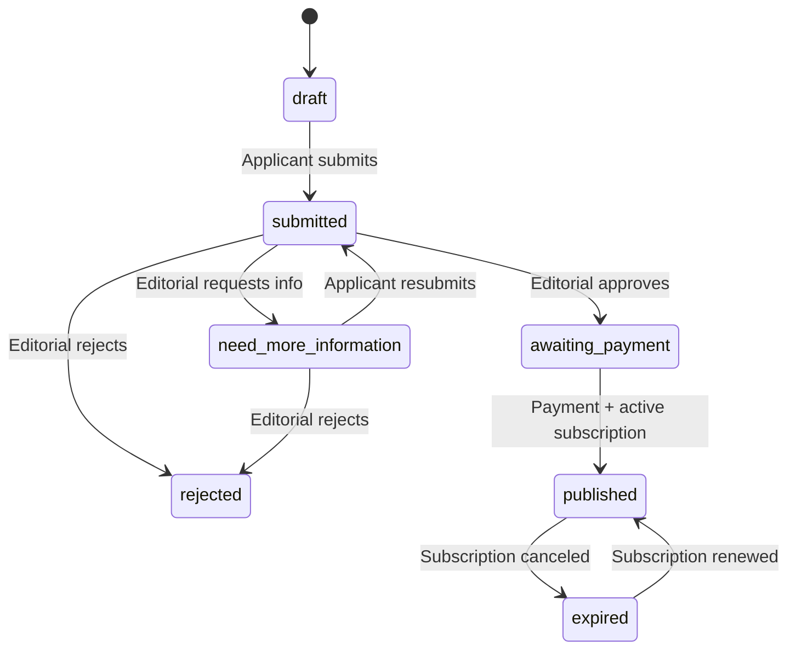

# Business Listing — Subscription & Email Lifecycle

> GraphQL-first listing applications with Stripe subscription gating and automated applicant communications.

---

## Lifecycle overview



---

## Subscription management

| Event | System behavior |
|-------|-----------------|
| **Active subscription** | `publicationStatus: published` — profile visible in directory. No editorial action required. |
| **Subscription canceled** | Profile removed from public view. `applicationStatus: expired`, `publicationStatus: expired`. **All data retained.** |
| **Subscription renewed** | Profile auto-republished. Previous business fields unchanged. |

Stripe webhooks (`metadata.type: listing_subscription`) drive publish/expire/republish via `listingSubscriptionService`.

---

## Automated emails

### Status notifications (immediate)

| Trigger | Template | When |
|---------|----------|------|
| Request info | `additional_information_requested` | Reviewer requests revisions |
| Approved | `application_approved` | Ready for payment |
| Rejected | `application_rejected` | Does not meet requirements |
| Payment | `payment_confirmation` | Published after successful payment |
| Cancel | `subscription_expiration` | Unpublished due to cancellation |

### Reminder campaigns (scheduled job)

| Campaign | Template | Default interval |
|----------|----------|------------------|
| Draft applications | `reminder_draft` | 3 days |
| Need more information | `reminder_need_more_information` | 2 days |
| Awaiting payment | `reminder_awaiting_payment` | 1 day |
| Expired listings | `reminder_expired_renewal` | 7 days |

Run reminders:

```bash
curl -X POST http://localhost:4000/api/jobs/listing-reminders \
  -H "Content-Type: application/json" \
  -H "x-jobs-key: $JOBS_API_KEY" \
  -d '{"tenantId":"demo"}'
```

Or GraphQL: `mutation { processListingReminders(tenantId: "demo") { sent } }`

---

## GraphQL API

```graphql
# Applicant
mutation {
  createListingDraft(input: {
    tenantId: "demo"
    applicantEmail: "alex@coaching.com"
    businessName: "Alex Coaching Co"
  }) { id applicationStatus }
  submitListingApplication(id: "...") { applicationStatus }
}

# Editorial
mutation {
  approveListing(id: "...") { applicationStatus }
  requestListingInformation(id: "...", notes: "Add credentials") { applicationStatus }
  rejectListing(id: "...", notes: "...") { applicationStatus }
}

# Payment
mutation {
  createListingCheckoutSession(
    listingId: "..."
    successUrl: "http://localhost:3000/listings/my?tenant=demo"
    cancelUrl: "http://localhost:3000/listings/my?tenant=demo"
  ) { url }
}
```

---

## Web routes

| Route | Audience |
|-------|----------|
| `/listings` | Public directory (published only) |
| `/listings/apply` | New application |
| `/listings/my` | Applicant status + pay/renew |
| `/admin/listings` | Editorial review queue |

---

## Configuration

| Variable | Purpose |
|----------|---------|
| `STRIPE_PRICE_LISTING` | Stripe price for listing subscription |
| `BILLING_DEV_MODE=true` | Simulate payment without Stripe |
| `EMAIL_PROVIDER=log` | Log emails to console (dev) |
| `EMAIL_PROVIDER=sendgrid` | Production email delivery |
| `WEB_APP_URL` | Links in email templates |

---

## Data retention

Listing documents are **never deleted** on expiration. Reactivation uses the same MongoDB document and republishes existing fields.

Email audit trail: `EmailNotificationLog` collection.

---

## Benefits (as designed)

- Reduces manual editorial follow-up via automated reminders
- Keeps applicants informed at every status change
- Encourages completion and renewals through timed campaigns
- Consistent communication via centralized templates
- Subscription state is the single source of truth for public visibility
