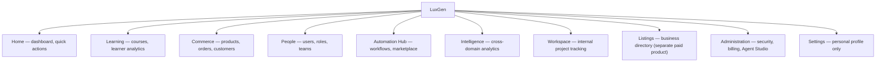

# LuxGen — Product Architecture (Domain Model)

> **Who reads this:** product, design, and engineers deciding where a new feature belongs.
> **Companion docs:** [MENU_STRUCTURE.md](./MENU_STRUCTURE.md) (the live nav tree — what this doc explains the *why* behind), [FEATURE_CATALOG.md](./FEATURE_CATALOG.md) (per-feature detail), [PAGE_FUNCTIONALITY_CHECKLIST.md](./PAGE_FUNCTIONALITY_CHECKLIST.md) (per-page detail), [AUTOMATION_HUB_STRATEGY.md](./AUTOMATION_HUB_STRATEGY.md) (Automation Hub deep dive), [BUSINESS_STRATEGY_2026.md](./BUSINESS_STRATEGY_2026.md) (why these domains, market-wise).
>
> **Scope of this pass:** this reorganizes the *sidebar and documentation* around business
> domains instead of code layers. It does **not** rename any URL — every route below is exactly
> what's live in `apps/web/pages` today. A full URL restructure (e.g. `/products` →
> `/storefront/products`) was considered and deliberately deferred — see "Why no URL changes"
> at the end of this doc.

---

## The domain model

LuxGen is organized around nine business domains. Each domain is a sidebar section
(`packages/ui/src/Layout/DefaultNavigation.tsx`'s `DEFAULT_SIDEBAR_SECTIONS`) and, loosely, a
GraphQL area in `apps/api/src/schema/`. Domains group *what a user is trying to do*, not which
package the code lives in.

| Domain | Sidebar section id | Real routes today | Owning GraphQL area |
| --- | --- | --- | --- |
| **Home** | `home` | `/dashboard` | `getDashboardData` |
| **Learning** | `learning` | `/courses`, `/courses/create`, `/courses/analytics`, `/courses/[id]`, `/courses/[id]/edit` | `courses` domain |
| **Commerce** | `commerce` | `/products*`, `/orders*`, `/admin/customers*` | `products`, `orders`, `customers` domains |
| **People** | `people` | `/organization/users`, `/organization/roles`, `/organization/groups` (+ `/groups/create`, `/groups/analytics`, `/groups/[id]*` — see note below) | `users`, `roles`, `groups` domains |
| **Automation Hub** | `automation-hub` | `/automations`, `/automations/tower*`, `/marketplace` | `automation`, `marketplace` domains |
| **Intelligence** | `intelligence` | `/analytics` | analytics resolvers |
| **Workspace** (internal) | `workspace` | `/project/iteration/*`, `/project/priority`, `/project/workflows` | internal project-tracking domain |
| **Listings** | `listings` | `/listings`, `/listings/my`, `/admin/listings` | `listings`/`marketplace` (business directory — a separate paid product, doesn't map cleanly onto the other domains, kept as its own top-level section) |
| **Administration** | `administration` | `/organization/security*`, `/organization/billing`, `/agent` | `security`, `billing`, agent/automation domains |
| **Settings** | `settings` | `/profile`, `/settings*` | user/profile domain |

## Why "People" includes Teams, not just Users/Roles

`/organization/groups` is the canonical list page for what the People domain calls "Teams" (label
renamed from "Groups" in the sidebar; **no route changed** — `/organization/groups` is still the
URL). That page links into `/groups/create`, `/groups/analytics`, `/groups/[id]`,
`/groups/[id]/edit`, `/groups/[id]/members` for the actual CRUD flows — this was verified by
reading the page's `router.push` calls, not assumed. `/groups/index.tsx` on its own is a
`@deprecated` server-redirect to `/organization/groups`, same pattern as `/users` →
`/organization/users` and `/billing` → `/organization/billing`. These three deprecated-stub
redirects were previously (incorrectly) flagged in `PAGE_FUNCTIONALITY_CHECKLIST.md` as
unresolved duplicate surfaces — they aren't; the redirect *is* the resolution. See that doc's
changelog note.

The one real, small bug found while verifying this: `/admin/users` redirected to `/users`, which
itself redirected to `/organization/users` — a needless double hop. Fixed to redirect straight to
`/organization/users`.

## Why "Automation Hub" and "Listings" stay separate from the rest

Automation Hub is called out as its own top-level domain (not folded into Administration) because
it's the platform's core differentiator — see `BUSINESS_STRATEGY_2026.md`'s core-vs-customization
model and `AUTOMATION_HUB_STRATEGY.md`. Listings (the business directory) is a separate paid
product with its own Stripe checkout and editorial review flow, unrelated to the LMS/commerce
domains a training business actually runs — it stays its own section rather than being awkwardly
merged into Commerce or Administration.

## Why "Settings" only has Profile

Per the domain model, Settings is *personal* (your profile, your notification preferences), not
tenant-wide. Tenant-wide configuration (branding, billing, security, SSO) lives in Administration.
Before this pass, the sidebar's "Settings" section additionally linked to `/organization/billing`
— the same URL Administration already links to. That duplicate sidebar entry was removed (the
underlying `/organization/billing` page is untouched; it just now has one sidebar entry instead of
two).

## Mapping to the monorepo

This domain model is a **navigation and documentation** grouping — it does not imply new
`apps/`/`packages/` boundaries. The existing structure (`apps/web` = all domains' UI, `apps/api` =
all domains' GraphQL, `apps/mobile` = Learning + Home today) is unchanged. See
`docs/technical/development/CODEBASE.md` for the technical map and
`docs/CROSS_PLATFORM_RESTRUCTURE.md` for the existing proposal on sharing presenter logic between
web and mobile as more domains reach mobile parity.

## Why no URL changes (this pass)

A full rename (`/products` → `/storefront/products`, `/organization/users` → `/people/users`,
etc.) was in scope for consideration but deliberately deferred:

- It touches every internal link, every presenter, GraphQL-adjacent redirect logic, the mobile
  app's deep links, and anything bookmarked externally (support tickets, saved links, browser
  history for existing users) — a large surface area to get right.
- It can't be meaningfully tested in this environment (no running dev server, no seeded
  tenant/DB, no way to click through the actual app) — shipping unverified route renames to a
  live product is exactly the kind of change that needs a staged rollout with redirects, not a
  single PR.
- The navigation/documentation reorganization in this PR already delivers the stated goal — menus
  and docs that make sense in business terms — without that risk.

If a full URL restructure is wanted later, do it as its own scoped `feat/` PR per
`.cursor/rules/pr-workflow.mdc`, with old-URL redirects shipped in the *same* PR as the new URLs
(never a bare rename), and a manual click-through test plan before merge.
