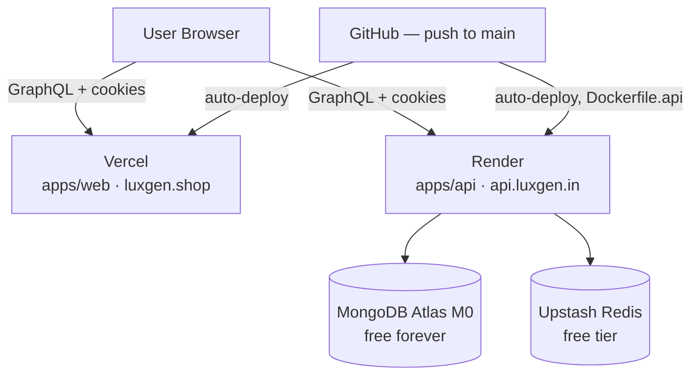

# Free stack v2: Render + Vercel (no VM, no SSH, no Oracle signup friction)

Replaces the Oracle Cloud plan (`docs/ORACLE_CLOUD_MIGRATION.md`) with an all-PaaS stack: nothing to SSH into, no server to patch, no swap/heap-ceiling tuning, no SSM. Both halves deploy on `git push` and both have real, current free tiers.

## Live right now

| Component | URL |
| --------- | --- |
| Web (Vercel) | https://luxgen-monorepo-web.vercel.app |
| API (Render) | https://luxgen-api.onrender.com |
| API docs (Swagger UI) | https://luxgen-api.onrender.com/api-docs |

Custom domains (`luxgen.shop` / `api.luxgen.in`) referenced elsewhere in this doc are the intended production domains, not yet cut over — both platforms are currently serving from their default `*.vercel.app` / `*.onrender.com` hostnames above. `render.yaml`'s `CORS_ORIGINS` already lists both the live Vercel URL and `luxgen.shop`, so the custom-domain cutover won't require a CORS change when it happens.

## Architecture

## Why Render instead of Oracle

No identity/card verification step — signup is GitHub OAuth, first deploy can land in minutes, which matters when you're up against a deadline. Trade-off, stated plainly: Render's free web services spin down after 15 minutes with no traffic and take about a minute to wake back up on the next request. That's a real UX cost (first request after idle is slow; a GraphQL subscription's open WebSocket also drops on spin-down and has to reconnect), but it doesn't block anything from working — it's a latency trade, not a functionality gap. If that cold start becomes a problem later, Render's paid tier ($7/mo) removes it, same price point as just paying for AWS would have been.

## Why not Render's own free Redis

Render's free Redis is 25MB — workable for light pub/sub message passing but tight, and this codebase's `activityPubSub.ts`/`timelineRedisBridge.ts` use Redis for realtime activity events across the app, not just a small cache. Upstash's free tier (256MB, no expiry, works with the existing `ioredis` client via a standard `redis://` or `rediss://` URL — no code change needed, only the connection string) is the better fit and doesn't tie the cache to whichever compute host runs the API, so it also survives any future host swap without a second migration.

## What changed in the codebase for this

`Dockerfile.api` (new, repo root) — Render's Docker builder has no way to target one stage of a multi-stage Dockerfile (confirmed: this has been an open Render feature request since 2021, still not implemented). The existing root `Dockerfile` ends at `runner-web` as its last stage, so pointing Render at it directly would build the wrong image. `Dockerfile.api` is a trimmed copy containing only the `base → deps → builder-api → runner-api` chain, kept in sync by hand with the root Dockerfile's equivalent stages — if one changes, check the other. It also switches the `HEALTHCHECK` from `curl` to `wget`: the original `runner-api` stage's `HEALTHCHECK CMD curl -f ...` relies on a binary that was never actually installed in the `node:18-alpine` base (Alpine doesn't ship curl by default) — BusyBox's built-in `wget` does ship by default, so this fixes a real (if previously untriggered — Docker's own `HEALTHCHECK` directive wasn't being relied on for the actual rollout decision, `scripts/deploy-api.sh`'s own `curl` loop was) latent bug while it was being touched anyway.

## Render service configuration

A `render.yaml` Blueprint is now checked into the repo root — in Render's dashboard, choose "New +" → "Blueprint", point it at this repo, and it reads the config automatically instead of setting each field by hand. It declares: Runtime `Docker`, Dockerfile Path `Dockerfile.api`, Docker Build Context `.` (repo root, so the build can see `apps/` and `packages/`), Health Check Path `/health`, Plan `free`.

Both `render.yaml` (root) and `deploy/platforms/render.yaml` also declare a `buildFilter` scoped to `apps/api/**`, `packages/**`, and the relevant Dockerfile — this is a monorepo, and without it every push to `main` (including a web-only or docs-only change) would trigger a full Docker rebuild here too. `render.yaml` itself is always honored by Render regardless of the filter. The Vercel side has the equivalent: `apps/web/vercel.json`'s `ignoreCommand: npx turbo-ignore` skips the build when nothing `apps/web` depends on changed since the last successful deploy.

Every secret in the Blueprint is marked `sync: false`, which means Render prompts you to type each value in on first deploy rather than reading it from the committed file — nothing sensitive lives in git.

**Verified against the actual codebase** (grepped every `process.env.*` read in `apps/api/src`), not guessed:

Required for the API to start and authenticate at all: `MONGODB_URI`, `JWT_SECRET`, `CORS_ORIGIN` (`https://luxgen.shop`), `NODE_ENV=production`, `PORT=4000`. `JWT_REFRESH_SECRET` is technically optional — `refreshToken.ts` falls back to `JWT_SECRET` if unset — but set it explicitly anyway so refresh tokens use a distinct signing key from access tokens, standard practice.

Required for the realtime activity feed (`timelineRedisBridge.ts`/`activityPubSub.ts`): `REDIS_URL` — the Upstash connection string, starting `rediss://`. `ioredis` (the client already in use) detects TLS straight from that URL scheme, so no code change was needed to swap in Upstash — confirmed by reading `apps/api/src/lib/redis.ts` directly, not assumed.

Optional, feature-gated, safe to leave unset (each one either no-ops or logs a warning rather than crashing if missing): `STRIPE_SECRET_KEY`/`STRIPE_WEBHOOK_SECRET`/`STRIPE_PRICE_LISTING` (billing), `SENDGRID_API_KEY`/`EMAIL_FROM`/`EMAIL_FROM_NAME` (transactional email), `JOBS_API_KEY` (internal jobs route), `TENANT_SUBDOMAINS` (defaults to `demo`), `LOGIN_RATE_LIMIT_MAX`/`LOGIN_RATE_LIMIT_WINDOW_MS`, `LOG_LEVEL`/`JSON_LOGS`, `APOLLO_INTROSPECTION`.

## Cutover plan

Same zero-downtime shape as the Oracle plan: stand up the Render service pointed at a temporary hostname, confirm `/health` and a real GraphQL query both return correctly, confirm login → refresh-token flow works end-to-end from the actual `luxgen.shop` frontend against it, then flip `api.luxgen.in`'s DNS record to Render's provided hostname (Render gives you a CNAME target, not a static IP — that's normal for a PaaS). Keep the EC2 instance running untouched until this is confirmed stable; it costs nothing extra to leave it up for the ~25 days left on the current AWS account regardless.
