# Tenant Layer — Superadmin Runbook

> **Audience:** Super admins, platform operators, architects debugging tenancy issues.  
> **Last updated:** 2026-06-20 (post PR #58)  
> **Related:** [MULTI_TENANT_ARCHITECTURE.md](../MULTI_TENANT_ARCHITECTURE.md), [SECURITY_HARDENING.md](./SECURITY_HARDENING.md), [tenant-keys.md](./tenant-keys.md), [GRAPHQL_PLATFORM.md](./GRAPHQL_PLATFORM.md)

This document explains **how tenant context is established, enforced, and debugged** across LuxGen. Use it when something “works on demo but not idea-vibes”, when login redirects with `tenant_mismatch`, or when CORS / GraphQL scope errors appear.

---

## 1. What is a “tenant” in LuxGen?

| Concept                  | Example                     | Where it lives                                                     |
| ------------------------ | --------------------------- | ------------------------------------------------------------------ |
| **Subdomain**            | `demo`, `idea-vibes`        | Browser host `demo.localhost:3000`, header `x-tenant: demo`        |
| **Mongo tenant id**      | `6a355d53668190e7d3d8e9e3`  | JWT payload `tenant`, GraphQL `tenantId` on many mutations         |
| **Tenant document**      | Full `ITenant` record       | MongoDB `tenants` collection via `@luxgen/db`                      |
| **Static tenant config** | Branding, theme defaults    | `packages/db/src/tenant-config/*`, `apps/api/src/config/tenants/*` |
| **Workflow config**      | Phase-7 automation security | `TenantConfigService` / `TenantWorkflow` in `@luxgen/shared`       |

**Golden rule:** The **browser host subdomain** is the source of truth for “which store am I on?”. The **JWT** is the source of truth for “which tenant does this user belong to?”. They must agree for a normal user session.

---

## 2. End-to-end request flow

```mermaid
sequenceDiagram
  participant Browser
  participant Next as Next.js (web)
  participant API as GraphQL API
  participant DB as MongoDB

  Browser->>Next: GET demo.localhost:3000/project
  Note over Next: middleware.ts adds ?tenant=demo
  Next->>Browser: SSR page + client bundle

  Browser->>Next: POST /api/graphql (Apollo)
  Note over Next: rewrite → localhost:4000/graphql
  Next->>API: POST /graphql + Origin + Authorization + x-tenant

  API->>API: cors (global + dev *.localhost)
  API->>API: tenantRoutingMiddleware (host or x-tenant → ITenant)
  API->>API: tenantSecurityMiddleware (per-tenant corsOrigins)
  API->>API: authMiddleware (JWT → req.user)
  API->>API: tenantAuthMiddleware (token tenant vs req.tenantId)
  API->>DB: resolver scoped by ctx.tenantId
  DB-->>API: tenant-scoped data
  API-->>Browser: JSON
```



### Web layer (`apps/web`)

| Step                | File                                 | Behaviour                                                                   |
| ------------------- | ------------------------------------ | --------------------------------------------------------------------------- |
| Host → subdomain    | `lib/tenant.ts`                      | `demo.localhost` → `demo`; bare `localhost` → `default`                     |
| Normalize for auth  | `lib/tenant-auth.ts`                 | `default` / `localhost` → `demo` for session checks                         |
| Next middleware     | `middleware.ts`                      | On `*.localhost`, injects `?tenant=<subdomain>`; `/` → `/dashboard`         |
| Session storage     | `lib/session.ts`                     | `authToken`, `currentUser`, `currentTenant` (legacy), `luxgen_user`         |
| GraphQL headers     | `graphql/client.ts`                  | `x-tenant` from **host** (`resolveRequestTenant()`), not stale localStorage |
| Auth gate           | `components/auth/AuthGuard.tsx`      | Protected routes validate token + host/session tenant match                 |
| Superadmin switcher | `SuperAdminTenantSwitchProvider.tsx` | Lists tenants via `GET_TENANTS`; **full navigation** to other subdomain     |

### API layer (`apps/api`)

Middleware order in `app.ts`:

1. `helmet` + **global CORS** (`getCorsOrigins()` + dev `*.localhost` via `isDevLocalOrigin()`)
2. `tenantRoutingMiddleware` — resolve tenant from Host subdomain, custom domain, or `x-tenant` header
3. `tenantSecurityMiddleware` — per-tenant `corsOrigins` + `allowedDomains`
4. `tenantHeadersMiddleware` / branding / rate limit
5. `tenantAuthMiddleware` — JWT tenant must match `req.tenantId`
6. `authMiddleware` — load user from JWT

GraphQL context (`context.ts`):

- `tenant` — subdomain string (`demo`)
- `tenantId` — Mongo ObjectId string
- `tenantDoc` — full `ITenant` when resolved from routing middleware

Tenant scope helper (`graphql/tenantScope.ts`):

- Accepts GraphQL `tenantId` arg as **subdomain or Mongo id**
- Resolves subdomain → Mongo id for DB queries (used by project resolvers)

---

## 3. Superadmin: what you can and cannot do

### What works today

| Capability                      | How                                                                                  |
| ------------------------------- | ------------------------------------------------------------------------------------ |
| See all tenants in nav          | `SuperAdminTenantSwitchProvider` + `GET_TENANTS` query (role `SUPER_ADMIN`)          |
| Switch tenant UI                | Dropdown → `window.location.href = getTenantUrl(subdomain, path)`                    |
| REST cross-tenant (some routes) | `requireTenantAccess` in `roleManagement.ts` bypasses tenant check for `SUPER_ADMIN` |

### Important limitation (architectural)

**Switching subdomain in the UI does not re-issue a JWT.** Your token is still bound to the tenant you logged into. On `idea-vibes.localhost` with a `demo` user session:

- `AuthGuard` / `isSessionTenantMismatch` → redirect to login with `reason=tenant_mismatch`
- API `tenantAuthMiddleware` may reject token vs resolved tenant

**Superadmin is not true cross-tenant impersonation yet** — it is navigation to another host, which expects a user session valid for that host’s tenant.

**Operational workaround:** Log in on each tenant subdomain separately, or use a dedicated superadmin account per tenant until impersonation ships.

---

## 4. Troubleshooting matrix (when something breaks)

| Symptom                                           | Likely cause                                   | Fix / check                                                                                                    |
| ------------------------------------------------- | ---------------------------------------------- | -------------------------------------------------------------------------------------------------------------- |
| `login?reason=tenant_mismatch`                    | Session tenant ≠ browser host                  | Use correct subdomain (`demo.localhost` not `localhost`); clear localStorage; re-login on target host          |
| `Not allowed by CORS` on `/graphql`               | Origin not in allowlist                        | Dev: use `*.localhost`; prod: set `CORS_ORIGINS` in API `.env`; avoid `127.0.0.1` if app uses `demo.localhost` |
| `Cannot find module vendor-chunks` / white screen | Corrupt `.next` (prod build mixed with dev)    | `make dev-clean-web`                                                                                           |
| GraphQL `Token is not valid for this tenant`      | `tenantId` variable vs `ctx.tenantId` mismatch | Pass Mongo id from `session.user.tenant.id` or subdomain (after #58 both work on project API)                  |
| `PLAN_UPGRADE_REQUIRED` on project                | Demo tenant on Free plan                       | Billing: upgrade tenant to Pro or use `setTenantPlanDev` in dev                                                |
| Tenant not found HTML page                        | Unknown subdomain / inactive tenant            | `scripts/init-tenants.js`, check Mongo `tenants` collection `status: active`                                   |
| Stale tenant after deploy                         | API in-memory cache (30s)                      | Wait or restart API; Redis cache key `luxgen:tenant:{subdomain}` TTL 30s                                       |

### Dev URLs (canonical)

| URL                                | Tenant                                                         |
| ---------------------------------- | -------------------------------------------------------------- |
| `http://demo.localhost:3000`       | `demo`                                                         |
| `http://idea-vibes.localhost:3000` | `idea-vibes`                                                   |
| `http://localhost:3000`            | Treated as `demo` in auth normalization (avoid for admin work) |

### Commands

```bash
make dev-stack-web      # Normal dev
make dev-clean-web      # Kill :3000/:4000, rm apps/web/.next, restart
make db-seed            # Re-seed if tenants/users missing
```

### Key localStorage keys (browser DevTools)

| Key             | Purpose                                                      |
| --------------- | ------------------------------------------------------------ |
| `authToken`     | JWT                                                          |
| `currentUser`   | Session user JSON (includes `tenant.id`, `tenant.subdomain`) |
| `currentTenant` | Legacy subdomain — **not** used for `x-tenant` anymore       |
| `luxgen_user`   | UI package mirror of user display fields                     |

---

## 5. Tenant lifecycle (how tenants are maintained)

```mermaid
flowchart LR
  subgraph bootstrap [Bootstrap]
    init[scripts/init-tenants.js]
    seed[API seedDatabaseIfEmpty]
  end
  subgraph runtime [Runtime]
    route[tenantRoutingMiddleware]
    cache[(Redis / in-memory 30s)]
    mongo[(MongoDB tenants)]
  end
  subgraph config [Configuration]
    static[tenant-config packages]
    apiCfg[apps/api/config/tenants]
    workflow[TenantWorkflow / billing plan]
  end

  init --> mongo
  seed --> mongo
  route --> cache --> mongo
  static --> Web UI theme
  apiCfg --> Security defaults per tenant file
  workflow --> Plan gates + feature flags
```

| Operation            | Script / location                                                                                      |
| -------------------- | ------------------------------------------------------------------------------------------------------ |
| Create seed tenants  | `npm run init:tenants` / `scripts/init-tenants.js`                                                     |
| Per-tenant JWT keys  | `TENANT_DEMO_KEY`, `TENANT_IDEA-VIBES_KEY` in `apps/api/.env` — see [tenant-keys.md](./tenant-keys.md) |
| Tenant list GraphQL  | `tenants` query → `tenantService`                                                                      |
| Plan / feature gates | `@luxgen/billing` + `requireFeature()` in resolvers                                                    |
| Branding             | `ITenant.settings.branding` + static overrides in UI                                                   |

---

## 6. Architectural assessment (honest)

### What is solid

- **Subdomain routing** with `x-tenant` fallback for API-direct calls (mobile, SSR proxy)
- **JWT per-tenant signing keys** (`TenantKeyManager`) — good isolation story
- **Layered API middleware** — routing → security → auth → tenant token match
- **Recent hardening (#57, #58)** — host-based `x-tenant`, `tenantScope` helper, dev CORS, `dev-clean-web`
- **Security doc** — [SECURITY_HARDENING.md](./SECURITY_HARDENING.md) defines service-level tenant scoping pattern

### Gaps / scalability risks

| Issue                                                                      | Risk                                       | Recommended direction                                                                                       |
| -------------------------------------------------------------------------- | ------------------------------------------ | ----------------------------------------------------------------------------------------------------------- |
| **Two meanings of `tenantId`** (subdomain vs Mongo id) across GraphQL args | Repeat of project-board bug on new domains | Enforce `resolveTenantIdForScope()` in all resolvers; GraphQL schema: `tenantSubdomain` vs `tenantId` types |
| **Multiple config sources** (Mongo, static files, TenantWorkflow)          | Drift: CORS in DB vs file vs env           | Single **TenantRegistry** read path: Mongo authoritative, files only for seed defaults                      |
| **Superadmin = URL hop, not impersonation**                                | Operators think switcher grants access     | Add `impersonateTenant` mutation + short-lived scoped token, audit log                                      |
| **Triple CORS** (Express, tenantSecurity, tenantWorkflow)                  | Confusing failures; duplicate headers      | One CORS policy module; tenant overrides as allowlist merge only                                            |
| **In-memory tenant cache per process**                                     | Stale tenant status under horizontal scale | Redis-only cache with pub/sub invalidation on tenant update                                                 |
| **GraphQL `context()` sync vs `buildGraphQLContext()` async**              | WS vs HTTP context drift                   | Unify on async context builder for all transports                                                           |
| **Build-time tenant** (`TENANT_BUILD_SYSTEM.md`) vs runtime Mongo          | Wrong branding in standalone Docker builds | Document when to use `select-tenant.js`; runtime theming from API for SaaS                                  |
| **No central tenant audit trail**                                          | Hard to answer “who changed tenant X?”     | Activity events for tenant settings + superadmin actions                                                    |

### Priority roadmap (supports business scale)

1. **Phase A — Consistency (in progress)**
   - `scopedTenantId()` + resolver coverage (automation, billing, course, user, enrollment, listing, marketplace, activity, project)
   - Web: `useTenantScope()` hook — `apps/web/lib/use-tenant-scope.ts`
   - [GRAPHQL_PLATFORM.md](./GRAPHQL_PLATFORM.md) — host-based `x-tenant` documented
   - Remaining: migrate commerce pages to `useTenantScope`, dashboard subdomain helper

2. **Phase B — Superadmin impersonation (feature PR)**
   - `POST /api/admin/impersonate { subdomain }` → 15m token, `act` claim, audit event
   - Switcher uses impersonation instead of naked redirect
   - Banner: “Viewing as idea-vibes (impersonating)”

3. **Phase C — Ops (chore PR)**
   - Tenant cache invalidation on `updateTenant`
   - Health dashboard: tenant count, lastActive, plan, CORS origins
   - Alert on repeated `tenant_mismatch` / CORS errors per tenant (log aggregation)

---

## 7. File index (quick navigation)

| Area                   | Path                                                                 |
| ---------------------- | -------------------------------------------------------------------- |
| Web host detection     | `apps/web/lib/tenant.ts`, `apps/web/lib/tenant-auth.ts`              |
| Web middleware         | `apps/web/middleware.ts`                                             |
| Apollo client          | `apps/web/graphql/client.ts`                                         |
| Session                | `apps/web/lib/session.ts`, `apps/web/lib/session-guard.ts`           |
| Superadmin switcher    | `apps/web/components/layout/SuperAdminTenantSwitchProvider.tsx`      |
| API routing            | `apps/api/src/middleware/tenantRouting.ts`                           |
| API security headers   | `apps/api/src/middleware/tenantHeaders.ts`                           |
| GraphQL context        | `apps/api/src/context.ts`, `apps/api/src/context/buildContext.ts`    |
| GraphQL tenant scope   | `apps/api/src/graphql/tenantScope.ts`                                |
| CORS config            | `packages/config/src/urls.ts` (`getCorsOrigins`, `isDevLocalOrigin`) |
| Tenant DB model        | `packages/db/src/tenant.ts`                                          |
| JWT keys               | `apps/api/src/utils/tenantKeys.ts`, `docs/tenant-keys.md`            |
| Role / superadmin REST | `apps/api/src/middleware/roleManagement.ts`                          |
| Dev reset              | `Makefile` target `dev-clean-web`                                    |

---

## 8. Case study: project board `tenant_mismatch` (fixed #58)

**What happened:** User logged in on `demo.localhost`, clicked Project. Redirect to login with `tenant_mismatch`.

**Root cause chain:**

1. `ProjectProvider` sent GraphQL variable `tenantId: "demo"` (subdomain)
2. Project resolver compared `"demo"` to `ctx.tenantId` (Mongo ObjectId) → FORBIDDEN
3. Apollo error link mapped message to `tenant_mismatch` and cleared session

**Fix:**

- API: `resolveTenantIdForScope()` accepts subdomain or Mongo id
- Web: `useAppTenantId()` prefers session Mongo id
- Session guard: do not treat scope errors as session tenant mismatch

**Lesson for superadmin:** Always check **both** subdomain and Mongo id when reading GraphQL network tab.

---

## 9. Checklist after tenant-related incidents

- [ ] Confirm browser URL subdomain matches user’s `currentUser.tenant.subdomain`
- [ ] Inspect GraphQL request headers: `Authorization`, `x-tenant`
- [ ] Inspect mutation/query variables: `tenantId` format
- [ ] Check API logs for CORS vs `tenantAuthMiddleware` vs resolver `FORBIDDEN`
- [ ] Verify tenant `status: active` in MongoDB
- [ ] Verify plan gate if feature-specific (`PLAN_UPGRADE_REQUIRED`)
- [ ] If frontend broken after push: `make dev-clean-web`
- [ ] If new tenant: run init script + add `TENANT_<SUBDOMAIN>_KEY` to API env

---

_For theme/branding architecture see [MULTI_TENANT_ARCHITECTURE.md](../MULTI_TENANT_ARCHITECTURE.md). For security invariants when adding APIs see [SECURITY_HARDENING.md](./SECURITY_HARDENING.md)._
