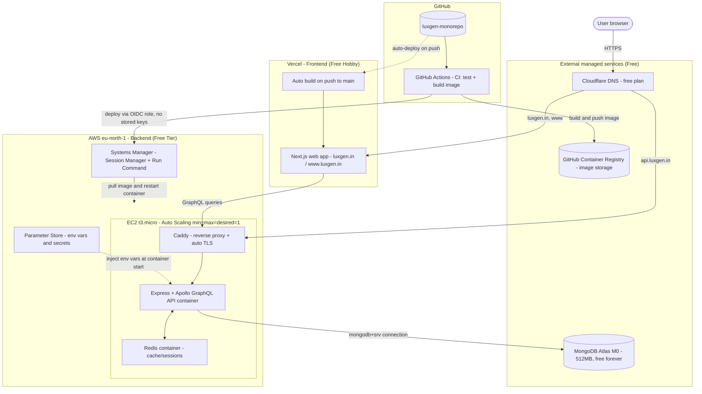

# LuxGen — Well-Architected, Free-Tier Hosting Stack

This document lays out a hybrid architecture for LuxGen that splits the frontend and backend across the services that host each best for free, while keeping the backend on AWS to match the original "secure, standard, scalable, AWS-based" brief. The guiding principle: prefer services with a genuinely permanent free tier over ones with a 12-month countdown, and only pay the operational cost of self-managed infrastructure (EC2 + Docker) where it actually buys something — full control over the API and database connectivity.

## Architecture diagram



## What each piece does and why

**Vercel hosts the Next.js frontend.** Connecting the GitHub repo gives push-to-deploy on `main` and an automatic preview URL on every pull request, with no Docker build, no server, and no SSM session to babysit. This removes the least reliable part of the stack we were fighting (Next.js builds on a 1GB instance) entirely. The Hobby plan is free indefinitely, not a 12-month trial — the only catch is its terms restrict it to non-commercial use, worth revisiting if LuxGen starts generating direct revenue.

**EC2 t3.micro (in an Auto Scaling Group of exactly one instance) hosts the API.** This keeps the backend AWS-native and under full control, matching the original brief. The ASG's `min=max=desired=1` setting makes it self-healing: if the instance is terminated or fails a health check, AWS replaces it automatically. `Redis` runs alongside the API in its own container for caching and session data — lightweight enough to coexist with the API on a 1GB instance now that MongoDB is no longer running locally.

**MongoDB Atlas (M0 free tier)** replaces a self-hosted Mongo container. 512MB storage, genuinely free forever (not a trial), and it removes the heaviest single process from the EC2 instance's memory budget — this was the single biggest fix for the RAM pressure we hit during earlier build attempts.

**Caddy** replaces nginx + manual certbot for TLS termination in front of the API. Caddy requests and renews Let's Encrypt certificates automatically with a three-line config file — no cron job, no manual renewal step to forget about six months from now.

**Cloudflare (free plan)** handles DNS instead of Route 53. Route 53 charges roughly $0.50/month per hosted zone — small, but it breaks the "fully free" goal for no real benefit here. Cloudflare's free plan has no such charge and includes optional CDN/proxying if you want it later.

**GitHub Actions + GitHub Container Registry (GHCR)** build the API's Docker image in CI (on GitHub's runners, not the memory-constrained EC2 box) and store it in GHCR, which is free for the image sizes an app like this needs. Deploying then becomes: SSM Run Command tells the EC2 instance to `docker pull` the freshly built image and restart the container — no compiling ever happens on the instance itself. This is the fix for the multi-minute stuck builds we hit earlier; it moves compilation off the free-tier hardware entirely.

**IAM OIDC federation** lets GitHub Actions assume an AWS role for the deploy step without storing any long-lived AWS access keys as GitHub secrets — the credential is issued per-run and expires automatically.

## Cost and durability breakdown

| Component | Service | Free tier | Expires? |
|---|---|---|---|
| Frontend hosting | Vercel Hobby | 100GB bandwidth, 1M invocations, 100 build min/mo | No (non-commercial use only) |
| Backend compute | EC2 t3.micro | 750 instance-hours/month | Yes — 12 months from account creation |
| Database | MongoDB Atlas M0 | 512MB storage | No — free forever |
| Cache | Redis (self-hosted on EC2) | Uses EC2's own resources | Tied to EC2's tier |
| DNS | Cloudflare Free | Unlimited queries | No |
| TLS certificates | Let's Encrypt (via Caddy) | Unlimited, auto-renewing | No |
| CI/CD | GitHub Actions | 2,000 min/month (private repo) | No |
| Image registry | GHCR | Free for typical image sizes | No |
| Monitoring | CloudWatch basic | 10 custom metrics, basic alarms | Partially — some limits drop after 12 months, basic monitoring continues |

EC2 is the one piece on a real clock. When that 12-month window closes, the practical options are: pay the (small, ~$7-8/month) on-demand t3.micro rate, or migrate the API to AWS Lambda + API Gateway, which has an Always Free tier (1M requests + 400,000 GB-seconds/month) that never expires — a good candidate for a follow-up migration well before the EC2 clock runs out.

## Reference code

### GitHub Actions: build, push, and deploy the API

```yaml
# .github/workflows/deploy-api.yml
name: CI/CD - API

on:
  push:
    branches: [main]
    paths:
      - 'apps/api/**'
      - 'packages/**'
      - 'Dockerfile'
      - 'docker-compose.prod.yml'

permissions:
  id-token: write   # required for OIDC - no stored AWS keys
  contents: read
  packages: write   # push to GHCR

jobs:
  build-and-deploy:
    runs-on: ubuntu-latest
    steps:
      - uses: actions/checkout@v4

      - uses: docker/setup-buildx-action@v3

      - name: Log in to GHCR
        uses: docker/login-action@v3
        with:
          registry: ghcr.io
          username: ${{ github.actor }}
          password: ${{ secrets.GITHUB_TOKEN }}

      - name: Build and push api image
        uses: docker/build-push-action@v5
        with:
          context: .
          file: ./Dockerfile
          target: runner-api
          push: true
          tags: |
            ghcr.io/${{ github.repository }}/luxgen-api:${{ github.sha }}
            ghcr.io/${{ github.repository }}/luxgen-api:latest
          build-args: |
            TENANT=demo

      - name: Configure AWS credentials via OIDC
        uses: aws-actions/configure-aws-credentials@v4
        with:
          role-to-assume: arn:aws:iam::501970550497:role/github-actions-deploy
          aws-region: eu-north-1

      - name: Deploy to EC2 via SSM Run Command
        run: |
          aws ssm send-command \
            --instance-ids i-09671064a03e91562 \
            --document-name "AWS-RunShellScript" \
            --parameters '{"commands":["cd /opt/luxgen && docker compose -f docker-compose.prod.yml pull api && docker compose -f docker-compose.prod.yml up -d api"]}' \
            --region eu-north-1
```

Adopting this means changing the `api` service in `docker-compose.prod.yml` from `build:` to `image: ghcr.io/<org>/luxgen-monorepo/luxgen-api:latest` once the registry is in place — noted here as the next step, not yet wired into the current deploy.

### Caddy: automatic TLS, replacing nginx + certbot

```
# Caddyfile
api.luxgen.in {
    reverse_proxy api:4000
}
```

```yaml
# docker-compose.prod.yml - replacing the nginx service
caddy:
  image: caddy:2-alpine
  container_name: luxgen-caddy-prod
  restart: unless-stopped
  ports:
    - '80:80'
    - '443:443'
  volumes:
    - ./Caddyfile:/etc/caddy/Caddyfile:ro
    - caddy_data:/data
  depends_on:
    - api
  networks:
    - luxgen-prod-network
```

Caddy requests and renews the Let's Encrypt certificate for `api.luxgen.in` automatically on first request — no certbot container, no renewal cron job.

### DNS records (Cloudflare free plan)

| Type | Name | Value |
|---|---|---|
| A | `api` | EC2 instance's public IP (or Elastic IP) |
| CNAME | `@` / `www` | Vercel's provided target (shown in Vercel's domain settings) |

## Suggested next steps

Move the web app's Vercel deploy in parallel with finishing the current EC2 API deploy — the two don't block each other. Once the API is live and stable, wire up the GitHub Actions + OIDC deploy path above to stop building on the EC2 instance entirely. Revisit Caddy vs. the existing nginx setup once there's spare time — not urgent while the current deploy is still in progress. Keep the EC2 12-month expiry date on a calendar and plan the Lambda migration a few weeks ahead of it, not the week it lapses.
