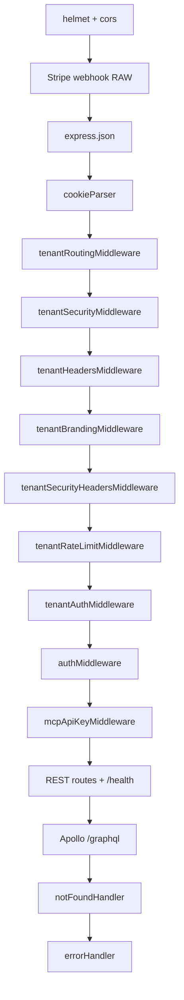

# app.ts — Deep Analysis (Hand-enriched)

## File Path

`apps/api/src/app.ts` (166 lines)

## Purpose

**Express application factory** for the LuxGen API server. Composes:

- Security middleware (helmet, CORS)
- Tenant resolution pipeline
- Authentication (JWT + MCP API key)
- REST route mounts
- Apollo GraphQL HTTP + WebSocket subscriptions

**Entry:** `index.ts` calls `createAppServer()` → listens on port 4000.

## Exports

| Export | Lines | Role |
|--------|-------|------|
| `createAppServer` | 114–147 | Async factory → `http.Server` |
| `stopAppServer` | 149–163 | Graceful shutdown (WS + HTTP + Apollo) |
| `app` | 165 | Raw Express instance (tests) |

## Middleware order (CRITICAL for interviews)



### Why order matters

| Rule | Reason |
|------|--------|
| Stripe **before** `express.json` | Webhook needs raw body for signature verification |
| Tenant **before** auth | JWT validation needs resolved `tenantId` |
| `errorHandler` **last** | Catches all upstream errors |

**Classic interview trap:** "What breaks if `express.json()` comes before Stripe webhook?" → Signature verification fails.

---

## Function-Level Analysis

### CORS callback — Lines 44–54

| | |
|--|--|
| **Inputs** | `origin` header |
| **Outputs** | Allow or `Error('Not allowed by CORS')` |
| **Logic** | Allow if no origin, dev localhost patterns, or `getCorsOrigins()` whitelist |
| **credentials: true** | Cookies/auth headers cross-origin |

---

### `startApollo` — Lines 107–112

| | |
|--|--|
| **Async** | `await apolloServer.start()` required in Apollo Server 3+ |
| **Mounts** | `/graphql` on same Express app |
| **Errors** | `formatError` logs via `logger` |

---

### `createAppServer` — Lines 114–147

**Lifecycle:**

1. `startApollo()` — attach GraphQL middleware
2. `createServer(app)` — Node HTTP server
3. `WebSocketServer` on same path as GraphQL
4. `useServer` from `graphql-ws` — subscription context

**WebSocket auth — Lines 127–136:**

```typescript
context: async (ctx) => {
  const params = ctx.connectionParams;
  const gqlCtx = await buildGraphQLContext({
    headers: {
      authorization: params.authorization ?? '',
      'x-tenant': params['x-tenant'] ?? '',
    },
  });
  if (!gqlCtx.user) throw new Error('Authentication required');
  return gqlCtx;
}
```

**Interview:** How do subscriptions authenticate?  
**Answer:** `connectionParams` carry same headers as HTTP; `buildGraphQLContext` reuses logic.

---

### `stopAppServer` — Lines 149–163

- Dispose WS cleanup
- Close HTTP server
- `apolloServer.stop()`
- **Used in:** tests, graceful deploy shutdown

---

## REST routes mounted

| Prefix | Module |
|--------|--------|
| `/api/auth` | Login, register, token |
| `/api/admin` | Admin operations |
| `/api/tenant` | Branding, settings |
| `/api/billing` | Stripe checkout |
| `/api/notifications` | Notification feed |
| `/api/security` | SAML, security settings |
| `/api/commerce` | Commerce webhooks |

GraphQL remains primary BFF for `apps/web`.

---

## GraphQL vs REST split

| Use REST | Use GraphQL |
|----------|-------------|
| Stripe webhooks (raw body) | Page data queries |
| Health checks | Mutations with typed schema |
| File upload (if any) | Subscriptions |

---

## Performance & scale

| Concern | Current | Scale-up |
|---------|---------|----------|
| Single Node process | ✅ dev/small prod | PM2 cluster / K8s replicas |
| WS subscriptions | In-memory | Redis pub/sub adapter |
| Rate limit | `tenantRateLimitMiddleware` | Redis-backed limiter |
| Body limit | 10mb | Tune per route |

---

## Interview questions

| Level | Question |
|-------|----------|
| Easy | What is middleware? |
| Medium | Why tenant middleware before auth? |
| Hard | Design zero-downtime deploy with open WebSockets |
| System | How would you split this into microservices? |

## Possible improvements

1. Extract middleware registration to `registerMiddleware(app)` for tests
2. OpenAPI spec for REST routes
3. GraphQL query depth/complexity limits
4. Separate WS server process

## Senior review

- **Would FAANG approve?** Structure yes; needs explicit rate-limit + authz matrix docs
- **Production gap:** `formatError` may leak paths in dev — ensure prod sanitization

## Related

- [packages-db-src-tenant-ts.md](./packages-db-src-tenant-ts.md) — tenant document resolved by middleware
- [interview-prep/05-node.md](../interview-prep/05-node.md)
- [interview-prep/07-api.md](../interview-prep/07-api.md)
- [interview-prep/08-system-design.md](../interview-prep/08-system-design.md)
