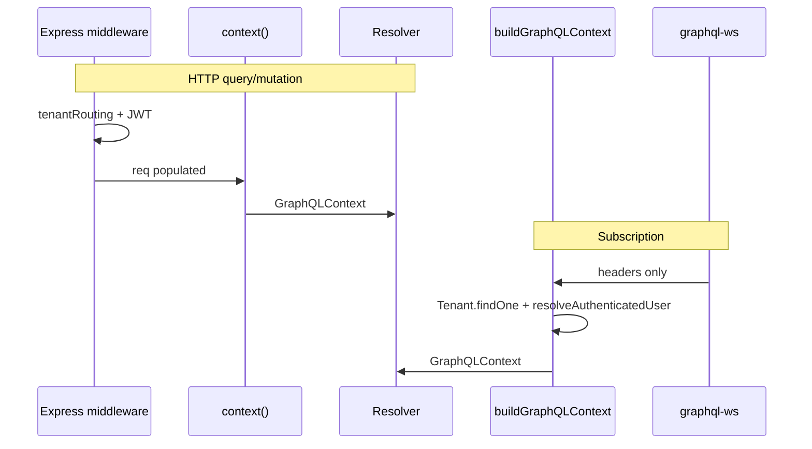

# context.ts — Deep Analysis (Hand-enriched)

## File Path

`apps/api/src/context.ts` (37 lines) + `apps/api/src/context/buildContext.ts` (43 lines)

## Purpose

**GraphQL request context factory** — the object every resolver receives as the third argument (`(_, args, context)`). Bridges Express middleware (`req.user`, `req.tenant`, …) into a typed `GraphQLContext` for Apollo Server.

Two entry points:

| Function | When used |
|----------|-----------|
| `context()` | HTTP GraphQL — middleware already populated `req` |
| `buildGraphQLContext()` | WebSocket subscriptions, tests, scripts — no full Express stack |

**Why it exists:** Resolvers need tenant scope, authenticated user, and auth error codes without re-parsing JWT on every field.

## Exports

| Export | Kind |
|--------|------|
| `GraphQLContext` | Interface — contract for all resolvers |
| `context` | Sync factory from Express `req`/`res` |
| `buildGraphQLContext` | Async factory with DB fallback |

---

## GraphQLContext fields

```typescript
export interface GraphQLContext {
  req: Request;
  res: Response;
  user?: IUser;
  tenant?: string;           // subdomain string (legacy resolver API)
  tenantDoc?: ITenant;       // full document from tenantRoutingMiddleware
  tenantId?: string;         // Mongo ObjectId string — authorization scope
  authError?: AuthErrorCode;
  mcpApiKey?: VerifiedMcpApiKey;
}
```

| Field | Source | Interview note |
|-------|--------|----------------|
| `tenant` | `req.subdomain` → `req.tenant.subdomain` → `x-tenant` → `'demo'` | **String subdomain**, not Mongo id |
| `tenantId` | `req.tenantId` from `tenantRoutingMiddleware` | Use for DB queries |
| `tenantDoc` | `req.tenant` | Branding, settings without extra lookup |
| `user` | `req.user` (JWT middleware) | `undefined` = guest |
| `authError` | `req.authError` | Why login failed without throwing |
| `mcpApiKey` | MCP REST auth | Agent/tooling paths |

---

## `context()` — Lines 21–34

```typescript
export const context = ({ req, res }: { req: Request; res: Response }): GraphQLContext => {
  const tenantSubdomain = req.subdomain || req.tenant?.subdomain || req.get('x-tenant') || 'demo';
  return {
    req, res,
    user: req.user,
    tenant: tenantSubdomain,
    tenantDoc: req.tenant,
    tenantId: req.tenantId,
    authError: req.authError,
    mcpApiKey: req.mcpApiKey,
  };
};
```

| Property | Detail |
|----------|--------|
| **Sync** | No DB — assumes `tenantRoutingMiddleware` ran first |
| **Fallback `'demo'`** | Matches web `normalizeTenantSubdomain` |
| **Pure mapping** | O(1); no side effects |

**Middleware order in `app.ts`:** tenant routing → JWT auth → GraphQL handler. Context only reads what middleware wrote.

---

## `buildGraphQLContext()` — buildContext.ts

Used when Express middleware did **not** run (subscriptions, integration tests).

### Tenant resolution — Lines 8–21

```typescript
let tenantDoc = req.tenant;
let tenantId = req.tenantId;
if (!tenantDoc && tenantSubdomain) {
  const found = await Tenant.findOne({ subdomain: tenantSubdomain, status: 'active' }).lean();
  if (found) {
    tenantDoc = found;
    tenantId = found._id.toString();
  }
}
```

| Concern | Behavior |
|---------|----------|
| Missing tenant | `tenantId` stays `undefined` — resolvers must handle |
| Suspended tenant | Filtered by `status: 'active'` — fail closed |
| Performance | `.lean()` — plain object, no Mongoose document overhead |

### Auth resolution — Lines 23–31

```typescript
const token = headers.authorization?.replace('Bearer ', '');
if (token) {
  const resolved = await resolveAuthenticatedUser(token);
  user = resolved.user;
  authError = resolved.authError;
}
```

Delegates to `resolveAuthenticatedUser` — verifies JWT, loads `User` from Mongo, checks tenant match.

---

## HTTP vs WebSocket flow



**Interview:** Why two paths? WebSocket upgrade may not replay full middleware chain; `buildGraphQLContext` duplicates critical resolution.

---

## Resolver patterns (how to use context)

```typescript
// ✅ Scope query to tenant
await Course.find({ tenantId: context.tenantId });

// ✅ Require login
if (!context.user) throw new AuthenticationError('Login required');

// ❌ Wrong — subdomain is not tenant id
await Course.find({ tenantId: context.tenant });
```

**JWT tenant claim** must match `context.tenantId` — enforced in `tenantRoutingMiddleware` (see `tenant.ts` analysis).

---

## Auth error vs throw

`authError` on context allows **login mutation** to return structured errors (`INVALID_CREDENTIALS`, `TENANT_MISMATCH`) while other resolvers use `user` presence.

| Pattern | Use |
|---------|-----|
| `context.user` undefined | Guest or invalid token |
| `context.authError` set | Token present but rejected (explain why) |

---

## Security notes

1. **Never trust `x-tenant` alone** — JWT `tenant` claim must match resolved `tenantId` (middleware does this on HTTP).
2. **`buildGraphQLContext` on WS** — must repeat tenant + token validation; subscription resolvers inherit same rules.
3. **MCP API key** — separate auth path; resolvers checking `user` should also consider `mcpApiKey` where applicable.

---

## Possible improvements

1. Unify `context()` and `buildGraphQLContext` — HTTP path could call async builder with `req.tenant` pre-set
2. Type `tenant` as branded `Subdomain` vs `tenantId` as `ObjectId` string — prevent swap at compile time
3. Cache `Tenant.findOne` per request id in AsyncLocalStorage for WS bursts
4. Deprecate `tenant` string field — migrate resolvers to `tenantDoc.subdomain`

## Interview questions

| Level | Question |
|-------|----------|
| Easy | What is GraphQL context? |
| Medium | Difference between `tenant` and `tenantId` in this codebase? |
| Hard | Design context for multi-tenant SaaS with row-level security |
| Debugging | User logged in but resolver sees `user: undefined` — checklist? |

**Debugging checklist:** Middleware order, `Authorization` header, token expiry, `tenantId` mismatch, WS using `buildGraphQLContext` without token in `connectionParams`.

## Related

- [apps-api-src-app-ts.md](./apps-api-src-app-ts.md) — middleware order
- [packages-db-src-tenant-ts.md](./packages-db-src-tenant-ts.md) — tenant model
- [apps-web-lib-session-ts.md](./apps-web-lib-session-ts.md) — client token storage
- [apps-web-graphql-client-ts.md](./apps-web-graphql-client-ts.md) — Apollo auth link
- [interview-prep/07-api.md](../interview-prep/07-api.md)
