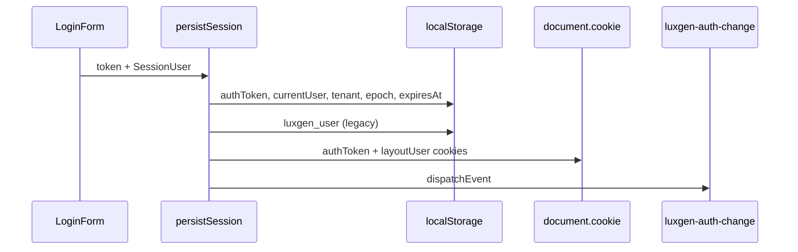

# session.ts — Deep Analysis (Hand-enriched)

## File Path

`apps/web/lib/session.ts` (200 lines)

## Purpose

**Canonical client-side authentication persistence** for the LuxGen web app. This is the single source of truth for:

- JWT storage and expiry checks
- `SessionUser` JSON in localStorage
- Cross-tab session sync (`luxgen-auth-change` event)
- SSR cookie mirror for layout user (first paint)
- Legacy `luxgen_user` cache sync for `@luxgen/ui` UserContext

**Why it exists:** GraphQL login returns a token + user; the browser must persist that contract consistently across NavBar, AuthGuard, Apollo headers, and SSR `getTenantPageProps`.

**Where used:** Login/register pages, `AuthGuard`, `LayoutUserProvider`, `SessionMonitor`, `user-actions.ts`, `SuperAdminTenantSwitchProvider`, profile updates.

## Imports & Exports

| Exports | Lines | Role |
|---------|-------|------|
| `SessionUser` | 6–18 | Typed session user shape |
| `AUTH_SESSION_CHANGE_EVENT` | 20 | `'luxgen-auth-change'` |
| `AUTH_STORAGE_KEYS` | 27–34 | localStorage key constants |
| `SSR_AUTH_COOKIE_NAMES` | 37–40 | Cookie names for SSR |
| `decodeJwtPayload` | 74–83 | Client JWT decode (no verify) |
| `getTokenExpiresAt` | 85–89 | `exp` → ms timestamp |
| `isTokenExpired` | 91–96 | Expiry with 30s skew |
| `getStoredTokenExpiresAt` | 98–104 | Read cached expiry |
| `isStoredSessionExpired` | 106–115 | Session validity check |
| `persistSession` | 118–148 | **Login success path** |
| `getStoredUser` | 150–159 | Read `currentUser` |
| `updateStoredUser` | 162–170 | Profile patch |
| `clearStoredSession` | 172–184 | **Logout / 401 path** |
| `getMsUntilExpiry` | 186–193 | Countdown for SessionMonitor |

## Design Pattern

**Facade + Event-driven session bus.** Hides localStorage/cookie details; notifies subscribers via DOM `Event`.

## Storage contract

| Key | Content |
|-----|---------|
| `authToken` | JWT string |
| `currentUser` | `SessionUser` JSON |
| `currentTenant` | Subdomain string |
| `authTokenExpiresAt` | Epoch ms |
| `authSessionEpoch` | Bumped on login/logout (cross-tab) |
| `luxgen_user` | Legacy UI cache (display only) |

**Interview rule:** Never treat `luxgen_user` alone as proof of login — always require `authToken` + valid expiry.

---

## Function-Level Analysis

### `notifyAuthSessionChange` — Lines 22–25

| | |
|--|--|
| **Inputs** | None |
| **Outputs** | Dispatches `luxgen-auth-change` on `window` |
| **Side effects** | Yes — global event |
| **Pure?** | No |
| **Complexity** | O(1) |

**Listeners:** `AuthGuard`, `LayoutUserProvider`, `useAppLayoutHeader`, NavBar-related hooks.

---

### `decodeJwtPayload` — Lines 74–83

| | |
|--|--|
| **Inputs** | JWT string |
| **Outputs** | `{ exp?, iat? }` or `null` |
| **Time** | O(1) — single base64 decode |
| **Security** | **No signature verification** — intentional for client expiry UX only |

**Interview:** "Is it safe to decode JWT client-side?"  
**Answer:** Only for `exp` display/redirect; **authorization always on server** with full verify.

**Alternative:** Call `/api/users/me` on every page load (higher latency, more secure UX).

---

### `isTokenExpired` — Lines 91–96

| | |
|--|--|
| **Inputs** | `token`, `skewMs` (default 30_000) |
| **Outputs** | `boolean` |
| **Default** | No `exp` claim → **treat as expired** (fail-closed) |

**Edge case:** Malformed JWT → `getTokenExpiresAt` null → expired.

---

### `persistSession` — Lines 118–148

**The login happy path.**

| | |
|--|--|
| **Side effects** | localStorage × 5+, cookies × 2, event |
| **Impure** | Yes |
| **Why cookies?** | SSR `getLayoutUserFromRequest` reads cookies for first HTML paint |

**Bug to avoid:** Forgetting `notifyAuthSessionChange()` → NavBar stale until full reload.

---

### `clearStoredSession` — Lines 172–184

**Logout / 401 / tenant mismatch path.**

- Clears all `AUTH_STORAGE_KEYS` except bumps `sessionEpoch` (intentionally kept for storage-event listeners)
- Clears `luxgen_user`
- Clears cookies
- Fires `luxgen-auth-change`

**Interview:** Why bump epoch on logout?  
**Answer:** `storage` event fires for other tabs; epoch change signals session invalidation.

---

### `updateStoredUser` — Lines 162–170

- Shallow merge into `currentUser`
- Does **not** update cookies — SSR layout may be stale until next login
- **Improvement:** Call `setSessionCookies` if profile name/avatar changes

---

## React / Interview Integration

| Consumer | How it uses session.ts |
|----------|------------------------|
| `AuthGuard` | `validateClientSession()` (session-guard.ts) reads token |
| `useLayoutUser` | `layout-user-context` reads via `getStoredUser` |
| `createHandleUserAction` | `clearStoredSession` on logout |
| `LoginForm` | `persistSession` on mutation success |

## Cross-tab sync

1. Tab A logs out → `clearStoredSession` → `storage` event in Tab B
2. Tab B `AuthGuard` `authEpoch` bump → re-validate → redirect

## Possible improvements

1. Single `SessionStore` class with typed subscribe API
2. `httpOnly` cookie-only session (remove localStorage XSS surface)
3. Refresh token rotation
4. Remove `luxgen_user` duplicate after UserContext migration complete

## Interview questions

| Level | Question |
|-------|----------|
| Easy | What keys prove a user is logged in? |
| Medium | Why mirror session to cookies for SSR? |
| Hard | Design session for 3 tabs + SSO logout |
| Senior | Compare localStorage JWT vs httpOnly cookie vs BFF session |
| Debugging | User sees name but gets 401 on API — what do you check? |

**Debugging answer:** Stale `luxgen_user` without valid `authToken`; or JWT `tenant` id mismatch.

## Senior review

| Org | Verdict |
|-----|---------|
| Startup | ✅ Pragmatic, well-documented keys |
| Enterprise | ⚠️ Would want httpOnly + refresh tokens |
| FAANG | ⚠️ Would separate auth SDK package + security review |

## Real-world bugs fixed in this repo

- Fabricated users from `getDefaultUser()` — removed; guest = `user={undefined}`
- Circular import with `layout-user-context` — split `layout-user-shared.ts`
- Mongoose bundled via `@luxgen/auth` → roles decoupled from `@luxgen/db`

## Related

- [apps-web-components-auth-AuthGuard-tsx.md](./apps-web-components-auth-AuthGuard-tsx.md)
- [apps-web-lib-layout-user-context-tsx.md](./apps-web-lib-layout-user-context-tsx.md)
- [interview-prep/03-react.md](../interview-prep/03-react.md)
