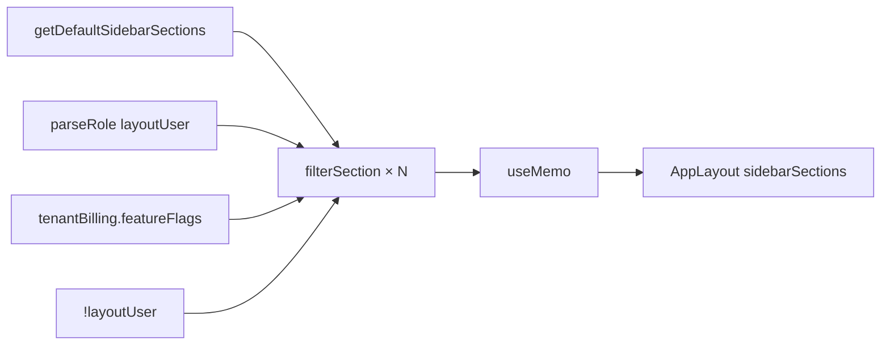

# use-sidebar-sections.ts — Deep Analysis (Hand-enriched)

## File Path

`apps/web/lib/use-sidebar-sections.ts` (105 lines)

## Purpose

**Role- and billing-aware sidebar filter** (audit item UI-14). Takes the full default navigation from `@luxgen/ui` and returns only sections/items the current user is allowed to see based on:

1. **Auth state** — guest vs logged-in
2. **RBAC** — `SUPER_ADMIN` > `ADMIN` > `INSTRUCTOR` > `STUDENT`/`USER`
3. **Plan feature flags** — automations, analytics, project, agentStudio from `GET_TENANT_BILLING`

**Used by:** `useAppShellConfig()` → every `AppLayout` page with sidebar.

## Exports

| Export | Line |
|--------|------|
| `useSidebarSections` | 85–104 |

## Imports

| Module | Why |
|--------|-----|
| `@luxgen/ui` `getDefaultSidebarSections` | Canonical nav tree |
| `GET_TENANT_BILLING` | Plan gates from API |
| `useLayoutUser`, `useAppTenantId` | Role + tenant Mongo id |
| `user-roles.ts` | `isStaffOrAbove`, `isAdminOrAbove` — **local** rank (avoids `@luxgen/db` in bundle) |

---

## Architecture



---

## Function-Level Analysis

### `parseRole` — Lines 17–22

| | |
|--|--|
| **Input** | `role?: string` from layout user |
| **Output** | Normalized role string or `null` |
| **Logic** | Uppercase, spaces → `_`, whitelist check |
| **Pure** | Yes — O(1) |

**Edge case:** Unknown role string → `null` → treated as lowest privilege in filters.

---

### `staffOrAbove` / `adminOrAbove` — Lines 24–30

Delegates to `user-roles.ts`:

```typescript
const ROLE_RANK = { SUPER_ADMIN: 5, ADMIN: 4, INSTRUCTOR: 3, STUDENT: 2, USER: 2 };
```

**Interview:** Why not import `@luxgen/auth`?  
**Answer:** Stale compiled `roles.js` + risk of pulling Mongoose via `@luxgen/db` into web bundle.

---

### `filterItem` — Lines 32–58

**Decision table:**

| Item ID | Visible when |
|---------|--------------|
| `customers`, `products`, `orders`, `admin-listings` | Admin+ |
| `analytics`, `course-analytics` | Staff+ AND `flags.analytics !== false` |
| `project` | `flags.project === true` |
| `automations`, `marketplace` | `flags.automations === true` |
| `agent-studio` | `flags.agentStudio === true` |
| `create-course` | Staff+ |
| Guest allowlist | `dashboard`, `listings-directory`, `my-listings`, `profile`, `settings` |

**Note:** `flags.analytics !== false` means **undefined defaults to visible** for staff — intentional permissive default until billing loads.

---

### `filterItems` — Lines 60–70

- Maps items; recursively filters `children`
- **Removes parent** if all children filtered out
- **Immutable:** spreads `{ ...item, children }` — new array refs for React

---

### `filterSection` — Lines 72–82

| Section ID | Rule |
|------------|------|
| Guest | Only `listings`, `settings`, `navigation` |
| `organization` | Admin+ only |
| `developer` | Requires `automations` flag |
| `developer-tools` | Requires `agentStudio` flag |

---

### `useSidebarSections` — Lines 85–104

**Hooks used:**

```typescript
const layoutUser = useLayoutUser();
const tenantId = useAppTenantId();
const { data } = useQuery(GET_TENANT_BILLING, {
  variables: { tenantId: tenantId ?? '' },
  skip: !tenantId,
  fetchPolicy: 'cache-first',
});
```

| Concern | Implementation |
|---------|----------------|
| Double fetch | `cache-first` on billing query |
| Re-compute nav | `useMemo` deps: role, individual flags, guest |
| No tenantId | Skips billing query; flags `{}` |

**Re-render triggers:**

- Login/logout → `layoutUser` changes → `guest` flips
- Billing data arrives → flags update → new sections
- **Not** on every Apollo cache write — memo deps are narrow

---

## React interview topics

| Topic | This file |
|-------|-----------|
| Custom hook | ✅ Encapsulates filter logic |
| useMemo | ✅ Expensive filter of ~50 nav items |
| useQuery | ✅ Billing flags |
| Pure helpers | ✅ `filterItem` etc. outside hook — testable |

**Common mistake:** Putting `flags` object in useMemo deps — would re-run every render; **fixed** by depending on `flags.automations`, etc.

---

## Security note

**Client-side only** — user could hack DOM to see nav links. **API must enforce** same rules on resolvers.

**Interview:** "Is sidebar filtering enough?" → **No.** Defense in depth.

---

## Possible improvements

1. Move decision table to config JSON — easier product edits
2. Server-driven nav endpoint (`GET /api/nav`) — single source of truth
3. Unit tests for `filterItem` matrix
4. Skeleton sidebar while billing loads

## Refactor example

```typescript
const VISIBILITY: Record<string, (ctx: Ctx) => boolean> = {
  customers: (c) => isAdminOrAbove(c.role),
  // ...
};
```

## Interview questions

| Level | Question |
|-------|----------|
| Easy | What does this hook return? |
| Medium | Why useMemo? What are dependencies? |
| Hard | Design nav for 100+ feature flags |
| Debugging | `hasRoleAtLeast is not a function` — what happened? |

**Debugging answer:** Stale `@luxgen/auth` JS; fixed by local `user-roles.ts`.

## Mock interview answer

> "Sidebar nav is derived data. We start from a static default tree in the UI package, then filter in a hook using the session role and billing feature flags from GraphQL. Guests get a reduced allowlist. We memoize so typing in a form doesn't rebuild the nav. Server still enforces authorization."

## Related

- [packages-ui-src-NavBar-NavBar-tsx.md](./packages-ui-src-NavBar-NavBar-tsx.md)
- [apps-web-lib-user-roles-ts.md](./apps-web-lib-user-roles-ts.md)
- [apps-web-lib-app-layout-user-ts.md](./apps-web-lib-app-layout-user-ts.md)
- [interview-prep/03-react.md](../interview-prep/03-react.md)
- [interview-prep/13-senior-review.md](../interview-prep/13-senior-review.md)
