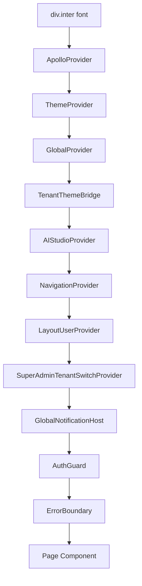

# 03 — React Deep Dive (LuxGen Codebase)

## App shell: `pages/_app.tsx`

### Provider tree (outer → inner)



### Interview: Why this order?

| Provider | Must run before | Reason |
|----------|-----------------|--------|
| ApolloProvider | any `useQuery` | GraphQL client context |
| ThemeProvider | TenantThemeBridge | `data-theme` on `<html>` |
| GlobalProvider | tenant-themed UI | Tenant config in context |
| LayoutUserProvider | AppLayout pages | NavBar user prop |
| AuthGuard | protected content | Redirect unauthenticated |

### `WebNavigationProvider` (lines 25–38)

- Wraps `@luxgen/ui` `NavigationProvider` with Next `router.push`
- **Re-render trigger:** `router.pathname` change
- **Pattern:** Adapter between framework router and design system

## Auth: `AuthGuard.tsx`

### Rendering flow

1. Public route (`requiresAuth(pathname) === false`) → render children immediately (SSR-safe)
2. `!mounted` → render children (avoid hydration mismatch; defer redirect)
3. `validateClientSession()` → redirect to `/login?reason=...` or render children

### `useEffect` + `authEpoch` (post-fix)

- Listens: `AUTH_SESSION_CHANGE_EVENT`, `storage`
- **Purpose:** Re-run validation after login/logout without full page reload
- **Common mistake:** Calling `setSessionVersion` after removing state (fixed)

### Interview questions

- **Easy:** What is hydration mismatch and how does AuthGuard avoid it?
- **Medium:** Why not use `router` in `getServerSideProps` for all auth?
- **Hard:** Design auth for SSR + SPA navigation + cross-tab sync.
- **Senior:** Compare cookie-only SSR session vs localStorage + API `/users/me`.

## Data fetching: Apollo Client

### Patterns in this repo

```typescript
// Stable reference data
fetchPolicy: 'cache-first'  // courses, users list

// Frequently changing
fetchPolicy: 'cache-and-network'  // orders, enrollments
```

### `useSidebarSections` hook

- `useLayoutUser()` → role
- `useQuery(GET_TENANT_BILLING)` → feature flags
- `useMemo` filters `getDefaultSidebarSections()`
- **Re-render triggers:** user change, billing data, tab change

## `@luxgen/ui` components to master

| Component | Key props | Senior topic |
|-----------|-----------|--------------|
| `AppLayout` | `user`, `sidebarSections`, `onUserAction` | `user={undefined}` for guest UI |
| `NavBar` | `onSearch`, `showThemeToggle` | Contract vs implementation |
| `Sidebar` | `onNavigate`, deprecated `onItemClick` | Single navigation path |
| `AdminDashboardLayout` | `onDashboardAction` | Discriminated union actions |
| `PlanGate` | `feature`, `currentPlan` | Client-side gating vs API enforcement |

## Performance patterns in repo

| Technique | Where |
|-----------|-------|
| `React.memo` on table rows | `OrderListTable` |
| `@tanstack/react-virtual` | 50+ order rows |
| `next/dynamic` ssr:false | TowerGraphCanvas, AgentTransparency |
| `next/image` | `OptimizedImage` wrapper |
| `next/font` | `lib/fonts.ts` → `_app` |

## React.memo / useMemo / useCallback — when asked

- **useMemo:** Expensive derived lists (`filtered` automations, sidebar sections)
- **useCallback:** Stable handlers passed to memoized children (`onSearch` in header)
- **React.memo:** Row components in large lists
- **Don't overuse:** Premature memo adds comparison cost

## Controlled vs uncontrolled

- **Controlled:** LoginForm inputs (state + onChange)
- **Uncontrolled:** File inputs (avatar upload) with ref or `onChange` reading files

## Accessibility (implemented)

- Skip link in `_app.tsx` → `#main-content`
- `aria-label` on sidebar nav
- Modal focus trap in `@luxgen/ui/Modal`
- `role="alert"` on Snackbar errors

## Mini React challenges from this codebase

1. Implement `useLayoutUser()` without circular imports (`layout-user-shared.ts` pattern)
2. Add optimistic UI to a GraphQL mutation
3. Fix double-fetch when parent and child both `useQuery` same entity

See [09-mini-projects](./09-mini-projects.md).
