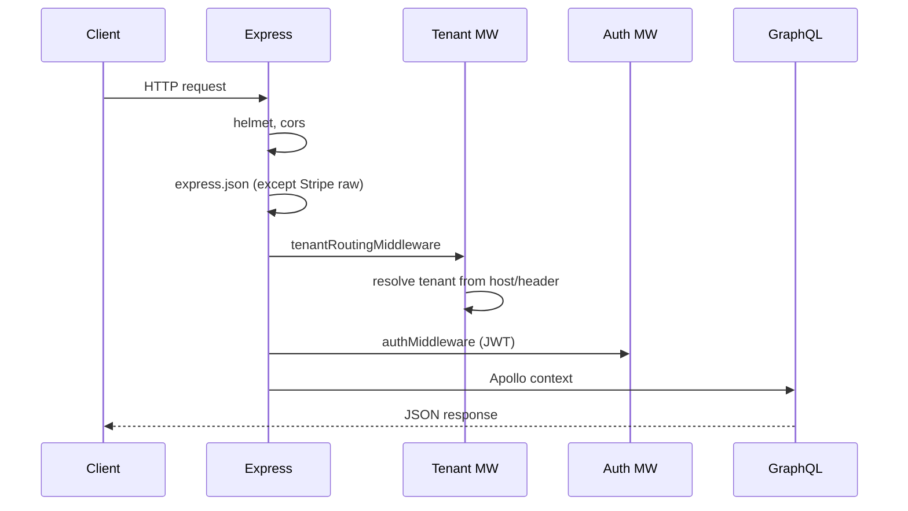

# 05 — Node.js & Express (apps/api)

## Server bootstrap

| File | Role |
|------|------|
| `apps/api/src/index.ts` | Connect Mongo, seed, listen |
| `apps/api/src/app.ts` | Express app + Apollo + WebSocket |

## Middleware pipeline (`app.ts`)

### Order matters (interview classic)

1. **Stripe webhook** — `express.raw` before `express.json`
2. **Tenant routing** — before auth (tenant scope for JWT validation)
3. **Auth** — attaches `req.user` / context
4. **GraphQL** — resolvers read context

## Key middleware files

| File | Purpose |
|------|---------|
| `middleware/auth.ts` | JWT verification, kid/tenant keys |
| `middleware/tenantRouting.ts` | Subdomain → tenant document |
| `middleware/tenantHeaders.ts` | Rate limit, branding headers |
| `middleware/mcpApiKey.ts` | MCP integration auth |

## GraphQL context (`context.ts`)

- Built per request from `req`
- Carries: `user`, `tenantId`, `tenant`, permissions
- **Interview:** "How do you prevent cross-tenant data leaks?" → every resolver filters by `context.tenantId`

## REST routes (alongside GraphQL)

| Route prefix | Use case |
|--------------|----------|
| `/api/auth` | Login, register, token refresh |
| `/api/billing` | Stripe checkout, webhooks |
| `/api/tenant` | Tenant branding, config |
| `/api/notifications` | Notification feed |
| `/api/admin` | Admin operations |

## Error handling

- `errorHandler`, `notFoundHandler` in `utils/errorHandler.ts`
- GraphQL errors vs HTTP 500 — format for client

## Node event loop — tie to this app

- **Sync:** bcrypt hash on register (CPU — don't block event loop at scale; use worker)
- **Async I/O:** Mongo queries, Redis, Stripe API
- **WebSocket:** `graphql-ws` subscription handler runs on same process

## Environment & config

- `@luxgen/config` — URLs, CORS origins, env validation
- `JWT_SECRET` must match between `apps/web` and `apps/api` for `pages/api/users/me`

## Senior questions

1. How would you horizontally scale the API? (stateless nodes, sticky WS, Redis pub/sub)
2. Where do you put business logic — resolver vs service layer? (**This repo:** `services/`)
3. How do you structure idempotency for Stripe webhooks?

## Next.js API routes (`apps/web/pages/api/`)

- Agent chat SSE — streams from `@luxgen/agent`
- `users/me` — JWT verify with shared secret
- Not the main API — GraphQL on port 4000 is source of truth
