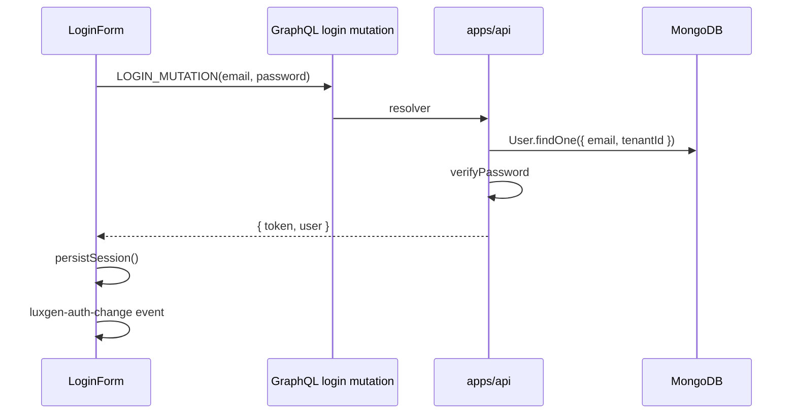
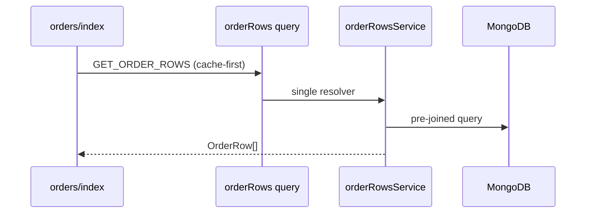

# 07 — API Reference (Interview Edition)

## GraphQL endpoint

| Item | Value |
|------|-------|
| URL (dev) | `http://localhost:4000/graphql` |
| Playground | Same URL (Apollo) |
| Subscriptions | `ws://localhost:4000/graphql` |
| Web proxy | `/api/graphql` → API (next.config rewrites) |

## Authentication

| Header | Purpose |
|--------|---------|
| `Authorization: Bearer <JWT>` | User identity |
| `x-tenant` | Tenant context (with subdomain routing) |

JWT claims include `tenant` (Mongo **id**), `kid` for signing key rotation.

## Core GraphQL domains

| Domain | Typical operations |
|--------|-------------------|
| user | login, register, users, updateUser |
| course | courses, course, createCourse |
| enrollment | enrollments, orderRows |
| dashboard | getDashboardData |
| billing | tenantBilling, checkout |
| automation | automations, toggle, runs |
| listing | business listings lifecycle |

Full reference: [docs/API_REFERENCE.md](../API_REFERENCE.md)

## REST routes (Express)

### Health

```
GET /health → { status: 'OK', timestamp }
```

### Auth (`/api/auth`)

- Login, register — returns JWT
- **Interview:** password hashed with bcrypt (`@luxgen/auth`)

### Billing (`/api/billing`)

- Stripe checkout session
- `POST /api/billing/webhook` — raw body, signature verify

### Tenant (`/api/tenant`)

- Branding, regional settings, storefront config

## Next.js API routes (apps/web)

| Route | Method | Purpose |
|-------|--------|---------|
| `/api/users/me` | GET | Session user from JWT cookie/header |
| `/api/users/avatar` | POST | Avatar upload |
| `/api/search` | GET | Search redirect stub |
| `/api/agent/chat` | POST | SSE agent stream |
| `/api/health` | GET | Web health |

## Error codes (typical)

| Code | When |
|------|------|
| 401 | Missing/invalid JWT |
| 403 | Wrong tenant, insufficient role |
| 404 | Entity not found |
| 429 | Rate limit (`tenantRateLimitMiddleware`) |
| 500 | Unhandled resolver error |

## Example flow: Login



## Example flow: Orders list (optimized)



## Interview questions per API style

**REST:** Idempotency keys, versioning, HATEOAS (usually no in internal APIs)  
**GraphQL:** N+1, query depth limits, field-level auth, subscriptions scale

## Validation

- GraphQL input types + resolver checks
- Mongoose schema validation on write
- Never trust client-only `PlanGate` — API must enforce plans
