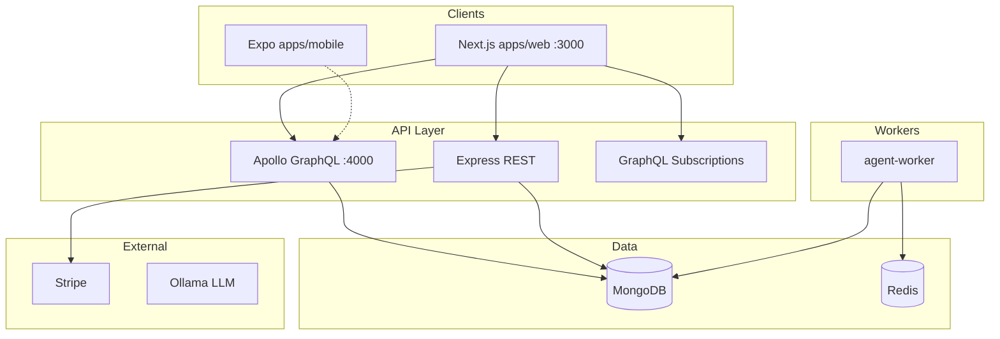
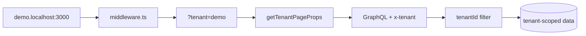
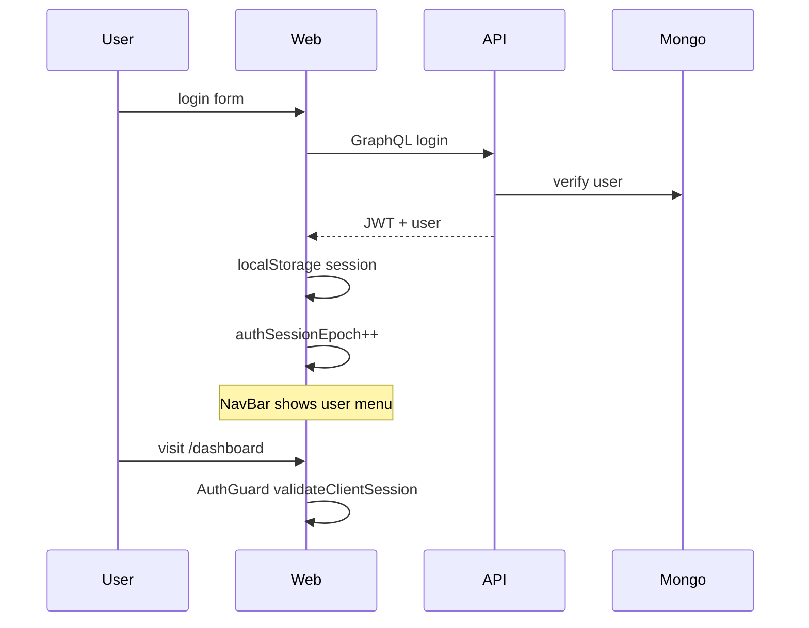
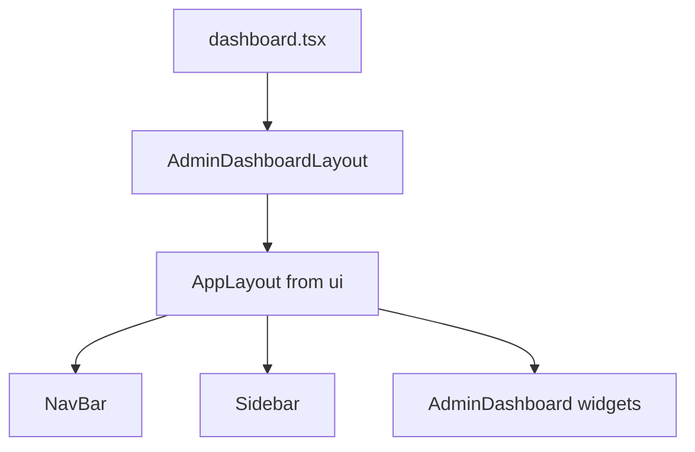
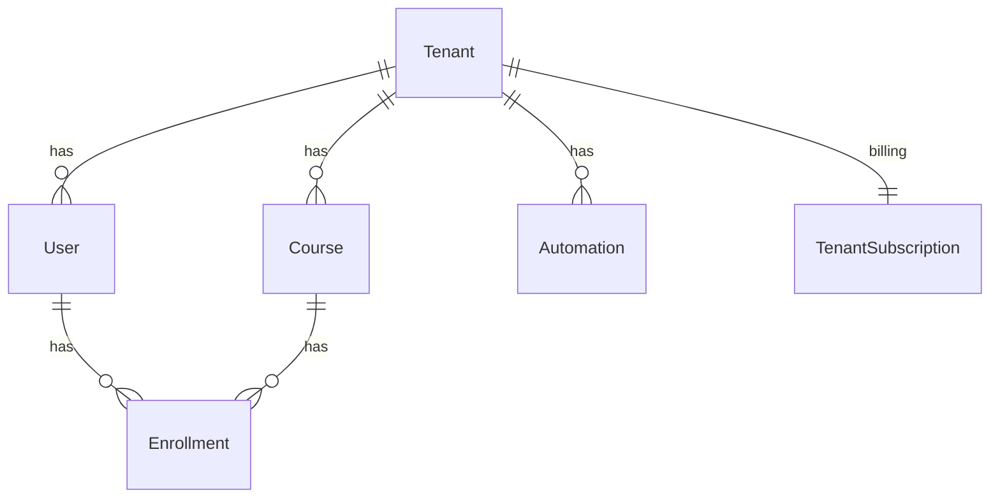

# 08 — System Design

## High-level architecture

## Multi-tenancy design

**Critical:** JWT `tenant` claim is Mongo **ObjectId** — never compare to subdomain string directly.

## Auth flow

## Component tree (typical admin page)

## Database ER (simplified)

## Caching layers

| Layer | Technology |
|-------|------------|
| Browser | Apollo `InMemoryCache` |
| CDN | Static assets (Next) |
| API | Redis (agent queue, optional rate limits) |
| DB | Mongo indexes |

## CI/CD (`.github/workflows`)

- PR: build web + api
- Turborepo cache
- See `docs/deployment/` for cloud targets

## Design interview prompts

1. **Design a notification system** — use existing `notifications` routes + WebSocket
2. **Design multi-region tenancy** — shard by tenantId, read replicas
3. **Design rate limiting** — Redis sliding window per tenant
4. **Migrate Pages Router → App Router** — RSC boundaries, session cookies

## Scalability talking points

- Stateless API nodes behind load balancer
- WebSocket sticky sessions or Redis pub/sub for subscriptions
- Background jobs via `agent-worker` + Redis queue
- Mongo replica set for HA
