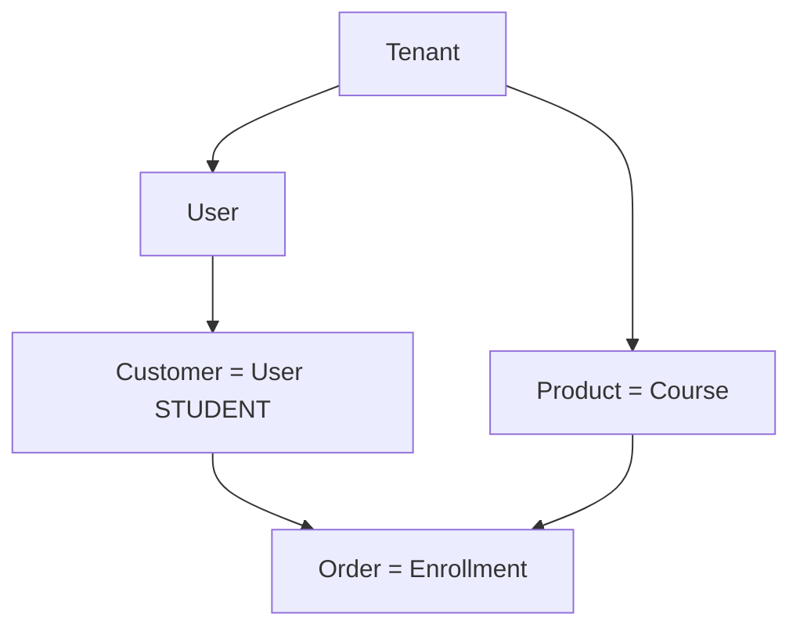

# Commerce API — Functional Specification

> **Audience:** Product, engineering, AI agents  
> **Stack:** GraphQL (`apps/api`) · Mongo (`@luxgen/db`) · Web admin (`apps/web/pages/admin`, `/products`, `/orders`)  
> **Related:** [BUSINESS_TECH_TRANSLATION.md](../BUSINESS_TECH_TRANSLATION.md), [API_REFERENCE.md](../API_REFERENCE.md), `.cursor/rules/commerce-crud.mdc`

---

## 1. Business context

LuxGen is a **multi-tenant training/commerce platform**. Operators (tenant admins) run a branded business: onboard learners as **customers**, sell **products** (courses), and manage **orders** (enrollments + payments).

| Business goal          | Technical outcome                                         |
| ---------------------- | --------------------------------------------------------- |
| White-label SaaS       | `Tenant` isolation on every query/mutation                |
| Shopify-familiar admin | Commerce UI labels; LMS entities underneath               |
| Learner monetization   | Stripe checkout on enrollments; storefront catalog        |
| Ops automation         | Activity timeline + automation events on commerce actions |
| Plan tiers             | `@luxgen/billing` gates (API access, learner limits)      |

**Personas:** Operator/Admin manages commerce; Learner buys via storefront; Superadmin manages tenants.

---

## 2. Entity hierarchy

Data and API authority flow **top-down**. Every child record is tenant-scoped.



| Layer        | Mongo model              | GraphQL type                    | Admin routes                             |
| ------------ | ------------------------ | ------------------------------- | ---------------------------------------- |
| **Tenant**   | `Tenant`                 | `Tenant`                        | Settings (partial), subdomain middleware |
| **User**     | `User`                   | `User`                          | `/users`, auth                           |
| **Customer** | `User` (`role: STUDENT`) | `User` / `customers` query      | `/admin/customers/*`                     |
| **Product**  | `Course`                 | `Course` / `storefrontProducts` | `/products/*`, `/store/*`                |
| **Order**    | `Enrollment`             | `Enrollment`                    | `/orders/*`, checkout                    |

There are **no** separate `Customer`, `Product`, or `Order` collections — commerce is a **facade** over LMS entities.

---

## 3. Functional requirements by entity

### 3.1 Tenant

| ID  | Requirement                                                        | Priority                               |
| --- | ------------------------------------------------------------------ | -------------------------------------- |
| T-1 | Resolve tenant by subdomain (`?tenant=demo`) or JWT `tenant` claim | P0 — shipped                           |
| T-2 | CRUD tenant (superadmin)                                           | P0 — shipped                           |
| T-3 | Storefront/branding in `tenant.settings`                           | P1 — partial                           |
| T-4 | Effective billing plan per tenant                                  | P0 — `tenantBilling` / billing service |

**Queries:** `tenant`, `tenantBySubdomain`, `tenants`  
**Mutations:** `createTenant`, `updateTenant`, `deleteTenant`

### 3.2 User

| ID  | Requirement                                  | Priority     |
| --- | -------------------------------------------- | ------------ |
| U-1 | Register / login with tenant scope           | P0 — shipped |
| U-2 | CRUD staff users (ADMIN, INSTRUCTOR)         | P0 — shipped |
| U-3 | JWT + `x-tenant` header on all protected ops | P0 — shipped |
| U-4 | Push notification tokens                     | P2 — shipped |

**Queries:** `user`, `users`, `currentUser`  
**Mutations:** `createUser`, `updateUser`, `deleteUser`, `login`, `register`

### 3.3 Customer (commerce view of User)

| ID  | Requirement                                              | Priority                   |
| --- | -------------------------------------------------------- | -------------------------- |
| C-1 | Create learner (`createUser` with `STUDENT`)             | P0 — shipped               |
| C-2 | List customers for tenant (STUDENT only, not all users)  | P0 — **Phase 1**           |
| C-3 | Read/update profile: name, email, phone, marketing prefs | P0 — shipped               |
| C-4 | Staff notes (internal, not visible to learner)           | P0 — `updateCustomerNotes` |
| C-5 | Delete customer (tenant-scoped, staff only)              | P0 — **Phase 1** fix       |
| C-6 | Activity timeline (`activityEvents` subject `CUSTOMER`)  | P1 — partial               |
| C-7 | Segmentation (RFM, tags)                                 | P3 — stub UI only          |

**Queries:** `customer` (alias `user`), `customers(tenantId, search)`  
**Mutations:** `createUser`, `updateUser`, `updateCustomerNotes`, `deleteUser`

### 3.4 Product (commerce view of Course)

| ID  | Requirement                                                 | Priority                                        |
| --- | ----------------------------------------------------------- | ----------------------------------------------- |
| P-1 | CRUD title, body, status                                    | P0 — shipped                                    |
| P-2 | SEO + meta (category, SKU, price) in description payload    | P0 — shipped (serialized JSON in `description`) |
| P-3 | **Storefront price from product meta** (not hardcoded)      | P0 — **Phase 1**                                |
| P-4 | First-class `priceCents` on `Course` model                  | P2 — Phase 2 migration                          |
| P-5 | Media, variants, inventory                                  | P3 — UI disabled until model exists             |
| P-6 | Public catalog (`storefrontProducts`, collections, bundles) | P1 — shipped                                    |

**Queries:** `course`, `courses`, `storefrontProducts`, `storefrontProduct`  
**Mutations:** `createCourse`, `updateCourse`, `deleteCourse`

### 3.5 Order (commerce view of Enrollment)

| ID   | Requirement                             | Priority                                              |
| ---- | --------------------------------------- | ----------------------------------------------------- |
| O-1  | Create order = enroll student in course | P0 — `enrollStudent`                                  |
| O-2  | List orders by tenant / by customer     | P0 — `enrollments`, `studentEnrollments`              |
| O-3  | Read order by enrollment id             | P0 — `enrollmentById`                                 |
| O-4  | Update notes (debounced on detail page) | P0 — `updateOrderNotes`                               |
| O-5  | Update payment status                   | P0 — `updateOrder`                                    |
| O-6  | Refund / cancel                         | P0 — `refundOrder`, `cancelOrder`                     |
| O-7  | Stripe checkout session                 | P1 — `createOrderCheckoutSession`                     |
| O-8  | Tags on order                           | P1 — **Phase 1** (DB field exists, expose in GraphQL) |
| O-9  | Draft orders                            | P3 — stub page                                        |
| O-10 | Abandoned checkouts                     | P3 — needs `CheckoutSession` model                    |

**Queries:** `enrollment`, `enrollmentById`, `enrollments`, `studentEnrollments`  
**Mutations:** `enrollStudent`, `unenrollStudent`, `updateOrderNotes`, `updateOrder`, `refundOrder`, `cancelOrder`, `createOrderCheckoutSession`

### 3.6 Cross-cutting — Activity timeline

| ID  | Requirement                                                 | Priority     |
| --- | ----------------------------------------------------------- | ------------ |
| X-1 | `activityEvents(tenantId, subjectType, subjectId)`          | P1 — shipped |
| X-2 | Record `customer.created` / `customer.updated` on mutations | P1 — partial |
| X-3 | `addActivityComment` on product/order/customer              | P1 — shipped |

---

## 4. API surface (canonical)

### Auth headers

```
Authorization: Bearer <jwt>
x-tenant: <subdomain>   # dev; production uses subdomain routing
```

### Tenant → User → Customer

```graphql
query TenantContext($subdomain: String!) {
  tenantBySubdomain(subdomain: $subdomain) {
    id
    name
    subdomain
    settings
  }
}

query Customers($tenantId: ID!, $search: String) {
  customers(tenantId: $tenantId, search: $search) {
    id
    email
    firstName
    lastName
    phone
    marketingEmail
    staffNotes
    createdAt
  }
}

mutation CreateCustomer($input: CreateUserInput!) {
  createUser(input: $input) {
    id
    email
  } # role: STUDENT
}

mutation UpdateCustomer($id: ID!, $input: UpdateUserInput!) {
  updateUser(id: $id, input: $input) {
    id
    firstName
    lastName
  }
}

mutation UpdateCustomerNotes($input: UpdateCustomerNotesInput!) {
  updateCustomerNotes(input: $input) {
    id
    staffNotes
  }
}
```

### Product

```graphql
query Products($tenantId: ID!) {
  courses(tenantId: $tenantId) {
    id
    title
    status
    description
    updatedAt
  }
}

mutation SaveProduct($id: ID!, $input: UpdateCourseInput!) {
  updateCourse(id: $id, input: $input) {
    id
    title
    status
  }
}
```

Product meta (price, SKU, category) is embedded in `description` via `luxgen-product-meta` JSON — see `packages/ui/src/ProductEdit/fetcher.ts`.

### Order

```graphql
query Orders($tenantId: ID!) {
  enrollments(tenantId: $tenantId) {
    id
    courseId
    studentId
    paymentStatus
    notes
    tags
    enrolledAt
  }
}

mutation CreateOrder($courseId: ID!, $studentId: ID!) {
  enrollStudent(courseId: $courseId, studentId: $studentId) {
    id
  }
}
```

---

## 5. Gap analysis (current vs required)

| Gap                                                          | Impact                               | Phase                     |
| ------------------------------------------------------------ | ------------------------------------ | ------------------------- |
| `users` returns all roles; admin filters client-side         | Wrong data in customer list at scale | **1** — `customers` query |
| `deleteUser` not tenant-scoped                               | Cross-tenant delete risk             | **1**                     |
| `staffNotes` only on `extend type User` in enrollment schema | Schema fragmentation                 | **1**                     |
| Storefront `priceCents` hardcoded                            | Wrong prices on `/store`             | **1**                     |
| `Enrollment.tags` not in GraphQL                             | Order tags not persistable           | **1**                     |
| `API_REFERENCE.md` missing commerce section                  | Agent/dev discovery                  | **1** — docs              |
| Course lacks first-class price fields                        | Meta-in-description fragile          | **2**                     |
| Draft / abandoned order pages are stubs                      | Missing APIs                         | **3**                     |
| Learner `/customers` dashboard uses mock data                | No learner API                       | **3**                     |
| Customer segmentation page stub                              | No segmentation API                  | **3**                     |

---

## 6. Implementation checklist

### Phase 1 — Foundation & safety (current sprint)

- [x] `docs/technical/COMMERCE_API.md` (this file)
- [x] Link from `docs/API_REFERENCE.md` and `docs/INDEX.md`
- [x] `customers(tenantId, search?)` query — STUDENT-only, tenant-scoped
- [x] `deleteUser` requires tenant match (resolver + service)
- [x] `staffNotes` on `User` type in `user/typeDefs.ts`
- [x] `Enrollment.tags` on GraphQL type + `updateOrder` input
- [x] `parseProductMeta` util; storefront uses meta `price` / `compareAtPrice`
- [x] Web: `GET_CUSTOMERS` query; customer list uses `customers` not `users`

### Phase 2 — Product commerce fields

- [x] Add `commerce` subdocument on `Course` (`priceCents`, `compareAtPriceCents`, `sku`, `category`)
- [ ] Migration script: extract meta from `description` → `commerce` (batch backfill)
- [x] GraphQL `Course.commerce` + update inputs
- [x] `updateCourse` / `createCourse` sync commerce from description meta (dual-write)
- [x] Storefront prefers `course.commerce.priceCents`

### Phase 3 — Order lifecycle extensions

- [x] `CheckoutSession` model for abandoned carts
- [x] `draftEnrollments` / `abandonedCheckouts` queries
- [x] Wire `/orders/drafts`, `/orders/abandoned`
- [x] `deleteCustomer` admin UI + cascade policy (block if active enrollments?)

### Phase 4 — Learner & analytics

- [ ] Learner dashboard GraphQL (progress, subscriptions)
- [ ] Customer segmentation query (aggregates from enrollments)
- [ ] MCP commerce tools parity with GraphQL

---

## 7. Layer wiring rule

Every new field must pass all layers (from `.cursor/rules/commerce-crud.mdc`):

```
Page → @luxgen/ui → apps/web/graphql → resolver → service → @luxgen/db
```

**PR policy:** One entity or one phase per PR; bugfixes (`fix/`) separate from features (`feat/`).

---

## 8. Key file map

| Layer        | Path                                                                         |
| ------------ | ---------------------------------------------------------------------------- |
| Models       | `packages/db/src/{tenant,user,course,enrollment}.ts`                         |
| Services     | `apps/api/src/services/{tenant,user,course,enrollment,storefront}Service.ts` |
| GraphQL      | `apps/api/src/schema/{tenant,user,course,enrollment,storefront}/`            |
| Web queries  | `apps/web/graphql/queries/{tenants,users,courses,enrollment,storefront}.ts`  |
| Admin pages  | `apps/web/pages/admin/customers/`, `products/`, `orders/`                    |
| Product meta | `packages/ui/src/ProductEdit/fetcher.ts`                                     |
| Timeline     | `apps/api/src/schema/activityEvent/`, `TIMELINE_ARCHITECTURE.md`             |
