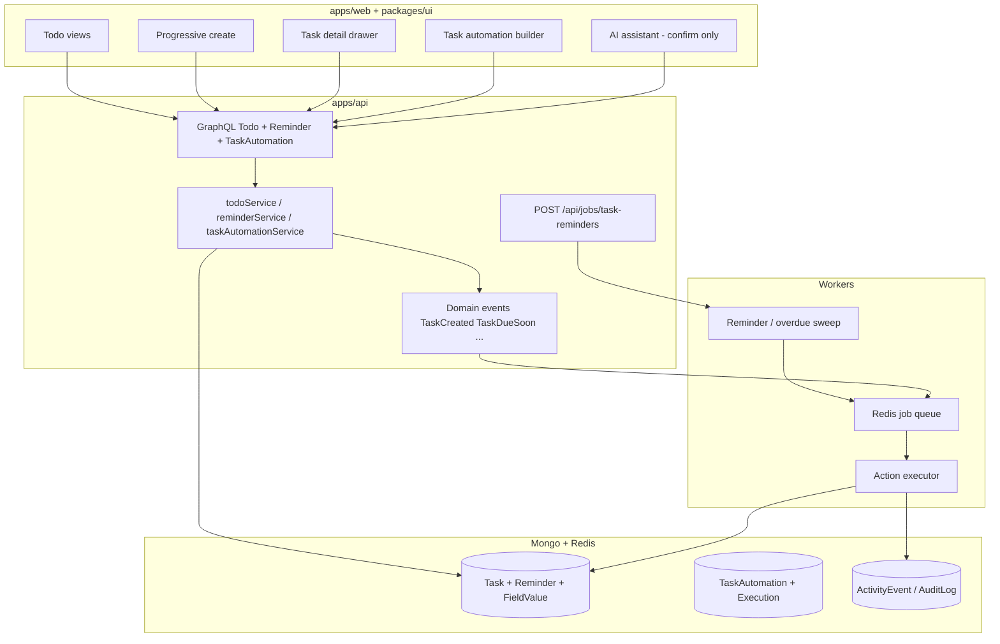

# Todo Engine — Architecture

> **Status:** Phase 1 in progress (`feat/todo-phase1-task-enrichment`).  
> **Scope:** Extend existing Todo/Task (not a separate Reminder app).  
> **Related:** [API.md](./API.md) · [DATABASE.md](./DATABASE.md) · [AUTOMATION.md](./AUTOMATION.md) · [TESTING.md](./TESTING.md)  
> **Platform:** [docs/ARCHITECTURE.md](../ARCHITECTURE.md) · [CODEBASE.md](../technical/development/CODEBASE.md)

---

## 1. Current architecture (as shipped)

### What exists today

| Layer                     | Reality                                                                                                                                                                                                                                            |
| ------------------------- | -------------------------------------------------------------------------------------------------------------------------------------------------------------------------------------------------------------------------------------------------- |
| **UI**                    | Hub `/todo` (named lists) + detail `/todo/[id]` with views: To Do, Done, Board, Chart, Gallery (+ Table, List, Dashboard, Timeline, Calendar, Form). Components in `packages/ui/src/Todo*.tsx`, board in `apps/web/components/todo/TodoBoard.tsx`. |
| **Model**                 | `TodoList` + `Task` (`packages/db/src/todoList.ts`, `task.ts`). Task fields: `tenantId`, `todoListId`, `title`, `notes`, `status` (`TODO`\|`DONE`), `sortOrder`, `dueDate`, `createdById`.                                                         |
| **API**                   | GraphQL only — `apps/api/src/schema/todo/` + `todoService` / `todoListService`. Tenant via `scopedTenantId`. Auth via global `secureResolvers` (JWT required). No fine-grained `task.*` RBAC yet.                                                  |
| **Create UX**             | Quick-add title row + `TodoTaskForm` (title / notes / due). No progressive “More options”.                                                                                                                                                         |
| **Sibling domain**        | `ProjectItem` — richer lifecycle (`BACKLOG`…`DONE`), assignee, priority, dates. **Keep separate**; borrow field patterns, do not merge collections.                                                                                                |
| **Automation (platform)** | Learning/commerce `Automation` + `@luxgen/agent` `emitAutomationEvent` + Tower flow. **Not** wired to Todo tasks.                                                                                                                                  |
| **Scheduler**             | `POST /api/jobs/*` + `x-jobs-key` (e.g. `certificate-reminders`). Cron-style sweeps, not in-browser timers.                                                                                                                                        |
| **Queue**                 | Redis (`apps/api/src/lib/redis.ts`); `apps/agent-worker` for agent jobs. No dedicated task-reminder queue yet.                                                                                                                                     |
| **Activity**              | `ActivityEvent` + pub/sub — reusable for task audit, not used by Todo today.                                                                                                                                                                       |
| **Notify**                | Push token service; no first-class in-app Notification Center for tasks.                                                                                                                                                                           |

### Non-goals of this design

- Separate “Reminders” product or parallel task DB.
- Rewriting Todo views or replacing Tower/commerce automation.
- Browser-only scheduling.
- AI that mutates tasks without confirmation.

---

## 2. Proposed architecture

Extend **Task** into the system of record. Layer **events → scheduler → queue → workers → actions → audit**. Reuse LuxGen job auth, Redis, ActivityEvent, and optionally emit into the existing automation bridge for cross-domain workflows later.



### Principles

1. **Progressive disclosure** — create stays light; schedule / reminder / fields / automation live in detail + “More options”.
2. **Server-side time** — reminders & recurrence via jobs sweeps + queue; UTC storage; display in user TZ.
3. **Idempotent executions** — every automation/reminder fire has an execution id + unique key.
4. **Tenant + permission** — every entity has `tenantId`; mutations check RBAC server-side.
5. **Deterministic first** — AI suggests; rules + queue execute.
6. **Reuse** — job route pattern, Redis, ActivityEvent, ProjectItem field patterns, existing Automation catalog only when bridging LMS/commerce (Phase 8+).

---

## 3. Component architecture

| Component               | Responsibility                                             | Home                                 |
| ----------------------- | ---------------------------------------------------------- | ------------------------------------ |
| `TaskCreateDialog`      | Title + assignee/team/priority/due + More options          | `packages/ui` + web page             |
| `TaskDetailDrawer`      | Full schedule, reminders, fields, automation, AI, activity | `packages/ui`                        |
| `ReminderEditor`        | Multi-reminder presets + custom                            | `packages/ui`                        |
| `RequiredFieldsEditor`  | Template-driven fields + completion gate                   | `packages/ui`                        |
| `TaskAutomationBuilder` | WHEN / IF / THEN (reuse Tower UX patterns lightly)         | `apps/web`                           |
| `NotificationCenter`    | Task reminders / assignments / automation                  | `packages/ui` + GraphQL              |
| `todoService`           | Task CRUD, status transitions, completion validation       | `apps/api`                           |
| `taskReminderService`   | Reminder CRUD + due-window query                           | `apps/api`                           |
| `taskSchedulerService`  | Sweep due/remind/overdue/recurrence                        | `apps/api` + `/api/jobs`             |
| `taskAutomationService` | Triggers, conditions, actions, executions                  | `apps/api`                           |
| `taskJobWorker`         | Async email / AI / webhook                                 | Redis consumer (api or agent-worker) |

---

## 4. Event model (domain)

Emit after successful writes (in-process first; Redis stream optional later):

| Event                     | When                                |
| ------------------------- | ----------------------------------- |
| `task.created`            | createTask                          |
| `task.updated`            | updateTask (include changed fields) |
| `task.assigned`           | assignee/team change                |
| `task.status_changed`     | status transition                   |
| `task.completed`          | → `DONE` / `COMPLETED`              |
| `task.due_soon`           | scheduler                           |
| `task.overdue`            | scheduler                           |
| `task.reminder_triggered` | reminder fire                       |
| `task.field_completed`    | required field filled               |
| `task.comment_added`      | Phase 8                             |

Subscribers: automation evaluator, notification fan-out, audit writer. **Do not** put React timers on these.

---

## 5. Scheduler & queue

### Scheduler (cron → HTTP job)

Mirror `certificateReminderService`:

```
POST /api/jobs/task-reminders   x-jobs-key
POST /api/jobs/task-overdue
POST /api/jobs/task-recurrence
```

Each run:

1. Query due reminders / overdue / recurrence windows (tenant-optional body).
2. Enqueue work items with idempotency keys (`reminderId:fireAtBucket`).
3. Return `{ processed, enqueued, skipped }`.

### Queue

- Prefer **Redis list/stream** already used by agent-worker, or BullMQ if introduced once (do not invent a second broker).
- Job payload: `{ tenantId, type, entityId, idempotencyKey, attempt }`.
- States: `queued | running | completed | failed | retrying | cancelled`.

### Failure handling

- Exponential backoff, max attempts, dead-letter + ActivityEvent `source: system`.
- Never double-send: unique index on `(tenantId, idempotencyKey)`.

---

## 6. Permission model (target)

| Permission                                                   | Use                                       |
| ------------------------------------------------------------ | ----------------------------------------- |
| `task.view` / `create` / `edit` / `delete`                   | CRUD                                      |
| `task.assign`                                                | assignee/team                             |
| `task.complete`                                              | mark done (also enforces required fields) |
| `automation.view` / `create` / `edit` / `execute` / `delete` | task automations                          |
| `team.manage`                                                | templates & required fields               |

Phase 1 may keep “authenticated tenant member” like today; introduce explicit checks by Phase 3–5. Frontend never sole gate.

---

## 7. AI architecture (Phase 7)

| Allowed                       | Forbidden without confirm       |
| ----------------------------- | ------------------------------- |
| Analyze missing fields        | Delete / reassign / bulk mutate |
| Draft description / checklist | External email/Slack send       |
| Propose automation from NL    | Enable automation silently      |
| Summarize activity            | Cross-tenant data               |

AI context: tenant-scoped task + fields + comments user can already view.

---

## 8. Security & observability

- Tenant filter on every query/mutation.
- Validate field values server-side before `COMPLETE`.
- Webhook actions: signed secrets, allowlist URLs.
- Metrics: reminders fired, automation success/fail, overdue count (Phase 9 analytics).
- Logs: structured `tenantId`, `taskId`, `executionId`.

---

## 9. Migration strategy

1. Additive schema fields (nullable) — no breaking GraphQL removals.
2. Expand `TaskStatus` carefully: map existing `TODO`→`OPEN`, `DONE`→`COMPLETED` (or keep aliases).
3. Feature flags: `todo.reminders`, `todo.requiredFields`, `todo.taskAutomation`, `todo.aiAssistant`.
4. Backfill `createdById` where missing; no destructive drops until Phase 8+.

---

## 10. Phased delivery (binding)

| Phase | Deliverable                                                                  | Depends |
| ----- | ---------------------------------------------------------------------------- | ------- |
| **1** | Ownership, team, priority, start/due, richer status, detail drawer, activity | —       |
| **2** | Reminder CRUD, job sweep, notify, snooze, TZ                                 | 1       |
| **3** | Required fields + team templates + completion block                          | 1       |
| **4** | Recurrence                                                                   | 2       |
| **5** | Task automation engine + executions + idempotency                            | 2       |
| **6** | Automation builder UI + test mode                                            | 5       |
| **7** | AI assistant + NL→automation draft                                           | 5–6     |
| **8** | Dependencies, escalations, approvals, Slack/Teams                            | 5       |

**Do not** start Phase 7 before Phase 5 is reliable.

---

## 11. Definition of done (engine-level)

Matches prompt §43: server scheduler, no duplicate fires, tenant isolation, server-side required-field validation, automation logs + retry, AI confirmation, TZ-aware schedule, audit trail, existing views unbroken.
